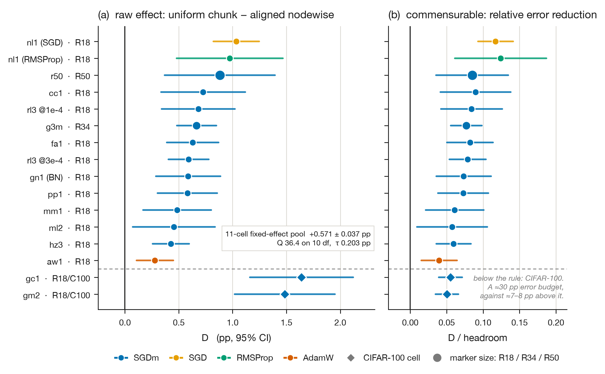
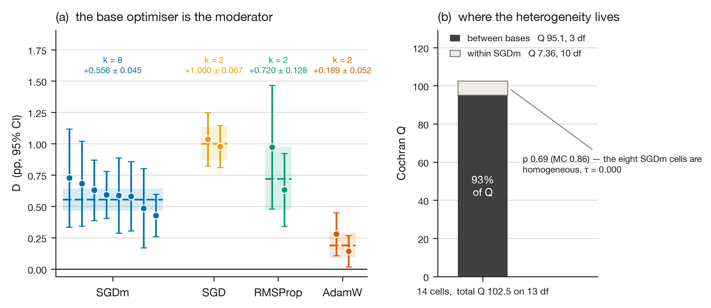
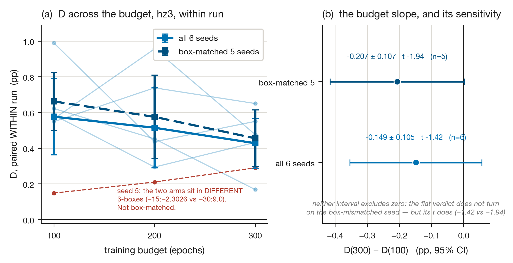
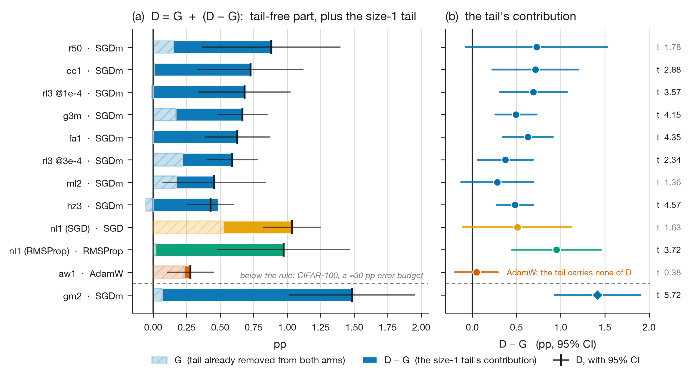

# The partition, not the count: a count-matched measurement of step-size granularity in online meta-gradient optimisation — and the mechanism we could not find

**M. Ahmaditeshnizi** · **S. Salehkaleybar**
LIACS, Leiden University, the Netherlands
Correspondence: `mohammadrezaahmaditeshnizi@gmail.com`

---

## Abstract

MetaOptimize (Sharifnassab, Salehkaleybar & Sutton, ICML 2025) meta-learns one step size per
parameter group and reports that finer partitions help inconsistently, never separating that from
the group *count*. Its contribution therefore remains unmeasured. Our research question is
whether it survives at fixed count. We answer with a benchmarking experiment on the
released artefact, patched only to add partitions. The sampling frame is a 2,173-run
CIFAR-10/CIFAR-100 corpus; the unit of analysis is a within-batch count-matched contrast.

The uniform partition wins in all twenty count-matched cells, on ResNet-18, ResNet-34 and
ResNet-50. Pooled over eight SGDm cells the effect size is +0.556 ± 0.045 pp (calibrated 95% CI ± 0.121), homogeneous against that null (Q 4.21, median 9.4), while cells
differing in base optimiser are not. Alignment
is a bounded null: at fixed count and size multiset, permuting group membership is worth
−0.009 ± 0.157 pp, and −0.018 ± 0.079 pp in a pre-registered replication at twice the resolution.
Of nine candidate mechanisms, none is a general carrier.

Threats to validity: the corpus is CIFAR-resolution vision, and a Lion meta-optimiser carries every
count-matched cell but one. Every accuracy is a test-set quantity with no held-out validation
split, bounding construct validity. The method trails tuned baselines (SGD+cosine on ResNet-18,
AdamW+cosine on ResNet-34 and ResNet-50) by 1.8–4.2 pp, dwarfing this ≈0.6 pp effect. Read this as a
constraint on partition design, not support for practitioners.

---

## 1. Introduction

Adaptive-step-size methods that *learn* their step sizes online — IDBD, Autostep, hypergradient
descent, SwiftTD, MetaOptimize — all face a design choice that is usually made silently: how many
weights share one step size. Call this the **granularity** of the partition. The choice ranges from
one global step size (m = 1) to one per weight (m = P), and every method in the family exposes it,
but almost none of them study it.

MetaOptimize exposes the choice and flags it as unresolved. Its §7.1 CIFAR-10 experiment uses two
granularities, scalar (m = 1) and a "blockwise" partition of six blocks — *"one for each linear
layer and four blocks for the ResNet modules"*; §7.2's non-stationary experiment uses a
"blockwise" of **two**. So the paper runs exactly two granularity values anywhere, and the value of
its coarse arm differs between experiments. Its §7.3 ImageNet aside reports *"Unlike CIFAR10, here
the blockwise versions of MetaOptimize showed no improvement over the scalar versions"*, and its
Limitations section asks for future work on *"the layer and weight levels"*.

That is also how the paper closes on the question: *"while increasing the number of step sizes
is anticipated to enhance performance, our experimental findings in Section 7 reveal that this
improvement is not consistent across the MetaOptimize approximations evaluated."* We take that
question up with 2,173 runs (≈1,632 GPU-hours; 1,731 admissible) on CIFAR-10 and CIFAR-100 —
ResNet-10, -18, -34, -50 and one ResNet-101 across the corpus, and ResNet-18, -34 and -50 in every count-matched
cell — and report one robust measurement, one bounded null, and a mechanism we could not find.

That is an unusually clean open question, and the obvious way to answer it is to build the ladder
and read off the shape. We did that, and the shape is not the answer — because "the number of step
sizes" is not one experimental variable. Along the way we found that:

* moving the shared meta-stepsize η by one decade moves the measured layerwise-minus-scalar gap
  from **+3.291 ± 0.146 pp** (η = 1e-3, the paper's own default) to **+0.655 ± 0.176 pp**
  (η = 1e-4), within one batch at fixed seeds — so four fifths of the reported granularity benefit
  at the default η is tolerance to an over-large meta-step, not accuracy (§4.1);
* the initial step size α₀ sets the *sign* of the ordering at the parent's own configuration
  (§4.1);
* the group count, holding the partition *family* fixed, is a smooth function of log m whose local
  slope runs from **+0.350 to +0.828 pp/decade** inside a single batch, so no single "count slope"
  exists to import (§4.2);
* and — this is the paper — **at fixed group count the partition still matters**, by an amount
  larger than the count effect it is usually confused with (§4.3).

The last of these is the measurement we can defend. The rest of the paper is about how far it
generalises (§4.4–§4.8), what it is *not* (§5), and what we could not measure (§6–§7).

**The measurement.** Replacing an architecture-aligned partition (one step size per output
channel, `nodewise`) by a uniform one of the *same group count* (fixed-size chunks of K weights)
is worth a positive amount of final accuracy in **every within-batch, count-matched cell we
measured** — Table 2 gives the cells and the count — spanning three networks (ResNet-18,
ResNet-34, ResNet-50), 2 datasets, 4 base optimisers, 2 meta-optimisers, 2 meta-stepsizes and
2 budgets. On ResNet-18/CIFAR-10 with an SGDm base the
effect D = +0.456 ± 0.195 to +0.727 ± 0.200 pp across **six independent batches**; on ResNet-34
D = +0.666 ± 0.094 (9 v 9); on ResNet-50 D = +0.881 ± 0.261; on CIFAR-100 D = +1.640 ± 0.245 and
+1.485 ± 0.238. Over the fourteen cells that run the same ResNet-18 partition contrast, D varies
genuinely across configurations (**Q = 102.47 on 13 df**: p = 5.5e-16 against χ²₁₃, which is the
**wrong reference** at these degrees of freedom, and **Monte-Carlo p = 0.013** against the
distribution Q actually has here; τ = 0.295 pp against 0.143 pp rms measurement error, both of
them upper bounds — §7 T13), and splitting those fourteen by base optimiser leaves them
homogeneous inside every level (within Q = 7.36 on 10 df, p = 0.69; Monte-Carlo p = 0.86) while
accounting for **92.8% of that Q** (between-base Q = 95.12 on 3 df, p = 1.7e-20 against χ²₃ and
**Monte-Carlo p = 0.005**). The weight-free statement of the same fact, which uses no standard
error at all and is what this claim now rests on: the base-optimiser grouping takes η² = 0.840 of
the unweighted variance of the fourteen D, ranking 9th of all 45,045 partitions of its shape
(**exact p = 0.00020**). **We do not claim the base optimiser is
identified**: the share is a property of the grouping and not of the label, and the obvious rival
— batch identity — accounts for 95.8% of the same Q. §4.4 states exactly what that analysis can
and cannot support. At a fixed base optimiser D does
not vary: over eight SGDm cells spanning seven separate submissions, two meta-stepsizes, two
budgets and three step-size clip boxes, D = **+0.556 ± 0.045 pp** with Q = 4.21 on 7 df (p = 0.76
against χ²₇; Monte-Carlo p = 0.86 against a null whose median is 9.4, τ = 0.000). The calibrated
95% interval on that pool is ± 0.121 pp, not the ± 0.088 its se implies (§7 T13). We report that as an estimate and not as a threshold clearance: this campaign's
pre-registered minimum interesting effect, 0.30 pp, was fixed before `mm1` ran and carried
unchanged into eight registered scorers, but it is registered for a single within-batch cell and
never for a pool (§3.3).

**The bounded null.** Architecture *alignment* is not a large carrier, and we can put a number on
how large it could still be. Permuting **which** weights share a group while holding the group
count **and the exact per-tensor group-size multiset** fixed is worth **−0.009 ± 0.157 pp
(t −0.06, 3 v 3, one batch)**, scored `NULL` against a symmetric band registered in advance. The
95% interval is **[−0.317, +0.298] pp = [−55%, +51%] of the same batch's D**, and the effect this
design could have detected at 80% power is **0.440 pp = 76% of D**. So an alignment effect
accounting for most of D is excluded; one accounting for half of it is **not** — power against
A = D/2 is 0.46. A pre-registered replication (`rp1`, 24 jobs, three permutation draws × six seeds
with the draw decoupled from the run seed) has since returned **−0.018 ± 0.079 pp**, 95% CI
**[−34%, +28%] of D**, with the permutation draw's variance component measured at **zero**
(F(2,10) = 0.175, p = 0.84). The null replicates at twice the power and the open contribution
narrows from about half of D to about a third; it is still **not** an equivalence claim (§4.6.1). We also record a defect in our own registration: the NULL band's half-width (0.15)
is **narrower than the standard error the batch achieved** (0.157), so a genuinely zero effect would
have scored `NULL` only 66% of the time. What is left as the leading carrier is the group-**size
distribution**, which takes **+0.590 ± 0.107 (t 5.53)** of the same decomposition.

**What we could not find.** **We do not have a mechanism**, and that is worth saying in the first
section rather than the last. We examined nine candidate mechanisms and report the verdict on each
in §5 — which are refuted, which is narrowed to a base–meta pairing, which is not separable from
the axes it is aliased with, and which cannot be decided by this instrument or this design —
because those verdicts are half the contribution. One refutation is fully pre-registered: at the
one corner where the base *and* the meta-optimiser both carry a second-moment normaliser — the
corner that predicted the smallest gap in the corpus — D = **+0.889 ± 0.228 pp (t 3.89)**, the
largest in the AdamW family, against a bar of D ≥ +0.55 committed before the runs existed. Chief
among the rest: the obvious carrier —
degenerate size-1 groups — is not it (removing 100% of a network's singletons buys
+0.115 ± 0.133 pp, t 0.87); the tail story is scoped to a base–meta pairing rather than a base
(pooled D − G = +0.514 ± 0.056 under SGDm + Lion, −0.061 ± 0.085 under AdamW + Lion, and
+0.629 ± 0.242 under AdamW + RMSProp, where G itself does not move at all: −0.001 ± 0.104);
no summary statistic of the size distribution is *identifiable*
from this corpus, because at fixed count the design contains exactly one contrast type and every
candidate collapses to an indicator for the aligned arm; and **no measurable property of a
configuration predicts D out of sample** better than the corpus mean by a margin that survives the
power bound (|r| ≥ 0.632 needed at 10 design points). A cross-validated *null* at n = 10 is
defensible in a way a cross-validated success at n = 10 never is; we report both, and the null is
the one that survives.

**Scope, stated here and not deferred to a threats section.** (i) Everything is CIFAR-resolution
vision with ResNets and one meta-learning framework; ImageNet is out of reach on our data
allocation (489 of 1000 train classes present, validation set unlabelled). (ii) MetaOptimize trails
a tuned schedule at every scale we ran: on ResNet-18 its best plain cell reaches 93.317 ± 0.083 pp
against a tuned SGD+cosine baseline at 95.124 ± 0.047 (n=5, the interior maximum of a bracketed
grid), a **1.807 pp deficit**, and the deficit widens to 2.56 pp on ResNet-34 and 4.21 pp on
ResNet-50. We make no competitiveness claim. (iii) The base optimiser has been varied four ways and
the meta-optimiser once: of the 427 admissible runs in the partition families, 415 carry a **Lion**
meta-optimiser and 12 — one cell, the second-moment corner that §6.1's void batch failed to test —
carry RMSProp. One cell is not an axis, so no general statement about the meta-optimiser is
available from this corpus. (iv) The effect is ≈0.6 pp inside a method that is 1.8 to 4.2 pp
behind a cosine schedule, and in our implementation the uniform arm also costs ≈17% more wallclock
— so this is a **designer-facing** result, addressed to whoever chooses where the groups go in a
step-size adapter, and not a recommendation to any practitioner to adopt this method or this
partition (§4.7). (v) Every accuracy here is a test-set quantity and no validation split was
held out anywhere (§3.3, §7 T12). (vi) We inherit, and partly overlap with, Choi et al. on
tuning-protocol sensitivity, Zheng & Kwok on blockwise adaptivity, and CAM-HD on the granularity
ladder and its interior optimum; §2 states exactly what is left, §1.1 lists what this paper adds,
and §3 fixes the partitions, the contrasts and the metric before any result is read.

### 1.1 Contributions

1. **A count-matched isolation of the group-size distribution from the group count** in
   meta-learned step sizes, replicated in 20 within-batch cells across three networks, 2 datasets,
   4 base optimisers and 2 meta-optimisers (§4.3–§4.5, Table 2, Figure 1). **This is the part of
   the paper that does not depend on the endpoint we chose**: re-derived on all four
   end-of-training columns the corpus carries, the sign holds in 20 / 20 cells on `plateau5`,
   20 / 20 on the 20-epoch column, 20 / 20 on `best_test` and 19 / 20 on `final_test`, and the
   pooled level stays between +0.396 and +0.614 pp — those four are **fixed-effect** pools,
   +0.396 to +0.674 pp on random effects, and **the sign claim does not depend on which**, nor on
   anything in §7 T13, because no quantity in Table 2 is a pooled quantity. The one exception is
   unresolved rather than
   reversed — `bm2` (SGD) at −0.073 ± 0.500, t −0.15, a cell whose se inflates 5.8-fold on a
   single-epoch reading (§4.4).
2. **A pre-registered permutation null, replicated and reported with its resolution**: at fixed
   count *and* fixed per-tensor size multiset, membership is worth −0.009 ± 0.157 pp
   (95% CI [−55%, +51%] of D, MDE 0.440 pp) in the original batch, and −0.018 ± 0.079 pp
   (95% CI [−34%, +28%] of D, MDE 0.222 pp) in a replication that removes the permutation-seed
   confound and measures the draw's variance component at zero. This **bounds** alignment's
   contribution rather than eliminating it, at one design point, and we report the registration
   defect that limits it and the equivalence test it still fails (§4.6, §4.6.1).
3. **A candidate moderator for the effect's heterogeneity, with its confound measured rather than
   asserted**: over fourteen same-contrast ResNet-18 cells the base optimiser is the coarsest
   partition that leaves them internally homogeneous (within Q 7.36 on 10 df, χ² p 0.69,
   Monte-Carlo p 0.86) and it
   accounts for 92.8% of the between-cell Cochran Q (95.12 of 102.47 on 3 df) — a share whose
   evidence now rests on a **weight-free exact permutation** (η² = 0.840, 9th of the 45,045
   partitions of its shape, p = 0.00020) rather than on the χ² p-values, which §7 T13 shows are
   anticonservative by many orders of magnitude at these degrees of freedom; inside the SGDm
   level D is homogeneous (τ = 0.000, 95% upper limit 0.109 pp) across seven submissions, two
   meta-stepsizes, two budgets and three clip boxes. **All four levels now rest on two or more
   independent submissions**, and each is internally homogeneous (within-level Q 0.17/1, 1.37/1,
   1.61/1 and 4.21/7 — Monte-Carlo p 0.70, 0.30, 0.25 and 0.86 against each level's own simulated
   null, every one of them *further* from significance than the χ² value it replaces); a
   registered replication (`bm2`) bought the two thinnest levels, and it is what makes the
   decomposition a testable restriction rather than an arithmetic identity.
   **We report, in the same place, that this is not yet identification**: the share is invariant to
   any relabelling that induces the same grouping, batch identity accounts for 95.8%, and base
   survives conditioning on batch only at ΔQ 4.11 on 2 df, p 0.13 (§4.4, Figure 2). **And that it
   is conditional on the endpoint**, which §3.3 concedes was chosen after seeing data: recomputed
   on the three other end-of-training columns the corpus carries, the base-optimiser share is
   86.8% on `final_test` with the level ordering *inverted* (SGD moves from the largest level to
   the smallest), 62.5% on the 20-epoch column, and on `best_test` there is no heterogeneity to
   decompose at all (Q 9.87 on 13 df, p 0.70, τ = 0.000, I² = 0%). **Referred to the right null
   (§7 T13) the conditionality is sharper still**: only `plateau5` has heterogeneity that resolves
   at all (Monte-Carlo p 0.013 against 0.24, 0.90 and 0.16), so on three of the four endpoints
   there is nothing for any moderator to explain. The weight-free permutation, which does not need
   the heterogeneity established first, puts the base grouping at η² 0.840, 0.800, 0.276 and 0.670
   (exact p 0.00020, 0.00029, 0.34 and 0.0076). Of the four endpoints, the one
   this project chose is the one on which the decomposition is strongest. We disclose that rather
   than change the primary metric.
4. **A ranking of the four variables** that "the number of step sizes" conflates, with the
   within-batch magnitude of each (§4.1–§4.2).
5. **Nine candidate mechanisms — four refuted, one narrowed to a base–meta pairing, one not
   separable, three undecidable by this design — and two nulls**, reported as a section rather than
   an appendix (§5), including the identifiability limit that makes a tenth unanswerable from this
   corpus. One of the four refutations is fully pre-registered: the bar was committed in the batch
   script before the runs existed and the batch cleared it in the direction the mechanism forbade
   (§5.5, M9).
6. **A designer-facing prescription with its scope attached, and the scope is not where we first
   put it**: merging each one-dimensional tensor into a single group is worth **+0.328 ± 0.084 to
   +1.363 ± 0.151 pp** across twelve within-batch cells under SGDm, SGD and RMSProp bases, and
   costs nothing in learned parameters. Under an AdamW base with a **Lion** meta-optimiser it is
   worth nothing measurable (+0.007 ± 0.056 over two batches); under the same AdamW base with an
   **RMSProp** meta it is worth +0.988 ± 0.231. Both halves face §4.4's endpoint knife in §4.7 and
   the first survives it: the twelve cells are positive on all four end-of-training endpoints
   (48 of 48) and the AdamW+Lion pool stays inside the registered ±0.15 pp band on all four,
   while resolution falls 12 / 12, 12 / 12, 8 / 12, 6 / 12 and `sm4` itself goes unresolved on
   `final_test` (t 1.51). The exception is a base–meta pairing, not a base
   (§4.7, §5.4, §5.5).
7. **A measurement-discipline appendix** documenting a batch that failed silently on its own axis,
   a metric column that produced two withdrawn headlines, an argument-line defect that voided two
   batches, and an internal variance claim that did not reproduce (§6, Appendix A).

---

## 2. Related work, and what is left

§2.1 fixes the parent method and the configuration this paper inherits from it. §2.2, §2.3, §2.4
and §2.5 then place the four literatures this measurement sits inside, and state in each case what
is already pre-empted and what is not.

### 2.1 MetaOptimize (Sharifnassab, Salehkaleybar & Sutton, arXiv:2402.02342)

The parent method learns `α = exp(β)` per group from a discounted meta-gradient carried by an
eligibility trace `h`. Its configuration, extracted from the released text rather than recalled:
ResNet-18, CIFAR-10, batch size 100; (base, meta) ∈ {(AdamW, Adam), (Lion, Lion), (RMSProp, Adam),
(SGDm, Adam)}; η = 1e-3 for every MetaOptimize row; α₀ = 1e-6; γ = 1; blockwise = six blocks.
§7.5 states that η *"works universally well… with no sweeping required"*.

Three points matter for what follows and are easy to get wrong.

* **§7.1 makes no blockwise-beats-scalar claim in its own text.** Its stated CIFAR-10 finding is
  *"In every tested combination, MetaOptimize outperforms its corresponding fixed-step-size
  baseline"* — the method against a tuned fixed LR. The positive granularity reading rests on the
  §7.3 aside and one figure.
* **§7.1 states no seed count and shows no error bars.** `grep -icE "error bar|shaded|standard
  deviation|confidence interval"` over the full text returns 0; the only "averaged over 5 random
  seeds" sentence belongs to §7.2. So the curves supporting the granularity inference are of
  unstated replication.
* **The §9 sentence is indexed by approximation**, verbatim: *"this improvement is not consistent
  **across the MetaOptimize approximations evaluated**."* It is not a claim that an
  accuracy-versus-m curve turns down; no such curve was measured. Any paper claiming to *explain a
  reported non-monotonicity of the granularity curve* is answering a sentence that does not exist.
  We do not make that claim.

We also record that six blocks on a ResNet-18 have sizes **[1856, 147968, 525568, 2099712,
8393728, 5130]** weights: the parent's coarse arm **cannot contain a size-1 group**, so no
degenerate-group story can be about the parent's own experiment.

### 2.2 Choi et al., *On Empirical Comparisons of Optimizers for Deep Learning* (arXiv:1910.05446)

Choi et al. show that optimiser rankings are set by the hyperparameter tuning protocol, and that
where an **inclusion relationship** holds — optimiser A's hyperparameter space contains a setting
that reproduces B — the more general optimiser never underperforms once tuned. This pre-empts a
large part of our §4.1: our layerwise-minus-scalar gap moving from +3.291 to +0.655 pp when both
arms are tuned is exactly their phenomenon, and we say so.

It does **not** pre-empt §4.3, and the reason is structural rather than empirical. Granularity is
not an inclusion relationship in Choi's sense. The finer partition's extra degrees of freedom are
**state** (the per-group β), not hyperparameters. In the released reduction, the coarse partition's
meta-gradient is a *raw sum* over its members' meta-gradients with no per-group normalisation
(`block_product`, `patches/HF_patched.py:161-172`: `scalar` returns
`[sum((u*v).sum() for all tensors)]`; `layerwise` returns the per-tensor sums), so a coarse group
is not obtainable from a fine partition by tying anything the search space exposes. The single
hyperparameter setting at which every granularity coincides is η = 0, where β never moves and all
arms degenerate to a fixed step size. So the inclusion holds only at a point where the method is
switched off. That is why a granularity comparison can be non-monotone *at each arm's own optimum*,
and §4.5 shows that it is: tuning each arm to its own argmax moves D by −0.090 ± 0.178 pp.

### 2.3 Zheng & Kwok, *Blockwise Adaptivity* (arXiv:1905.09899)

Zheng & Kwok partition network parameters into blocks and make the **second-moment normaliser**
blockwise rather than coordinate-wise, arguing theoretically for comparable convergence and better
uniform stability, and reporting lower test error than Adam on CIFAR-10 ResNet-56/110 for all four
of their block constructions. Those constructions are: per parameter tensor/matrix/vector; per
output dimension/output channel; per convolution kernel; and per input dimension with a **single
stepsize per parameter vector**. The last of these is, structurally, the prescription we arrive at
independently in §4.7 — a whole 1-D tensor gets one group.

Two things separate their work from ours, and one caveat is ours to declare. They adapt a
second-moment *preconditioner*, not a meta-learned step size, so the object being grouped is
different. And their four schemes vary group **count** and group-size **distribution**
simultaneously, so their ranking of block constructions cannot separate the two — which is the
confound the present paper exists to remove. The caveat: the markdown rendering of the paper we
hold locally collapses every scheme label to the same token, so **we cannot identify from our copy
which of their four schemes they report as best**, and we make no claim about their ranking beyond
"all four beat Adam".

### 2.4 CAM-HD — Jie, Gao, Vasnev & Tran, *Adaptive Multi-level Hyper-gradient Descent* (arXiv:2008.07277)

This is the closest prior work and it must be cited in the first paragraph of any granularity
claim. Working in the hypergradient-descent framework, CAM-HD extends learning-rate adaptation to
**layer-wise, unit-wise and parameter-wise** levels, and:

* **states the small-sample mechanism, in words, four years before us**: *"For the model involving
  a large number of learning rates for different groups of parameters, the updating for each
  learning rate only depends on the average of a small number of examples. Therefore, when the
  batch size is also not large, over-parameterization is an issue to be concerned."*
* **reports the interior optimum explicitly**: *"usually the optimal performance is neither at full
  global level nor full layer/filter level, but a weighted combination of two levels of adaptive
  learning rates."*
* **fixes it with the classically correct remedy**: a learned weighted combination of levels, i.e.
  hierarchical partial pooling / shrinkage, with the combination weights themselves trained.

What is not in CAM-HD, and is therefore ours: degenerate and size-1 groups, and one-dimensional
tensors as a distinguished object; the decomposition of the granularity contrast into a
**size-distribution** part and an **alignment** part, with the alignment null; and **count
matching** — CAM-HD's levels differ in group count and in size distribution simultaneously, so its
interior optimum is exactly the confound we remove.

CAM-HD also frames the referee question we owe an answer to: *the classical remedy for noisy small
groups is shrinkage, and CAM-HD already published partial pooling for this. Why a hard rule rather
than the soft, classically optimal version?* We answer it with data in §5.9: three pooling
operators were implemented and all three failed their own controls. In particular, full pooling in
meta-gradient space (`zpool`, r = 0) lands at **87.880 ± 0.070 (n=5)**, which is
**87.879 ± 0.046 (n=12)** — plain scalar — to one part in a thousand, confirming the operator does
what it says; and at the good partition it is monotone harmful, r = 1 → 91.037 ± 0.079 versus
r = 0 → 87.880 (−3.157 pp). The best interior cell we can see on layerwise is r = 0.99 at 91.112
(n=1), +0.075 pp over no pooling and well inside seed noise. Pooling *does* rescue an
over-fine partition — weightwise goes 79.235 ± 0.154 (r=1) to 89.272 ± 0.162 (r=0.99), a +10.04 pp
rescue — but the rescued arm is still **2.18 pp below plain six-block (91.448 ± 0.049)** and
2.47 pp below plain nodewise. Shrinkage repairs a bad partition; it does not beat a good one.

### 2.5 Methods that ship a tensor-level rule and do not justify it

| method | what it does to 1-D tensors | stated reason |
|---|---|---|
| **Adam-mini** (arXiv:2406.16793) | Algorithm 3, *Partition for non-Transformers*, is verbatim `for name, param in parameters: param_blocks[name] = param` — **one block per tensor**. On a ResNet, Adam-mini is layerwise and already ships our prescription. | Its stated principle is Hessian sub-block **alignment**. Our permutation null (§4.6) bounds what that principle can be buying in this regime — at fixed count and fixed per-tensor size multiset, membership is worth −0.009 ± 0.157 pp, 95% CI [−0.317, +0.298] — which excludes a large alignment effect within one layer at one design point and does not exclude a moderate one. |
| **Adalayer** (Zhao et al., arXiv:2407.07972) | LayerNorm parameters form whole-tensor blocks. | Concludes that adaptivity **on** the last layer and LayerNorm is *necessary*. Note the direction: this is about **merging across** norm tensors versus **shattering within** one, and about a second-moment preconditioner, not a meta-learned step size. It is not evidence for or against our contrast; we flag it because a careless reading makes it look like both. |
| **Muon** | 1-D parameters, embeddings and the head are routed to AdamW. | Tensor **rank**, from the geometry of Newton–Schulz orthogonalisation. |
| **LARS / LAMB** (arXiv:1708.03888) | BatchNorm and bias parameters conventionally exempted from the layer-wise trust ratio. | Folklore: tiny norms, unstable ratio. |
| **bitsandbytes** (arXiv:2110.02861) | Tensors with < 4096 elements kept at 32-bit. | Precision, not grouping. |
| **Shampoo** | `max_preconditioner_dim` is a cap from *above*; 1-D parameters get diagonal Adam. | Cubic preconditioner cost — the opposite direction. |
| **Adafactor** | `min_dim_size_to_factor` falls back to full per-coordinate second moments below a threshold. | Memory — again the opposite direction. |

No method in this survey imposes a **minimum group size** on step sizes; two impose a maximum. Our
§4.7 supplies the first count-matched measurement of what such a floor buys, and §5.4 supplies its
scope limit.

**An attribution we withdraw.** An earlier version of this project attributed a
√N noise-averaging argument for coarse grouping to Adam-mini, Adalayer and SGG. Reading all three
in full, that attribution is wrong and is withdrawn: Adam-mini's non-Transformer partition is
per-tensor and its stated principle is Hessian block structure, and Adalayer's conclusion runs the
other way. We record the withdrawal because the misattribution was ours.

---

## 3. Method and experimental setup

§3.1 constructs the partitions and their group counts, §3.2 defines the four differences that
carry every claim in this paper, and §3.3 fixes the metric, the admissibility gate and the unit of
replication — all three before any result is read.

**The workload, and the task suite it runs on.** Every number in this paper comes from one usage
profile, stated here in the detail a replication needs rather than left to the submission scripts.
**Task suite.** Supervised image classification on CIFAR-10 and CIFAR-100 (Krizhevsky 2009) at
native 32×32 resolution, on the shipped 50,000/10,000 train/test split, with **no held-out
validation partition anywhere in the project** (§3.3, §7 T12). 1,967 of the 2,173 runs are
CIFAR-10 and 206 are CIFAR-100. **Subject systems.** Networks are instantiated by the parent
release's `build_network.py`: ResNet-18 on 1,872 rows (1,667 CIFAR-10, 188 CIFAR-100, 17 the
GroupNorm variant of §7 T7), ResNet-34 on 150, ResNet-10 on 119, ResNet-50 on 31 and ResNet-101
on 1. Every count-matched cell of Table 2 is ResNet-18 (eighteen cells), ResNet-34 (one) or
ResNet-50 (one). **Training scenario.** Mini-batch size 100 in all 2,173 runs; one test-set
evaluation after every training epoch; augmentation is `RandomCrop(32, padding=4)` followed by a
random horizontal flip (`patches/patch_augment.py`), recorded on in 2,059 rows, off in 27, and
unrecorded in 87 early rows — and on in 534 of the 535 partition-family rows, the one exception
carrying no value in that column. **Budgets.** 100 epochs is the standard workload (1,614 runs);
the budget ladder of §4.8 extends it to 300 (62 runs); 392 runs are 20-epoch probes, and the
remaining 105 sit on other budgets (36 at 80 epochs, 30 at 40, 6 at 600 and 33 on 2–5-epoch smoke
runs). **No learning-rate schedule is applied to any MetaOptimize arm** — the step size is what the
method learns — and the tuned cosine-schedule baselines of §7 T4 are the only arms in the corpus
that carry one. **Execution environment.** One virtual environment
on both cluster accounts (Python 3.10.4, PyTorch 2.0.1+cu118, CUDA 11.8, torchvision 0.15.2,
numpy 1.26.4, Slurm) across NVIDIA L4 24 GB, RTX 2080 Ti 11 GB, A100 80 GB and A100 MIG 40 GB
partitions; 1,632 GPU-hours over 29 nodes (§8).

### 3.1 The partitions

All partitions are defined over the network's `named_parameters()` list and are constructed, not
assumed; every count below is re-derived analytically and cross-checked against the optimiser's own
allocated `beta` on the cluster.

**Table 1 — the partitions, on ResNet-18 (62 tensors, 11,173,962 weights).**

| arm | rule | ResNet-18: m | min group | size-1 groups | size CV |
|---|---|---|---|---|---|
| `scalar` | one group | 1 | 11,173,962 | 0 | — |
| `resnet18_blocks` | the parent's six blocks | 6 | 1,856 | 0 | — |
| `layerwise` | one per tensor | 62 | 10 | 0 | — |
| `nodewise` | one per output channel / row | **14,420** | **1** | **9,610 (66.64%)** | **1.916** |
| `permnode` | nodewise's exact per-tensor size multiset, membership randomised **within each tensor** | 14,420 | 1 | 9,610 | 1.916 |
| `chunk777` | uniform chunks of K = 777 weights | **14,421** | 10 | 0 | 0.045 |
| `nodewise1d` | one per output channel, but **each 1-D tensor is one group** | **4,851** | 10 | 0 | 0.756 |
| `chunk2325` | uniform chunks of K = 2325 | **4,851** | 10 | 0 | 0.088 |
| `weightwise` | one per weight | 11,173,962 | 1 | all | 0 |

ResNet-18 has 62 parameter tensors and 11,173,962 weights, of which **41 tensors are
one-dimensional** — every BatchNorm scale and shift plus the classifier bias — totalling **9,610
weights = 0.0860% of the network**. `nodewise` gives each of those 9,610 weights its own step size;
that is where two thirds of its groups live, over less than a thousandth of its parameters.

### 3.2 The contrasts

Write $\mathcal{P}$ for a partition of the network's weights into $m$ step-size groups
and $\mu(\mathcal{P})$ for the mean `plateau5` of the arm that trains under it, taken over
the seeds of one batch. All four differences below are **within batch** and
**count-matched by construction**.

The primary contrast replaces an architecture-aligned partition by a uniform one at the
same group count:

$$
D \;=\; \mu(\texttt{chunk777}) \;-\; \mu(\texttt{nodewise}),
\qquad m = 14{,}421 \ \text{vs}\ 14{,}420
\tag{1}
$$

— one group apart, $3\times10^{-5}$ decades of count. The same contrast with the
degenerate size-1 tail **already removed from both arms**, count-matched exactly, is

$$
G \;=\; \mu(\texttt{chunk2325}) \;-\; \mu(\texttt{nodewise1d}),
\qquad m = 4{,}851 \ \text{exactly}
\tag{2}
$$

so that $D - G$ is the tail's contribution and, being a difference of two within-batch
differences taken in the same batch, carries no cross-batch floor. The alignment leg holds
the count *and* the exact per-tensor group-size multiset and randomises only which weights
share a group, within each tensor:

$$
A \;=\; \mu(\texttt{permnode}) \;-\; \mu(\texttt{nodewise}),
\qquad m = 14{,}420,\ \ \text{size multiset identical}
\tag{3}
$$

The pure count axis holds the partition *family* fixed and moves only $m$:

$$
U \;=\; \mu(\texttt{chunk2325}) \;-\; \mu(\texttt{chunk777}),
\qquad \log_{10}\!\big(14{,}421/4{,}851\big) = 0.4732\ \text{decades}
\tag{4}
$$

and the practitioner's move — merge each one-dimensional tensor into a single group — is

$$
T \;=\; \mu(\texttt{nodewise1d}) \;-\; \mu(\texttt{nodewise}).
\tag{5}
$$

$T$ is count-confounded by construction, and the confound is exact rather than
approximate:

$$
T \;=\; (D - G) \;+\; U .
\tag{6}
$$

Two further identities are used and are exact by construction, not by fitting. With
$B = \mu(\texttt{chunk777}) - \mu(\texttt{permnode})$,

$$
A + B \;=\; D ,
\tag{7}
$$

which is what licenses reporting alignment and size-distribution as *shares* of one
effect in §4.6.

Every difference in (1)–(5) is reported with a Welch standard error formed from the two
arms' own variances, never from a pooled or an assumed one:

$$
\widehat{\mathrm{se}}(\mu_1-\mu_2)\;=\;\sqrt{\frac{s_1^{2}}{n_1}+\frac{s_2^{2}}{n_2}}\,,
\qquad t=\frac{\mu_1-\mu_2}{\widehat{\mathrm{se}}} .
\tag{8}
$$

Because a percentage point is not comparable across error budgets, the commensurable
companion to $D$ is the share of the aligned arm's remaining error that it removes:

$$
\rho \;=\; \frac{D}{100 - \mu(\texttt{nodewise})} .
\tag{9}
$$

Figure 1(b) plots $\rho$; §4.3 states, and this paper obeys, the rule that CIFAR-10 and
CIFAR-100 values of $D$ are never averaged and never placed on one percentage-point axis.

On ResNet-34, ResNet-50 and ResNet-18/CIFAR-100 the count matching in (1) is close but not
exact: chunk835 25,562 vs nodewise 25,556 (R34); chunk295 79,796 vs 79,700 and chunk884
26,715 vs 26,677 (R50); chunk771 14,595 vs 14,600 and chunk2293 4,943 vs 4,941 (C100). The
largest mismatch, 0.14% of the count, is 685× below the resolution floor at the measured
count slope.

**A structural caveat specific to ResNet-50.** Its largest 1-D tensor has 2,048 elements,
which exceeds K = 295, so `chunk295` **splits** some 1-D tensors across groups instead of
giving each one a single group. It still contains no size-1 group (min group size 10).
ResNet-18, ResNet-34 and ResNet-18/CIFAR-100 all have largest 1-D tensor 512 < K, so their
chunk arms give each 1-D tensor exactly one group. The ResNet-50 $D$ is therefore a
slightly different object and is reported as such.

### 3.3 Metric, admissibility, multiplicity, and units of replication

**Metric.** For a run $r$ that completed $E_r$ test epochs with accuracies
$a_r(1),\dots,a_r(E_r)$, the primary metric throughout is

$$
\texttt{plateau5}(r)\;=\;\frac{1}{5}\sum_{e=E_r-4}^{E_r} a_r(e).
\tag{10}
$$

The 20-epoch analogue $\frac{1}{20}\sum_{e=E_r-19}^{E_r} a_r(e)$ is present in the corpus
as the CSV's `plateau` column and is **banned as a primary**: two of this project's headlines
were withdrawn for quoting it (Appendix A.2). It carries no number in this paper except inside
§4.4's endpoint-sensitivity tables, which read all four end-of-training columns side by side as a
*disclosure* and make none of them primary.

**Admissibility.** A run enters an analysis iff

$$
\mathrm{adm}(r)\;=\;\big[\,\texttt{window\_ok}(r)=1\,\big]\ \wedge\
\big[\,\texttt{complete}(r)=1\,\big]\ \wedge\
\big[\,\texttt{plateau5}(r)\ \text{readable}\,\big],
\tag{11}
$$

where $\texttt{window\_ok}(r) = [\,E_r > 20\,]$ — the tail in (10) must be a genuine
plateau and not most of a short probe — and
$\texttt{complete}(r) = [\,E_r \ge 0.95\,E^{\mathrm{req}}_r\,]$. The second condition is not
redundant: **17 of 2,173 runs pass `window_ok` while having completed under 95% of their
requested epochs** (16 of the 17 finished under 90%; the seventeenth stopped at 94 of 100).
The lowest-accuracy of them, `rs-blk6-1e4-s2`, ran 29 of 100 epochs and still reports `plateau5`
85.228; it sits in a `resnet18_blocks` arm of the `rs` meta-stepsize sweep, where including
it moves that arm's mean by 1.22 pp and inflates its sem 19-fold. **None of the 17 is in a
count-matched arm of any cell reported in this paper** — see the attrition ledger in
§8, which books these same seventeen rows as its `window_ok = 1, complete = 0` line and where
attrition inside the primary contrasts is zero. Of 2,173 rows, **1,731 are
admissible**. (This count is 7 higher than the 1,724 of earlier versions of this paper for one reason only:
`rp1`'s eight mid-flight snapshot rows have been refreshed from the completed `.out` files, so
seven of them now pass the `complete` gate. No other row moved.)

**Selection on the test set, stated in full.** **No validation split was held out anywhere in
this project.** CIFAR-10 and CIFAR-100 ship a 50,000/10,000 train/test split; we trained on
the 50,000 and evaluated on the 10,000, and `plateau5` is a mean of five of those test
evaluations. Every tuning decision in this paper was therefore made on the same 10,000 images
the paper reports accuracy on. Six places where that matters:

1. **The metric is the test set.** Every accuracy in this paper, including both numbers in
   §7 T4, is a test accuracy with no held-out estimate behind it.
2. **The operating point.** η = 1e-4 and α₀ = 1e-3 were chosen because both arms score better
   there (§4.1). `D` depends on η at −0.189 pp per decade within batch (§4.5), so `D` is
   reported at a test-selected operating point, not at a random one.
3. **§4.5's per-arm optima** are argmaxes over a two-rung η ladder taken on the same test
   accuracies that define `D`.
4. **§7 T4's absolute numbers are all argmaxes**: the MetaOptimize cell is the maximum of
   a seven-rung α₀ ladder and the baseline the maximum of a four-rung learning-rate grid, both
   scored on the test set.
5. **The β-box** was widened between batches in response to observed clipping, which is an
   analysis-affecting choice made after seeing runs (*Box occupancy* below, §6).
6. **The metric window.** `plateau5` was made primary after the 20-epoch column produced two
   withdrawn headlines (Appendix A.2). The choice has a mechanical justification — a
   trailing window longer than the plateau contains the mid-training trough of §4.8 at short
   budgets and not at long ones — and it has been applied uniformly since, but it was not
   fixed before the first analysis.

Over the campaign, **418 distinct admissible configuration cells** were scored on that test
set. Two consequences, and we separate them because they are not the same size.
**For absolute accuracies the effect is the usual one and it is not small**: every level in
this paper should be read as an optimistic, selection-inflated estimate, and we make no
claim that any of them would survive on a genuinely held-out split.
**For the contrasts it is much smaller, and for a structural reason**: `D`, `G`, `A`, `T` and
`U` are differences between two arms trained and evaluated identically inside one batch,
and **no arm and no cell was ever selected** — §4.3 shows that every count-matched contrast
the corpus contains is reported, including the one that is excluded. What is selected is the
operating point at which the contrast is measured, not the contrast. A reader should read
`D` as "the effect at a tuned operating point", which is the setting a practitioner
is in, and should not read any absolute accuracy in this paper as a benchmark result.

**Box occupancy.** β is clipped to a box, and a run at a guard is uninterpretable. Occupancy is read
**per coordinate and per seed**, never from a per-tensor summary — reading the 62-element summary
instead reported 0.000000 occupancy on 24 runs that were clipped in every record and inverted an
arm ranking, which voided one batch (`ar1`, excluded from every primary here). The scorers report
`rec_lo`/`rec_hi` per run; all `cc1`, `mm1`, `pp1` and `bn1` arms read 0.0000 on both guards. The
box is **not** constant across cells: the fourteen-cell pool of §4.4 spans three boxes, and one cell
(`hz3`) contains a single seed whose two arms sit in *different* boxes (§7 T9, §4.8).

**Unit of replication.** Every primary contrast is taken **within one batch** (one contiguous
submission), so any offset shared by the two arms cancels identically. §6.3 reports what we can and
cannot say about the size of such offsets. Two cells are exceptions to "one contiguous submission"
and are marked as such in Table 2: the two `rl3` rungs and the two `nl1` bases each share a batch,
and `hz3` is *two* submissions 32,288 job ids apart.

**Heterogeneity.** Across $k$ cells with estimates $y_i$ and standard errors
$\mathrm{se}_i$, writing $w_i = \mathrm{se}_i^{-2}$ and
$\bar{y} = \sum w_i y_i / \sum w_i$, we report Cochran's

$$
Q\;=\;\sum_{i=1}^{k} w_i\,(y_i-\bar{y})^2
\quad\text{on } k-1 \text{ df},
\qquad
\hat\tau^{2}=\max\!\left(0,\ \frac{Q-(k-1)}{\sum w_i-\dfrac{\sum w_i^{2}}{\sum w_i}}\right)
\tag{12}
$$

(DerSimonian–Laird), and, where a moderator is claimed, the exact partition of $Q$ into
its within-level and between-level parts, $Q = Q_{\mathrm{within}} + Q_{\mathrm{between}}$
with degrees of freedom adding likewise. Figure 2(b) is that partition.

**The reference distribution Q is referred to, and why it is not χ².** Eq. (12) is a χ²ₖ₋₁
statistic only when the se_i are known, or estimated at enough degrees of freedom to be treated
as known. Ours are Welch standard errors formed from two arms of three to six runs: over the
fourteen cells §4.4 pools, their Welch–Satterthwaite degrees of freedom run from **2.04 to 9.68,
median 2.91**. At three degrees of freedom a sample variance is unstable enough that
w_i = se_i^-2 is a wildly variable weight, and Q is correspondingly over-dispersed — its null
mean on 13 df is **26.9, not 13**. Beside every χ² p-value this paper reads as *resolving* heterogeneity we
therefore print a **Monte-Carlo p**, obtained by simulating this paper's own estimator under a homogeneous
truth: for each cell, n_c and n_n normal draws at that cell's own two arm standard deviations and
its own n, pushed through the same `welch()` and the same DerSimonian–Laird `meta()` as
everything else in the paper, 20,000 times at a registered seed. The code is
`analysis/c99_qcalibration.py` and §7 T13 states what it changes. **Two nulls are simulated and
both are printed**, because they bracket the answer: a *per-cell* null that takes each cell's own
two arm standard deviations as the truth, and a *common-sd* null that gives every arm one pooled
within-arm sd (0.186 pp on 70 df). The first is the larger-p end of the bracket and is the one we
quote as *the* Monte-Carlo p; the second is printed beside it so that the reader sees the range
rather than the flattering end of it. Where an interval rather than a p-value is at stake we
quote a **calibrated half-width**: the 95th percentile of |μ̂ − μ| in that same simulation, which
has exact 95% coverage by construction. Across three seeds the headline Monte-Carlo p moves
between 0.011 and 0.013, and at 200,000 draws it is 0.012; we quote the registered 20,000-draw
value and state that range rather than implying more precision than 20,000 draws buy. **Where a
χ² p is printed with no simulated companion we say so here rather than leave it to be found.** The
simulation is registered for §4.4's fourteen-cell D pool, for the base-optimiser groupings taken
inside it, for that pool on all four end-of-training columns, for §5.4's G family at twelve,
fourteen and fifteen tests, and for the momentum-present residual of §5.5's 2 × 2 collapse. It is
*not* run for §4.4's conditioning ΔQ's, for the subset Q's taken inside the SGDm level (the four
moderator axes, the leave-one-cell-out sweep and the four identical-configuration submissions), or
for the eleven- and thirteen-cell box partitions quoted as record, whose χ² p's are printed for
the record only. Every one of those supports a null or an unresolved reading, and on *every* statistic
we have calibrated the correction moved the p **up** — so an uncalibrated χ² p overstates
significance and never understates it, which for a null reading is the conservative
direction.

**The precision every pooled quantity is computed at.** Every pooled estimate, Cochran *Q* and
DerSimonian–Laird τ in this paper is computed from full-precision arm means in the run table,
which is what the deposited code computes and what `make reproduce` re-derives. Computing the
same quantities from the three-decimal (D, se) pairs *as printed in Table 2* gives values that
differ in the second decimal (43.19 → 43.01 on twelve cells; 36.40 → 36.29 on eleven); both are
given in Appendix A.4 so that a referee who recomputes from the printed table alone finds no
surprise.

**Multiplicity.** One family of tests in this paper is large enough that an uncorrected
nominal α would be misleading: the secondary contrast `G`, which is measured once in every
count-matched cell. We declare the family — the `G` leg of every cell in Table 2 that has
one, twelve tests as the table stood when the family was fixed — and report Holm–Bonferroni
step-down adjusted p-values for all twelve in §5.4, together with the enlarged fourteen-test
family that the four new Table 2 cells produce, so that the effect of enlarging it is visible
rather than absorbed. The primary `D` is **not** corrected and is not presented as a family of
hypothesis tests: it is one quantity estimated in twenty cells, reported as twenty intervals and
pooled once, and the claim made of it is "positive in every cell", not "significant in *k*
cells". Where a p-value is quoted anywhere in this paper it is two-sided; at n = 3 v 3 we
give the Welch–Satterthwaite value as primary and the normal approximation alongside it,
because the two differ materially at 2–4 degrees of freedom and the paper's `t` columns are
the normal-approximation quantity. **That concession was made for `t` and, until this version,
was not carried into the Q layer. The inconsistency is ours, and we state it before a referee
does.** Every Cochran Q in this paper is built out of the same 2–4 df standard errors, and until
now every Q p-value in this paper was referred to χ²ₖ₋₁ as though those standard errors were
known. They are not; the reference is wrong in the anticonservative direction and by a large
factor; and the next paragraph, §4.4 and §7 T13 carry into Q exactly the correction this
paragraph already carried into `t`.

**The minimum interesting effect, and where it was fixed.** Every registered scorer in this
campaign judges a within-batch difference against the same three-way band: |Δ| ≤ 0.15 pp is a
null, |Δ| > 0.30 pp is an effect, and (0.15, 0.30] is registered **in advance** as undecided so
that a middling result cannot be argued into either camp afterwards. The band was fixed in
`analysis/c76_mm1_score.py` before `mm1` ran and has been transcribed unchanged into seven
further scorers — `c77_pp1_score.py`, `c78_bn1_score.py`, `c79_ar1_score.py`,
`c81_cc1_score.py`, `c84_gn1_score.py`, `c88_scorers.py` (`aw1`) and `c97_bm2_score.py` — the
last of which records the provenance in its own source (`DECIDE = 0.30  # the REPLICATES line,
unchanged from cc1/gn1/aw1`). **0.30 pp is therefore this paper's pre-registered minimum
interesting effect, at the level of a single within-batch cell.** Two forms of the rule are in
use and we say which applies where: most scorers test the point estimate with a t or se side
condition, while `aw1`'s tests the 95% interval.

**It is registered for a cell, not for a pool, and we do not extend it.** The headline
+0.556 ± 0.045 pp is an inverse-variance pool over eight cells; no scorer registered a bar for a
pooled quantity, and inventing one after the pooling is exactly the failure mode §3.4 exists to
prevent. **We therefore report the pooled headline as an estimate with its interval, not as a
threshold clearance.** For a reader who wants the comparison anyway, it is stated once and not
relied on: the pool clears the 0.30 line on both forms of the rule (point estimate +0.556; 95%
lower limit +0.468), and cell by cell all eight clear it on the point estimate (minimum +0.428)
while five of eight clear it on the interval — `mm1` (+0.169), `hz3` (+0.258) and `gn1`'s
BatchNorm arm (+0.287) do not. That spread is the reason we pool, and it is also the reason the
pool's clearance is not evidence the individual cells were each registered-significant.

**Duplicate runs.** Two differently-named runs are *duplicates*, not replicates, when they
resolve to the same experiment: the same effective argument line after `argparse`'s last-wins
resolution, the same `ENV` line, and the same `--seed`. The rule such runs carry is: **any n,
se or t computed over rows sharing a `dup_group` first drops rows marked `superseded`, then
averages within the group, and counts n as the number of distinct groups.** The run table's
`dup_group` column carries twenty-one groups — the eighteen collapsed pairs (twelve in `ml2`,
four in `h2`, two in the CIFAR-100 smoke tests) and the three `a0` reruns already on record,
where one member of each carries `superseded = 1`. Twelve of the eighteen are `ml2`'s, which is
why `ml2` is a 3 v 3 cell with se 0.195 and not a 6 v 6 cell with se 0.142 (§6.1).

Two facts about that column a reader should have before relying on it. **Within a batch it is
exhaustive, and we checked rather than assumed:** applying the signature above to every run
that logs an `ENV:` line returns exactly those eighteen pairs and no others. (One hundred and
nine runs predate the `ENV:` line; for those the hierarchical arm axis was never logged, and
six apparent collapses in `ha`, `hs`, `det` and `hv` are that blind spot rather than
duplicates.) **Across batches the same signature finds far more:** 154 groups covering 364
runs are the same experiment at the same seed in two or more submissions. None of those
inflates the n of a within-batch primary, which is one of the things "within batch" buys — but
they are why §4.4 no longer calls its four repeated cells independent, and one of them is
§4.1's parent cell, where nine `pp_`/`PP_` pairs are two submissions of one nine-run design at
the same three seeds. **The column does not yet carry those nine.** §4.1 applies the rule to
them by hand and reports that cell at n = 3; a reader who reads the cell off the run table
alone will recover n = 6. That is the one bookkeeping gap this paper ships open, we name it
rather than let the column imply a completeness it does not have, and
`analysis/args_repair.py` is the one-line place it would be closed.

### 3.4 Registration discipline

Where a batch has a scorer committed before its runs existed, that scorer is run **unedited** and
its printed verdict is quoted rather than paraphrased. This rule exists because it was broken: two
cycle-91/92 headlines were withdrawn after being produced by reductions hand-written at read time
(Appendix A.2). The scorers used here are `analysis/c76_mm1_score.py`, `c77_pp1_score.py`,
`c78_bn1_score.py`, `c81_cc1_score.py`, `c82_fa1_score.py`, `c83_gc1_score.py`,
`c87_rl3_score.py`, `c87_hz3_score.py`, `c88_scorers.py` (committed at `5129e74`, before any
`ub9`/`aw1` run existed; md5 `0363bcccb4d3bbad50beb19c9281b9be`), and `c84_gn1_score.py`
(md5 `82c515d1ad490228ecb20f83288a510f`), **which halted `gn1` at its commensurability gate T0.6 —
a 2.862 pp difference in level against a 2.0 pp bar — and issued no verdict; we report that
outcome rather than the contrast it declined to compute (§5.6, §7 T7). Run instead against the
deposit, which excludes the probe files, the same scorer halts one gate earlier and for a
different reason (§7 T7, §8).**

**The rule has exactly three exceptions in this paper, and they are listed here rather than left
to be discovered.** In each case we depart from a registered scorer's own instruction, we say so
at the point of use, and we say so again here so that a reader is not required to reconstruct the
set.

1. **§4.4 pools across step-size clip boxes, and `analysis/c87_rl3_score.py`'s registered header
   forbids it** — "NO POOLING ACROSS BOXES", on the registered ground that a box change moves the
   optimiser and not merely the instrument. The base-optimiser decomposition pools fourteen cells
   spanning three boxes (`−15:−2.3026`, ten cells; `−30:9.0`, three; `−25:−2.3026`, one). Our
   justification is a measurement rather than an assertion, and we give it with its own history
   rather than only in the state that flatters it. On the eleven-cell pool of the previous version of this paper,
   partitioning Q by box left between-box Q 1.08 on 2 df (p 0.58) against within-box Q 35.32 on
   8 df; on the thirteen-cell intermediate pool that contained `bm2` but not `sm3` it rose to
   5.14 on 2 df (p 0.077), because both `bm2` cells sit in `−15:−2.3026`; on the fourteen-cell
   pool it is **0.69 on 2 df (p 0.71)**. That figure moves because the box axis is partly
   confounded with the base axis — all four non-SGDm cells sit in one box — so we do not rest the
   pooling on it. The uncontaminated test is the one taken inside a single base: over the eight
   SGDm cells, which between them span all three boxes, between-box Q is **0.76 on 2 df, p 0.68**
   (pools +0.582 ± 0.080, +0.629 ± 0.123, +0.523 ± 0.060). That is the number the pooling rests
   on. A `β-box` column is carried in Table 2 and in Appendix B so that a reader who does not
   accept the argument can redo the split. It remains an exception.
2. **Table 2 row 4 is a quantity we re-derived past the point where its own scorer halts.**
   `analysis/c84_gn1_score.py` evaluates its T0 validity gates first and per run; T0.5 is box
   occupancy measured on `gn1`'s own probe records, which are not in the deposit, so the scorer
   halts at T0.5 and never reaches T1, the positive-control gate at which `D_BN` would have been
   computed. Row 4's +0.587 ± 0.153 is therefore ours, not the scorer's. The GroupNorm arm of the
   same batch, which is the contrast the scorer was written to judge, is excluded from every pool
   and quoted nowhere (§4.3, §7 T7).
3. **§4.8 reports the budget contrast on `plateau5` and declines the scorer's registered primary
   window.** `analysis/c87_hz3_score.py` fixes a 50-epoch mean as its primary reading and returns
   `GROWS` on it, with D(300) − D(100) = +0.229; `plateau5`, this paper's primary metric
   everywhere else, returns −0.149 ± 0.105 (t −1.42). We keep `plateau5` for consistency and print
   the registered verdict alongside it rather than instead of it, and §4.8 explains the mechanism
   of the disagreement — a 50-epoch trailing window at B = 100 contains the mid-training trough
   and at B = 300 does not.

There is no fourth. Every other scorer named in this section was run unedited and its printed
verdict quoted, including where the verdict cost us a subsection (§5.6, §7 T7) and including
where it refuted a mechanism we had proposed (`sm4`, §5.5). Supplying a scorer's own documented
arguments — `--root`, `--runs`, `--probes`, `--csv` — is not editing it.

This list is a list of the scorers we *have*, not a claim of coverage. **Five batches behind
material reported in this paper have no scorer that was registered before their runs existed** —
`ml2`, `nl1`, `r50`, `gm2` and `sm3` — and the per-batch provenance table in §8 marks each one.
`nl1` is the serious case: it supplies two of Table 2's rows and both of the single-batch levels
of the base-optimiser moderator in §4.4, so the newest headline's weakest flank is also its
unregistered one. Their run-table values were reconciled field-by-field against their own runs'
`ARGS:` lines with zero mismatches; what is missing is not the data but the
commitment-before-the-fact. The replication that repairs `nl1`'s half of it has since run:
`bm2` (§3.5, R3) was registered before any of its runs could exist and supplies a second,
independent batch at both of `nl1`'s levels (§4.4).

Every figure in this paper is generated by `analysis/c98_figures.py` directly from
`results/all_runs.csv` and the raw `.out` series; `--numbers` prints each plotted value.
**No figure contains a value that was typed.**

`analysis/c98_reproduce.py` re-derives and asserts the numbers that carry a claim, and we state
its scope rather than let "the audit passes" be read as coverage. It asserts: the corpus and
admissibility counts (§8); every cell of Table 2 with its standard error and the count of
positive cells; the commensurable ratio ρ of Eq. 9 for all twenty cells **and the rank of each
cell we name** (§4.3); the fourteen-cell pool, τ, the within/between-base Q partition and the
conditional test against batch identity (§4.4); the alignment legs A and B and the additivity
identity (§4.6); the prescription table T (§4.7); the tail decomposition D = G + (D − G) and its
pools (§5.4); the count axis U and the `ck1` ladder (§4.2); the meta-stepsize pair (§4.1); the
budget ladder read within run from the raw series (§4.8); the competitiveness deficit (§7 T4);
the `gn1` commensurability gate's levels, budgets and gated difference (§7 T7); Appendix A.4's
printed-table pools; the partition-family meta-optimiser census (§7 T1); and the deposit
reachability register of §8. It does **not** assert: prose-only quantities, group counts, the
attrition ledger's upstream cluster-side rows, wallclock and byte counts, Appendix B's arm means,
or any value that exists only inside a registered scorer's own printed output — those are quoted
from the scorer, not re-derived. Measured by `python3 analysis/c98_reproduce.py --census` on
`paper/DRAFT-v4.md`, the
audit executes **557 claim-carrying assertions covering 372 of the 849 distinct
quantity-numerals** in this manuscript, which is 43.8% of them. Those three figures are not
merely measured: section `[16]` of the audit reads this sentence back out of **both markups** —
`paper/DRAFT-v4.md` and `paper/paper.tex` — and asserts the triple against that one fresh
measurement, so a stale coverage claim in *either* file now exits non-zero instead of passing
quietly, which is what it did for three review cycles. (The count is taken on the draft alone,
because the quantity rule stated above is a markdown fence rule; the two markups are required to
print the same triple, and `[16]` fails if they disagree. The eight
sites that do that self-check are excluded from the count and from the coverage they report,
so the census never counts itself.) We print the fraction rather than a superlative because a superlative is exactly the
kind of claim this audit exists to catch: the first version of it checked no ρ, and a false ρ
superlative survived two review cycles in §4.3 as a result.

### 3.5 Four pre-registered batches: three scored, one never started

Three weaknesses this paper states about itself, and one experiment it declares was never run, are
addressed by the four batches tabulated below, submitted while this paper was being written. Three of the four — `bm2`,
`sm4` and `rp1` — have since completed and been scored by running their registered scorers
**unedited**, and their verdicts are folded into §4.4, §4.6, §4.7, §5.4, §5.5 and §7. One — the
`hz3` seed-5 trio — is not scored, and **no number from it enters any claim in this paper**. The
registrations are stated here in full regardless of outcome, so that the decision rules are on the
record ahead of the numbers, and so that a reader can check that the three verdicts we did read are
the ones we said we would read.

Every one of the four was submitted under the two rules that the failures in §6.1 paid for:
**STANDING RULE 20** — a batch's science is what the runs' own `ARGS:` line says, never what the
submission script's header claims — enforced by `analysis/argsline_guard.py` and
`bin/_lib_guards.sh` before and after launch; and **STANDING RULE 21** — no batch is submitted
without a scorer that already exists, whose selftest already passes, and whose sha256 is recorded.

| tag | batch | jobs | what it repairs | registered scorer | status |
|---|---|---|---|---|---|
| R1 | `rp1` | 24 | the alignment null's power **and** its permutation-seed confound (§4.6) | `analysis/c97_rp1_score.py` | **SCORED on the second run — null REPLICATED (§4.6.1)** |
| R2 | `hz3` seed-5 trio | 3 | the budget cell's clip-box and GPU-class mismatch (§4.8, §7 T9) | `analysis/c87_hz3_score.py`, reused unedited | **queued, not started** |
| R3 | `bm2` | 12 | the base-optimiser moderator's single-batch SGD and RMSProp levels (§4.4) | `analysis/c97_bm2_score.py` | **SCORED — both levels REPLICATE (§4.4)** |
| R4 | `sm4` | 12 | the second-moment corner the void batch of §6.1 failed to test | `analysis/c97_sm4_score.py` | **SCORED — mechanism REFUTED (§5.5)** |

**R1 — `rp1`, the alignment replication and the two-way variance decomposition.** `nodewise` × 6
fresh run seeds plus `permnode{101,202,303}` × the same 6 seeds, fully crossed: 24 jobs at `pp1`'s
own cell (ResNet-18/CIFAR-10, SGDm + Lion, η = 1e-4, α₀ = 1e-3, 100 epochs, box −15:−2.3026). The
permutation seed is an explicit constant **decoupled from the run seed**, which `pp1` could not do
(§4.6, limit 2), and the guard asserts on the live tree that each draw reproduces `nodewise`'s
per-tensor size multiset exactly, is a true non-identity permutation, differs from the other two
draws, and coincides with none of `pp1`'s. Registered in advance: the design takes se(A) from 0.157
to ≈0.09 and the minimum detectable effect from 0.440 pp to ≈0.25 pp — below half of D and inside
the pre-registered band for the first time — and yields a permutation-draw × run-seed variance
decomposition. **Also registered in advance, and this is the part that binds us**: *if `rp1`
returns an interval that still spans half of D, the alignment leg is to be reported as
**underdetermined**, not as a null.* **That demotion is this manuscript's registration and not the
scorer's, and we correct our own earlier description of it here**: the string `UNDERDETERMINED`
appears **zero** times in `analysis/c97_rp1_score.py`. The scorer supplies the interval and issues
no such verdict. The demotion *it* carries is `T1b`, which refuses to call any `NULL` an
equivalence claim unless the entire 95% interval lies inside the ±0.15 band, and which prints
`pp1`'s registration defect (band half-width 0.15 < realised se 0.157) whichever way the new data
land. Two rules, two owners, both reported in §4.6.1: one of them fired and one of them did not,
and it is not the one a reader would guess.

**R2 — the `hz3` seed-5 trio, re-run box- and hardware-matched.** `hz3-ch-s5`, `hz3-c23-s5` and
`hz3-n1d-s5` re-run at 300 epochs in the batch's own box `−30:9.0` and pinned to the batch's own
GPU class for seed 5 (RTX 2080 Ti), restoring a matched 6 v 6 at every budget. Nothing else in
`hz3` is touched; its seed-5 `nodewise` partner is already in the right box. The composed argument
line was verified byte-identical to the original `hz3-ch-s5` run's own `ARGS:` line modulo the
partition flag, and the box arithmetic was pre-registered: at ms·T = 1e-4 × 300 × 500 = 15.0 nats
of travel from β₀ = −6.907755, β is confined to [−21.908, +8.092], so **both rails of `−30:9.0`
are provably unreachable** while the superseded box's floor of −15 is reachable from epoch 162 —
which is exactly what the probe records show happened (§7 T9). This batch changes the data the
registered reader reads; it does not change the reader. `analysis/c87_hz3_score.py` is reused
**unedited** (sha256 `0be1f5201d…`, selftest 144/144 PASS) rather than a second scorer being
written, because writing one would create two registrations for one question.

**R3 — `bm2`, the base-moderator replication.** One submission, four arms (`SGD`/`RMSProp` ×
`nodewise`/`chunk777`), three **fresh** seeds (3, 4, 5 against `nl1`'s 0, 1, 2), 12 jobs at `nl1`'s
own cell taken from `nl1`'s own `ARGS:` line. Independence is bought twice — a separate submission,
so the batch random effect is resampled, and fresh seeds, so the `ml2` failure mode (two
"independent" halves that shared their seeds) cannot recur. Registered bands, committed before the
runs existed: `REPLICATES` if D′ ≥ 0.30 and t ≥ 2; `FAILS TO REPLICATE` if D′ ≤ 0.15 **and**
se ≤ 0.15; `UNDECIDED` otherwise; agreement with `nl1` if |D′ − D_nl1| ≤ 0.5, the unmodelled
cross-batch offset. The registration also states, in advance, that **the powered-null branch is
unreachable on the planning noise** — se(D′) = 0.194 exceeds the 0.15 the null branch requires — so
a small D′ must read `UNDECIDED` and may not be written up as a refutation. That sentence exists
because this project has already published an underpowered null as a refutation once (§4.6).

**R4 — `sm4`, the second-moment corner, properly composed.** AdamW base × **RMSProp** meta at four
granularities × 3 seeds, 12 jobs: the cell that `sm3` declared and did not run (§6.1). The payload
is built once in a single shell array and handed to `sbatch` unmodified, so the `$BFLAGS`-then-append
shape that voided both `ml2` and `sm3` is absent by construction; the first launched job's own
`ARGS:` line was read off the cluster and carries **exactly one** `--alg-meta`, reading `RMSProp`,
and the runtime prints neither of the attribute-mismatch warnings that `sm3` printed. Registered in
advance against anchors re-derived at write time (`aw1` D +0.279 ± 0.087, `sm3` D +0.141 ± 0.064,
pooled AdamW + Lion D +0.210 ± 0.056): **REFUTED** if D ≥ +0.55; **CONSISTENT** if D ≤ +0.279 and
the 95% upper bound is below +0.55; **UNDECIDED** otherwise, in which case the registration forbids
adding seeds to this batch and requires a fresh registered replicate instead. A blocking
operating-point gate fires first: an RMSProp meta-optimiser has never run anywhere in this corpus
and its meta-stepsize was matched to `aw1` rather than tuned, so if the 12-run mean `plateau5` lands
more than 3.0 pp from the 93.161 anchor **every contrast in the batch is demoted to descriptive and
labelled off-anchor** — reported, never discarded.

**Status, stated because "in flight" is not a uniform state.**

**R3 and R4 are done and are in the paper.** `bm2`'s twelve jobs and `sm4`'s twelve jobs completed
at 100/100 epochs each. Each was scored exactly as registered: the scorer file was run **unedited**,
with only its own documented `--root` / `--runs` / `--probes` arguments supplied, and its verdict is
quoted rather than paraphrased — `bm2`'s in §4.4, `sm4`'s in §5.5. Both scorers' ARGS gates (RULE 20)
returned CLEAN on the runs' own `ARGS:` lines, and both box gates were measured on the batches' own
probe records rather than inherited: `sm4`'s four arms and `bm2`'s twelve probe directories all
report `rec_lo` and `rec_hi` of exactly 0.0000 over T = 10,000 recorded steps, so neither batch
touched a clip rail. Both verdicts are among the six that a reader holding the deposit alone
cannot regenerate, because both gates read the excluded probe records; §8 says so and names them.

**R1 is complete and scored — and the first attempt to score it is void.** All 24 `rp1` runs reach
100 epochs in their own `.out` series. The **first** invocation of `analysis/c97_rp1_score.py`
nonetheless returned `V0: 16/24`, with eight probe directories reading `ep=86/100`, `ep=84/100` and
similar, against `.out` tails on which all 24 read `Epoch 99` and `RUN_DONE`. The scorer's `V0`
gate takes `epochs_done` from the **run table** and not from the probe, so what had failed was the
table and not the runs: eight of the twenty-four rows (`p101-s{10,11}`, `p202-s{9,10,11}`,
`p303-s{9,10,11}`) had been ingested mid-flight and carried the partial epoch counts of that
snapshot. **The verdict of that first run is void, no number from it appears anywhere in this
paper, and we record that it happened rather than only its replacement**: a paper that asks to be
judged on its process does not get to report only the run that worked. The `.out` mirror was
re-synced from both clusters and the run table was rebuilt with `analysis/aggregate.py` followed by
`analysis/args_repair.py --apply` — the second step is not optional, because `aggregate.py` alone
marks `dup_group` only where a *run name* collides and silently drops the annotations that tag
differently-named same-experiment pairs. The rebuild changed exactly those eight rows and **no
other row in the corpus** (2,173 rows in and out; 0 added, 0 removed, 8 changed, 0 of them outside
`rp1`). `analysis/c97_rp1_score.py` was then run a **second** time, **unedited** — selftest 147/147
PASS, md5 `7d21c4f5c16ccf25196fd6a5e6391fa9` — on the rebuilt table; every validity gate returned
24/24; and **only that second run is transcribed**, in §4.6.1.

**The demotion registered in this manuscript did not fire; the demotion registered in the scorer
did.** Ours — report the leg as *underdetermined* if the interval still spans half of D — does not
fire: half of D is 0.327 pp and the realised interval half-width is 0.203 pp, so the alignment leg
is reported as a **null**. The scorer's — `T1b` — does fire, and returns `CONSISTENT WITH NULL,
UNDERPOWERED`: the point estimate lies inside the ±0.15 band and the 95% interval does not, so the
null may not be written as an equivalence claim. Neither verdict was selected after the fact and
neither is quoted without the other; the arithmetic for both is printed in §4.6.1 so that a reader
can check each against the rule as registered.

The RULE 20 ARGS sweep was run over all 24 `.out` files before the scorer: every flag appears
**exactly once** in every file, and the permutation seed is confirmed **decoupled from the run
seed** — `permnode101`, `permnode202` and `permnode303` each appear against the full run-seed set
6–11, so the draw is fixed within an arm while the seed varies across it. This is the specific
defect of `pp1` (`bin/c77_permuted_partition.sh` passed `S =` the run seed) and the `.out` lines
show it is gone. Had the draw index tracked the seed we would have declared the batch void; it
does not.

**R2 is still queued and has never started.** The three seed-5 jobs (`hz3-ch-s5`, `hz3-c23-s5`,
`hz3-n1d-s5`) sit `PENDING` with elapsed time `0:00` and no assigned start time, on the same
congested partition on which the original `hz3` seed-3 and seed-4 runs waited 16 and 23 hours, so a
wait is expected rather than anomalous. No `.out` file exists for any of the three job ids, so
STANDING RULE 20's post-launch ARGS check **remains owed** and cannot be discharged yet; it is owed
the moment they start, and the batch is to be cancelled on any `BETA_CLIP` mismatch. Until they run,
the box-matched 6 v 6 at 300 epochs does not exist and **§4.8's budget verdict is unchanged**.

---

## 4. Results

### 4.1 The meta-stepsize and the initial step size each move the granularity gap by more than the gap

**Meta-stepsize.** Within one batch (`ms`), at fixed seeds, ResNet-18/CIFAR-10, SGDm base + Lion
meta, α₀ = 1e-3:

| η | layerwise | scalar | layerwise − scalar |
|---|---|---|---|
| 1e-3 (the parent's default) | 91.259 ± 0.076 (n=3) | 87.967 ± 0.124 (n=3) | **+3.291 ± 0.146, t 22.6** |
| 1e-4 (both arms' bracketed optimum) | 92.960 ± 0.024 (n=3) | 92.305 ± 0.174 (n=3) | **+0.655 ± 0.176, t 3.72** |

Both arms are **better** at η = 1e-4 than at η = 1e-3 — scalar by 4.338 pp, layerwise by 1.701 pp.
The granularity gap at the default η is therefore mostly the scalar arm's greater sensitivity to an
over-large meta-step. This is Choi et al.'s tuning-protocol effect, in the specific place where the
parent's protocol fixes η and states that no sweeping is needed.

**Initial step size.** At the parent's own (AdamW base, Adam meta, η = 1e-3) configuration:

| α₀ | scalar | six blocks | layerwise |
|---|---|---|---|
| 1e-6 | 91.630 (n=3) | 91.681 (n=6) | 91.781 (n=3) |
| 1e-3 | 92.631 (n=6) | 92.237 (n=9) | 91.382 (n=16) |

The ordering is monotone **increasing** in granularity at α₀ = 1e-6 and monotone **decreasing** at
α₀ = 1e-3. (These cells pool across batches with unequal composition and are descriptive; the
in-batch statement is the η pair above.)

**The parent's own cell, checked for a clipping artefact — and it is three seeds, not six.**
Eighteen unaugmented AdamW/Adam runs at η = 1e-3, α₀ = 1e-6 in the parent's own clip box are
the only runs in the corpus that touch the parent's actual experiment. They read scalar
73.830, six blocks 74.352, layerwise 73.449, so the parent's blockwise-beats-scalar step
reproduces at **+0.522** and the *next* rung reverses it at **−0.903**. The eighteen are not
eighteen independent runs. They are two submissions of one nine-run design — `pp_*`
(job ids 4683697–4683705) and `PP_*` (4700548–4700556) — and for all nine same-arm pairs the
effective argument line, the `ENV` line and the `--seed` are identical. Under this paper's own
duplicate rule (§3.3) the cell is **3 v 3**, and the two steps become

> **six blocks − scalar = +0.522 ± 0.293, t 1.78 — UNRESOLVED** (Welch p 0.17 on 3.05 df;
> normal-approximation p 0.075), where reading the eighteen as six seeds gave ± 0.208 and
> t 2.52; and **layerwise − six blocks = −0.903 ± 0.278, t 3.25**, which the Welch statistic
> §3.3 makes primary at 3 v 3 also leaves unresolved (p 0.058 on 2.61 df) though the
> normal approximation does not (p 0.0012).

**We state that plainly: at the parent's own configuration and in the parent's own clip box,
this corpus does not resolve the parent's blockwise-beats-scalar step.** Per seed the step
reads +0.481, +0.336, +0.750, and neither submission resolves it alone (`pp` +0.477 ± 0.294,
`PP` +0.567 ± 0.358). That is a finding about how thin the parent's own cell is, not a defect
in the replication, and it is the reason the reproduction question had to be bought with fresh
runs rather than settled on the eighteen.

It also had to be bought for a second reason. β₀ = ln(1e-6) = −13.8155 sits 1.1845 nats above
a −15 floor while the travel budget is 50 nats, so this cell is arithmetically capable of
binding on both guards, and `runs/PP` holds no `probe.jsonl` — occupancy is unmeasured in both
directions. We re-ran the cell (`ub9`, 9 jobs, three arms × seeds 0–2, one submission) in a
wide box with clip counting on. The registered scorer's verdict, verbatim: *"REPRODUCTION
STANDS. The parent's blockwise>scalar step survives a box in which clipping is measured rather
than assumed, AND the next rung still reverses it."* That scorer's rule is a threshold on arm
means fixed before the runs existed, so the duplicate correction above cannot move it. In the
wide box, and at a genuine 3 v 3 with no duplicate pair in it, the step is **+2.375 ± 0.557
(t 4.26)** and the reversal at the next rung is **−0.806 ± 0.273 (t 2.95)**.

**So the reproduction claim rests on `ub9` and not on the eighteen.** In the parent's own box
the step is +0.522 and unresolved; in a box where clipping is measured it is +2.375 and
resolved, and the non-monotonicity survives both. The eighteen are still worth their place —
nine same-config, same-seed pairs across two submissions give mean |Δ `plateau5`| 0.306 pp and
max 0.510 pp, one of the two direct re-measurement bounds in this corpus (§6.1 gives the
other) — but they are not six seeds and this paper no longer reports them as six.

### 4.2 The group count is smooth within a family, but shallow and sign-unstable across cells

Holding the partition family fixed (uniform chunks) inside **one** batch (`ck1`), ResNet-18,
SGDm + Lion, η = 1e-4:

| arm | m | plateau5 (n=3) |
|---|---|---|
| chunk1 (per weight) | 11,173,962 | 90.979 ± 0.131 |
| chunk2 | 5,586,981 | 91.095 ± 0.024 |
| chunk16 | 698,373 | 91.411 ± 0.277 |
| chunk128 | 87,297 | 92.159 ± 0.063 |
| chunk1024 | 10,913 | 92.526 ± 0.077 |

The five-rung ascent is **+1.547 ± 0.152 pp (t 10.2)** over 3.01 decades. Its *local* secants, in
ladder order from finest to coarsest, run **+0.383, +0.350, +0.828, +0.407** pp/decade — a factor
of 2.4 between adjacent rungs of one curve, which is why mutually incompatible "count slopes" can
all be fitted to one corpus.

Measured *directly*, at fixed partition family and inside a batch, the count axis is small and
sign-unstable. Over fourteen in-batch measurements of **U = chunk2325 − chunk777** (0.4732 decades):

| cell | U | cell | U |
|---|---|---|---|
| cc1 | +0.101 ± 0.190 | ml2 | +0.337 ± 0.112 |
| rl3 @1e-4 | +0.064 ± 0.154 | g3m (R34) | +0.263 ± 0.074 |
| rl3 @3e-4 | +0.017 ± 0.098 | r50 (R50) | +0.321 ± 0.259 |
| fa1 | +0.019 ± 0.094 | gm2 (C100) | −0.054 ± 0.196 |
| hz3 (300 ep) | −0.148 ± 0.080 | nl1/SGD | +0.182 ± 0.283 |
| aw1 (AdamW) | +0.045 ± 0.097 | nl1/RMSProp | −0.037 ± 0.085 |
| sm3 (AdamW) | +0.071 ± 0.082 | sm4 (AdamW, **RMSProp meta**) | **+0.359 ± 0.074** |

U changes sign across cells — it is negative in three of the fourteen — and its magnitude never
exceeds +0.36 pp, which is smaller than D in every cell where both are measured. The maximum is
`sm4`'s +0.359 ± 0.074, the corpus's one non-Lion cell, where it is 40% of that cell's own D; on
the thirteen Lion cells the maximum is `ml2`'s +0.337 and the previous version's +0.34 bound still
holds. (`ml2`'s entry is computed on its three seed groups, not its
six runs, per §3.3: on six runs it would read ± 0.088 rather than ± 0.112.) **No single count slope exists to import**, and any count correction must be measured in the batch and at the budget being
corrected.

### 4.3 The primary: at fixed group count, the partition matters

**Table 2 — D (Eq. 1) = uniform chunk − architecture-aligned nodewise, count-matched, within batch,
`plateau5`.** Welch difference of arm means (Eq. 8); se from the two arm variances. Every cell is a
separate contiguous submission except the two `rl3` rungs and the two `nl1` bases, which share a
batch, and **`hz3` (row 9), which is two submissions 32,288 job ids apart, in two clip boxes and on
two GPU classes** — see §7 T9. The β-box column matters in §4.4: the pool spans three boxes, and box
is shown there not to be a moderator.

| # | batch | network | dataset | base | η | epochs | β-box | n | **D (pp)** | se | t |
|---|---|---|---|---|---|---|---|---|---|---|---|
| 1 | cc1 | ResNet-18 | C10 | SGDm | 1e-4 | 100 | −15:−2.3026 | 3 v 3 | **+0.727** | 0.200 | 3.63 |
| 2 | mm1 | ResNet-18 | C10 | SGDm | 1e-4 | 100 | −15:−2.3026 | 3 v 3 | **+0.485** | 0.161 | 3.01 |
| 3 | pp1 | ResNet-18 | C10 | SGDm | 1e-4 | 100 | −15:−2.3026 | 3 v 3 | **+0.581** | 0.141 | 4.11 |
| 4 | gn1 | ResNet-18 | C10 | SGDm | 1e-4 | 100 | −15:−2.3026 | 4 v 4 | **+0.587** | 0.153 | 3.83 |
| 5 | ml2 | ResNet-18 | C10 | SGDm | 1e-4 | 100 | −15:−2.3026 | 3 v 3 (×2 reruns) | **+0.456** | 0.195 | 2.34 |
| 6 | rl3 | ResNet-18 | C10 | SGDm | 1e-4 | 100 | −30:9.0 | 3 v 3 | **+0.681** | 0.173 | 3.93 |
| 7 | rl3 | ResNet-18 | C10 | SGDm | 3e-4 | 100 | −30:9.0 | 3 v 3 | **+0.591** | 0.096 | 6.18 |
| 8 | fa1 | ResNet-18 | C10 | SGDm | 3e-4 | 100 | −25:−2.3026 | 6 v 6 | **+0.629** | 0.123 | 5.11 |
| 9† | hz3 | ResNet-18 | C10 | SGDm | 1e-4 | **300** | −30:9.0 (one seed at −15:−2.3026) | 6 v 6 | **+0.428** | 0.086 | 4.94 |
| 10 | aw1 | ResNet-18 | C10 | **AdamW** | 1e-4 | 100 | −15:−2.3026 | 3 v 3 | **+0.279** | 0.087 | 3.19 |
| 11 | nl1 | ResNet-18 | C10 | **SGD** | 1e-4 | 100 | −15:−2.3026 | 3 v 3 | **+1.035** | 0.109 | 9.54 |
| 12 | nl1 | ResNet-18 | C10 | **RMSProp** | 1e-4 | 100 | −15:−2.3026 | 3 v 3 | **+0.973** | 0.251 | 3.87 |
| 13 | g3m | **ResNet-34** | C10 | SGDm | 1e-4 | 100 | −15:−2.3026 | 9 v 9 | **+0.666** | 0.094 | 7.08 |
| 14 | r50 | **ResNet-50** | C10 | SGDm | 1e-4 | 100 | −15:−2.3026 | 3 v 3 | **+0.881** | 0.261 | 3.37 |
| 15 | gc1 | ResNet-18 | **C100** | SGDm | 1e-4 | 100 | −15:−2.3026 | 4 v 4 | **+1.640** | 0.245 | 6.71 |
| 16 | gm2 | ResNet-18 | **C100** | SGDm | 1e-4 | 100 | −15:−2.3026 | 3 v 3 | **+1.485** | 0.238 | 6.24 |
| 17 | bm2 | ResNet-18 | C10 | **SGD** | 1e-4 | 100 | −15:−2.3026 | 3 v 3 | **+0.978** | 0.086 | 11.40 |
| 18 | bm2 | ResNet-18 | C10 | **RMSProp** | 1e-4 | 100 | −15:−2.3026 | 3 v 3 | **+0.631** | 0.149 | 4.23 |
| 19 | sm3 | ResNet-18 | C10 | **AdamW** | 1e-4 | 100 | −15:−2.3026 | 3 v 3 | **+0.141** | 0.064 | 2.22 |
| 20§ | sm4 | ResNet-18 | C10 | **AdamW** | 1e-4 | 100 | −15:−2.3026 | 3 v 3 | **+0.889** | 0.228 | 3.89 |

§ **Row 20 is the only cell in this table whose meta-optimiser is not Lion.** `sm4` runs an
**RMSProp** meta-optimiser (§5.5, §7 T1); every other row in the table, and every other
count-matched contrast in the corpus, runs Lion. Its own registered scorer forbids pooling it with
`aw1` or `sm3`, so it enters no pool in §4.4 and appears here as a listed cell only. Rows 17 and 18
are `bm2`, the registered replication of §4.4's two formerly single-batch levels at fresh seeds
3, 4, 5; row 19 is `sm3`, which declared an RMSProp meta and ran Lion (§6.1) and is therefore an
independent replicate of `aw1` rather than the corner it was built for.

† `hz3`'s seed-5 `chunk777` run sits in a narrower clip box and on a different GPU class from its
`nodewise` partner (§7 T9). The matched 5 v 5 reading is **+0.455 ± 0.096, t 4.75**; the cell's
sign, magnitude and resolution are unchanged, the difference being 0.028 pp at full precision
(0.027 from the rounded table entries) against a 0.086 pp se.
Run R2 (§3.5) restores a matched 6 v 6.

**Row 5's `n` is three, not six.** `ml2`'s two nominal halves are the same effective command line
*including* `--seed`, so the batch is three seeds run twice rather than six seeds (§6.1). The point
estimate is unaffected; the standard error is 0.195 rather than 0.142 and the *t* is 2.34 rather
than 3.20.

**D is positive in every cell.** Eighteen of the twenty are resolved at t ≥ 3.0; the two exceptions
are `ml2` at t 2.34, whose three independent seeds were run twice under two names, and `sm3` at
t 2.22, which is the smallest D in the corpus (+0.141 ± 0.064) and sits at the same AdamW cell as
`aw1`. A further cell
(`ar1`, D = +0.697 ± 0.118) is **excluded** as box-void — it bound on the guards asymmetrically, in
the direction that inflates D — and is reported here only so that its exclusion is visible. A
**twenty-first** contrast exists and is also excluded: `gn1`'s ResNet-18/GroupNorm arms. Its
registered scorer's commensurability gate fired: the two halves sit 2.862 pp apart in level
(BatchNorm 92.293, error budget 7.707 pp; GroupNorm 89.431, budget 10.569 pp) against a
registered bar of 2.0 pp on that difference and the scorer printed **"NO TRANSFER VERDICT IS
ISSUED … THIS IS NOT A NULL"** before reaching the contrast at all. We therefore quote no D for it
in Table 2 and admit it to no pool: a cell whose scorer issued no verdict cannot be a forest row
or a pool member. Its `D` is quoted **once** in this paper and nowhere else — +0.202 ± 0.137
(t 1.48, 8 v 8) in §4.4, solely to show that the base-optimiser decomposition does not depend on
the exclusion — and it is never reported as a normalisation-scheme result. Its arm means are in
Appendix B and its role in the design is discussed under T7 in §7. Consequently **every cell in this paper uses BatchNorm.**

**Table 2 together with the excluded `ar1` cell is the complete set of count-matched
`nodewise`-versus-uniform-chunk contrasts in this corpus. None is omitted, and the excluded one is
also positive.** We verified this by enumeration rather than by recollection: of the 2,173 runs,
every batch that ever ran a `nodewise` arm alongside a count-matched uniform-chunk arm is one of
these twenty-two (the twenty above, `gn1`-GroupNorm, and `ar1`), and every other batch carrying a
`nodewise` arm has no arm to match it against. The enumeration also shows that no such cell could
have been lost to the admissibility gate: all 256 uniform-chunk, `nodewise1d` and `permnode` runs in
the corpus — 238 of them outside `rp1`, and now all 18 of `rp1`'s `permnode` rows as well — are
admissible, and the twenty batches involved
contribute 332 runs of which 332 are admissible (§8, Table 3). Three further count-matched contrasts exist in the corpus and are reported
elsewhere in this paper rather than in Table 2, and the reason is the same in all three cases —
none of them yields a `D`. `bn1` ran `nodewise1d` and `chunk2325` at m = 4,851 without a
`chunk777` arm, giving G = +0.295 ± 0.048 and no `D` (§5.4). `pp1`'s `permnode` arm is the
alignment leg `A` at m = 14,420 (§4.6). And `rp1` re-runs that same alignment contrast at higher
power — `nodewise` against `permnode101`, `permnode202` and `permnode303`, four arms × six run
seeds, **all four arms at m = 14,420** — which is again an `A` and not a `D`, and is reported in
§4.6.1. There is no fourth.

**A commensurability warning we obey.** A percentage point is not comparable across error budgets.
ResNet-18/CIFAR-10 sits on a ≈7–8 pp budget and CIFAR-100 on ≈29–30 pp. The two CIFAR-100 cells
carry the two **largest** D in the corpus, +1.640 pp (`gc1`) and +1.485 pp (`gm2`). On **relative**
error reduction (Eq. 9) they are ρ = 0.055 and ρ = 0.050 — the **fourth and third smallest of the
twenty**, above only `sm3`'s 0.020 and `aw1`'s 0.040, and below every CIFAR-10 cell except those
two, whose median ρ is 0.080. The largest is `nl1`/RMSProp at 0.1241. The pp ordering and the
commensurable ordering are therefore close
to inverted, which is why we never average CIFAR-10 and CIFAR-100 D's and never plot them
on one axis. The rule is worth something measurable rather than being a stylistic preference:
adding a single CIFAR-100 cell to the percentage-point `D − G` pool of §5.4 moves the estimate by
+0.044 pp and multiplies its Cochran Q from 4.52 on 7 df to 17.17 on 8 df.



**Figure 1 — D in every count-matched cell, and the same effect made commensurable.**
(a) D = uniform chunk − architecture-aligned nodewise, `plateau5`, taken within batch,
with 95% intervals from the Welch standard error of Table 2. Colour is the base
optimiser, marker shape the dataset, marker size the network depth. **D is positive in
every one of the twenty cells.** The horizontal rule separates CIFAR-10 from
CIFAR-100: the two sit on ≈7–8 pp and ≈29–30 pp error budgets and a percentage point does
not mean the same thing across it, so panel (a) must not be read across the rule.
(b) The same twenty contrasts as a share of the aligned arm's remaining error,
ρ = D / (100 − aligned) (Eq. 9), which *is* commensurable. The ordering changes: CIFAR-100's
+1.640 pp, the **largest** D in panel (a), is ρ = 0.055 — the **fourth smallest of the twenty**,
behind `sm3` (0.020), `aw1` (0.040) and the other CIFAR-100 cell `gm2` (0.050). The inset
gives the fixed-effect pool over the fourteen cells that run the same ResNet-18 partition
contrast; `sm4`, the one cell with a non-Lion meta-optimiser, is plotted but is not in that pool.

### 4.4 The heterogeneity has a candidate moderator, the base optimiser — and a rival we can measure but not exclude

Restrict Table 2 to the fourteen cells that run the same ResNet-18 partition contrast
(`nodewise` → `chunk777`, count-matched to +1 group on 14,420; rows 1–4, 6–12 and 17–19) so that
the contrast itself is held fixed. `sm4` (row 20) is **excluded from every pool in this section**
by its own registered scope note, which forbids pooling it with `aw1` or `sm3`; it runs a
different meta-optimiser and is treated in §5.5. Those fourteen are heterogeneous. Because
τ > 0 the **random-effects** (DerSimonian–Laird) pool is the honest summary of them, and it is
**+0.611 ± 0.087 pp**, 95% CI [+0.441, +0.782]. The **fixed-effect** pool — which is what
Figure 1's inset, the endpoint table below and every other "pooled D" in this paper report — is
+0.530 ± 0.029, and that interval covers the truth 65% of the time rather than 95%: its
calibrated 95% half-width is 0.089 pp, not the 0.058 that 1.96 se gives (§7 T13). We print both
and label which is which rather than quietly switching.

> **Q = 102.47 on 13 df**: p = 5.5e-16 against χ²₁₃, which is **not the distribution this Q
> has**, and **Monte-Carlo p = 0.013** against the distribution it does have (0.002 under the
> common-sd null; §7 T13). The null Q on 13 df has mean 26.9, median 21.4 and 95th percentile
> 62.4, against χ²₁₃'s 13, 12.3 and 22.4. DerSimonian–Laird **τ = 0.295 pp** against an rms
> measurement se of **0.143 pp**, i.e. I² = 87% — **both of these are upper bounds**, because
> Eq. (12) subtracts k − 1 = 13 where the null mean is 26.9; recentred there they read τ = 0.271
> pp and I² = 74% (0.280 pp and 79% under the common-sd null). We keep the standard estimator and
> label it rather than substituting one of our own.

Three of the fourteen were not available to the previous version of this paper. Two are `bm2`, the registered
replication of §3.5's R3, and they are quoted from its scorer, `analysis/c97_bm2_score.py`, run
unedited on the cluster where its probe records live (RULE 16; the box gate R0.5 is measured on
`bm2`'s own twelve probe dirs, T = 10,000 records, all rails 0.0000):

> `D'_SGD  base SGD  +0.9780 ± 0.0858  t 11.40  3v3  -> REPLICATES`
> `D'_RMS  base RMSProp  +0.6313 ± 0.1492  t 4.23  3v3  -> REPLICATES`
> `SGD      nl1 +1.0353±0.1085 | bm2 +0.9780±0.0858 -> pool +1.0000 ± 0.0673  Q 0.172 on 1 df -> REPLICATED`
> `RMSProp  nl1 +0.9733±0.2515 | bm2 +0.6313±0.1492 -> pool +0.7204 ± 0.1283  Q 1.367 on 1 df -> REPLICATED`

`bm2` is one submission of four arms at three **fresh** seeds (3, 4, 5 against `nl1`'s 0, 1, 2),
at `nl1`'s own cell read off `nl1`'s own `ARGS:` line. Independence is bought twice — a separate
submission, so the batch random effect is resampled, and fresh seeds, so the `ml2` failure mode
cannot recur. The third is `sm3`, whose twelve rows are now in the deposited run table and which
— under RULE 20, on its own `ARGS:` line — ran AdamW + Lion and is an independent replicate of
`aw1` (§6.1). `nl1` is **combined with** `bm2` and is not overwritten, and the two `bm2` bases are
**never pooled with each other**, both of which the scorer's R5 forbids.

Split the fourteen by the base optimiser, the axis §5.5 was already looking at:

| base optimiser | base state, from the runs' own `ARGS` line | cells | batches | pooled D (pp) | within-level Q/df (χ² p; MC p) |
|---|---|---|---|---|---|
| SGD | no momentum, no second moment | 2 | 2 | **+1.000 ± 0.067** | 0.17 / 1 (0.68; **0.70**) |
| RMSProp | second moment 0.999, no momentum | 2 | 2 | **+0.720 ± 0.128** | 1.37 / 1 (0.24; **0.30**) |
| SGDm | momentum 0.99, no second moment | 8 | 7 | **+0.556 ± 0.045** | 4.21 / 7 (0.76; **0.86**) |
| AdamW | momentum 0.9 + second moment 0.999 | 2 | 2 | **+0.189 ± 0.052** | 1.61 / 1 (0.20; **0.25**) |

**Between base optimisers, Q = 95.12 on 3 df — 92.8% of the total; within levels, Q = 7.36 on
10 df.** Both p-values are printed twice throughout, because the first of them is computed
against the wrong reference: between-base p = 1.7e-20 against χ²₃ and **Monte-Carlo p = 0.005**
against the distribution that Q actually has (0.0007 under the common-sd null), within-level
p = 0.69 against χ²₁₀ and Monte-Carlo p = 0.86. **The direction of every one of these corrections
is the same**: heterogeneity is far less resolved than χ² says, and homogeneity is more so. §7
T13 gives the simulation, and the weight-free permutation two paragraphs below is what this
subsection's central claim now rests on. **Every level of this moderator now rests on at least two
independent submissions.** That is new, and it is the single most important thing `bm2` and the
`sm3` ingest bought. Before stating what the decomposition does and does not license, we state the
arithmetic that limits it, because a referee will find it otherwise.

**The share is a property of the grouping, not of the label.** A level with one cell contributes
Q = 0 by construction. In the eleven-cell pool of the previous version of this paper, *three* of the four levels
were singletons, so Q_between was identically Q_total minus the eight-cell SGDm Q —
36.4048 − 4.2060 = 32.1988 — for **any** partition isolating those three cells, whatever it called
them, and "88% is one identified moderator" therefore claimed more than the number could carry.
On fourteen cells no level is a singleton: 3.15 of the present 7.36 within-level Q sits, on 3 df,
in levels that previously had none, and those 3 df were a test the label could have failed — the
scorer's registered line is Q > 3.841 → the level is not a stable quantity — and did not. The
base partition is now a **restriction the data could have rejected**, and it did not reject it:
all four levels are homogeneous, χ² p 0.20–0.76 and Monte-Carlo p 0.25–0.86. (That registered
rule is itself mis-sized for the same reason: simulated, Q > 3.841 fires on a homogeneous
two-cell level 10% of the time and not 5%, and the size-0.05 critical value is 6.22. A level that
does not fire it is therefore *stronger* evidence of homogeneity than the rule claims, not
weaker.) Over all 45,045 partitions of the fourteen cells with the realised shape {8, 2, 2, 2},
the base-optimiser partition ranks 14th (permutation p = 0.00031, against a median share of 0.333
and a maximum of 0.957). Leave-one-cell-out over the fourteen gives 89.6% to 95.7%.

**The weight-free version of that permutation, which is what this subsection now rests on.** The
rank-14 test above permutes labels but still scores each partition by a *weighted* share of Q, so
it inherits the se_i and their two-to-four degrees of freedom. Scoring the same 45,045 partitions
by the **unweighted** between-group share of the fourteen D's variance removes the standard
errors from the test altogether:

> η² = **0.840** for the base-optimiser partition, **rank 9 of 45,045**, exact p = **0.00020**,
> against a null median of 0.200 and a maximum of 0.894.

**This is the load-bearing statistic for the moderator claim from here on**, because it does not
depend on the se estimates at all and so is untouched by §7 T13. It is an exact enumeration, not
a sample, so it carries no Monte-Carlo error; and run on the weighted share it reproduces the
published rank 14 and p = 0.00031 above, which is how we know the enumeration is the paper's own.
Note what it does and does not say: like the rank-14 test it is conditional on the observed
spread of the fourteen D and asks only whether *this partition* of them is special. Whether there
is any spread to partition is the separate question Q answers, and calibrated, Q answers it at
p = 0.013.

**The rival label, measured.** The variable most likely to induce this grouping by accident is
batch identity, because the two partitions very nearly coincide: the fourteen cells fall into
eleven submissions, so a four-way split on the base optimiser is close to a split on which
submission a cell came from. (An earlier version of this paragraph motivated the test instead with
a batch random effect of F(62,85) = 5.47 carried from the project record. That statistic is
**withdrawn** — it does not re-derive under any cell definition we could build; see §6.3 and
Appendix A.3 — and the test below never depended on it. The rival is worth testing because of how
the design is confounded, not because of a variance estimate.) Partitioning the fourteen cells by
submission gives eleven levels,
between Q = 98.16 on 10 df — **95.8%, more than the base optimiser's 92.8%**. Nesting both inside
their common refinement (base × batch, thirteen levels, within Q = 0.21 on 1 df) separates them:

> Adding **batch given base** costs **ΔQ = 7.15 on 9 df, p = 0.62** — once you know the base
> optimiser, which submission a cell came from explains nothing further. Adding **base given
> batch** costs **ΔQ = 4.11 on 2 df, p = 0.13** — knowing the base optimiser does add something
> beyond submission identity, but not at p < 0.05.

On the eleven-cell pool the second of those two numbers was **ΔQ = 0.05 on 1 df, p = 0.82**: base
added nothing whatsoever beyond batch. That is what `bm2` bought, and it is a smaller purchase
than "the moderator is now replicated at every level" would suggest — the conditional test is
**unchanged** by the `sm3` ingest, because `sm3` is its own batch as well as an AdamW cell. Nor is
the base optimiser the best-fitting partition: cutting the same fourteen cells post-hoc into four
contiguous groups in D order removes **97.5%** of Q, and the best partition of the realised shape
removes 95.7%. Neither is a competitor, because both are chosen on the outcome; they are quoted so
that "92.8%" is read as *this axis removes almost all of the heterogeneity*, not as *no other
partition could*. Two axes that are not chosen on the outcome remove essentially none of it:
β-box 0.7%, meta-stepsize 1.2%, budget 1.5%.
**The base optimiser is the parsimonious description of these fourteen cells — four levels lose
nothing against eleven — and it is not yet separated from the nuisance variable it co-varies
with.** We therefore write "candidate moderator", not "identified moderator", and we do not write
that the base optimiser *carries* or *explains* the heterogeneity.

**The one out-of-sample test that exists.** `bm2` is the first occasion on which the moderator made
a prediction before the data existed. `nl1`'s levels predicted +1.0353 (SGD) and +0.9733 (RMSProp);
the corpus mean predicted +0.5707 for both. Observed: +0.9780 and +0.6313, prediction errors −0.057
(z −0.41) and −0.342 (z −1.17). The base-level predictor's RMSE is 0.245 pp against the grand
mean's 0.291 pp — **29% of the squared prediction error removed, on two points**, and on RMSProp
alone the grand mean was the better predictor. This is offered as the direction the evidence
points, not as a validated rule; §5.8's out-of-sample null, whose unit is the design point and
whose predictors are continuous, is unaffected.

The remaining within-level residual is not resolvable at all:

> Over the eight SGDm cells — **seven separate submissions, two meta-stepsizes (1e-4, 3e-4), two
> budgets (100 and 300 epochs), three β-boxes and two clusters** — the pool is **+0.556 ± 0.045**
> with **Q = 4.21 on 7 df, I² = 0%, τ = 0.000**. χ²₇ puts that Q at p = 0.76; **its own simulated
> null, whose median is 9.4, puts it at Monte-Carlo p = 0.86 and at the 14th percentile** (§7
> T13), so the homogeneity claim holds and the reference it used to be stated against did not.
> The one-sided 95% Q-profile upper limit on τ is **0.109 pp** against χ²₇ and **0.097 pp** when
> the profile is simulated at each trial τ — **the one quantity in this subsection the χ²
> reference gets wrong in our disfavour** — and both are below the 0.146 pp rms measurement se of
> the cells themselves. The pool's own interval is the one that moves the other way: ± 1.96 se is
> ± 0.088 pp and covers 73%, and the calibrated 95% half-width is ± 0.121 pp.

Four of those eight are submissions of the *identical* configuration — `cc1`, `mm1`, `pp1` and
the BatchNorm arm of `gn1` — and they land at +0.727, +0.485, +0.581 and +0.587, Q = 0.88 on
3 df, p = 0.83. **They are not four independent replications and we no longer describe them as
such.** Between them the four draw thirteen cell-seeds from **six** distinct seeds: `mm1`,
`pp1` and `gn1` all use seeds 0–2, `gn1` adds seed 3, and `cc1` uses 3–5. The overlap is exact
rather than nominal — `gn1-bn-ch-s0`, `mm1-ch-s0` and `pp1-ch-s0` are the same experiment, the
same effective argument line after last-wins resolution with the same `ENV` and the same
`--seed`, as are their `nodewise` partners (which `bn1` and `tw0` also re-run), and
`cc1-*-s3` is the same experiment as `gn1-bn-*-s3`. The largest mutually seed-disjoint subset
of the four is **two** cells: `cc1` against either `mm1` or `pp1`, which agree at Q = 0.88 and
Q = 0.36, each on 1 df. Restricted to the three seeds they share, `mm1`, `pp1` and `gn1` read
+0.485, +0.581 and +0.408 — a 0.173 pp spread over three measurements of one six-run
experiment.

**What their agreement measures is therefore re-measurement of a fixed seed set across
batches, not replication across seeds**, and §6.3 is where its worth is settled: with the batch
variance component withdrawn (sd_batch = 0.000 pp, F(39, 172) = 0.71), a second submission at
the same seeds is a rerun, not a replicate. Q = 0.88 on 3 df says that D does not move between
reruns, which is worth knowing and is not nothing; it does not say that D survives a change of
seed. The one comparison in this pool that does say that is `cc1` against `mm1` or `pp1`, and
it agrees. The within-SGDm residual inherits the same caveat and we flag it rather than let
the reader find it: four of the eight cells re-measure one seed set, which can only lower Q,
so **Q = 4.21 on 7 df is an upper bound on homogeneity's evidence, not a neutral test.**
Leave-one-cell-out over the eight never resolves heterogeneity (Q 1.21–4.17 on 6 df, pool
+0.544 to +0.603; τ = 0.000 in all eight subsets), and no other axis available inside the
subset competes with the base: β-box Q = 0.76/2 (p 0.68), meta-stepsize Q = 0.68/1 (p 0.41),
budget Q = 2.99/1 (p 0.084), cluster account Q = 0.76/1 (p 0.38).

**These fourteen cells are not one configuration, and we do not call them one.** They span three
step-size clip boxes — `−15:−2.3026` (10 cells), `−30:9.0` (3), `−25:−2.3026` (1) — and
`analysis/c87_rl3_score.py`'s registered header forbids pooling across boxes, on the ground that a
box change moves the optimiser and not merely the instrument. We pool anyway; §3.4 lists this as
one of the paper's three departures from a registered scorer. **The measurement that justifies it
moves with the cell set, and we report that rather than only the state that flatters us.** On the
eleven-cell pool, partitioning Q by box gave between-box Q = 1.08 on 2 df (p = 0.58) against
within-box Q = 35.32 on 8 df; on the thirteen-cell intermediate pool that contained `bm2` but not
`sm3` it rose to **5.14 on 2 df (p = 0.077)**, because both `bm2` cells sit in `−15:−2.3026`; on
the fourteen cells above it is **0.69 on 2 df (p = 0.71)**. That figure is unstable because the box
axis has become partly confounded with the axis under study — all four non-SGDm cells sit in one
box — so we do not rest the pooling on it. The test that is not confounded is the one taken inside
a single base: over the eight SGDm cells, which between them span all three boxes, between-box Q is
**0.76 on 2 df, p = 0.68**, with pools +0.582 ± 0.080 (`−15`), +0.629 ± 0.123 (`−25`) and
+0.523 ± 0.060 (`−30`). **That** is what the pooling rests on. A `β-box` column is carried in
Table 2 and in Appendix B so the reader can redo either split.

So the finding is not "D varies for reasons we cannot attribute", and it is not "one identified
moderator" either. It is:

> **Inside a base optimiser, D does not move.** Under SGDm it is +0.556 ± 0.045 pp across seven
> submissions, two meta-stepsizes, two budgets, three β-boxes and two clusters (Q 4.21 / 7,
> τ = 0.000); under SGD it is +1.000 ± 0.067, under RMSProp +0.720 ± 0.128 and under AdamW with a
> Lion meta +0.189 ± 0.052, each across two independent submissions (Q 0.17, 1.37 and 1.61, each
> on 1 df). **Between base optimisers the pooled level moves by a factor of 5.3**, and a four-way
> split on that axis leaves the fourteen cells internally homogeneous while accounting for 92.8%
> of their Cochran Q. **What we cannot say is that the base optimiser is the cause.** The same
> 92.8% would be earned by any covariate inducing the same grouping; the grouping's chief rival,
> batch identity, accounts for 95.8%; and conditioning one on the other leaves base adding
> ΔQ 4.11 on 2 df, p 0.13 — real, and not resolved.

**Say which denominator.** The between-base Q of 95.12 is 92.8% of the fourteen-cell Q of 102.47,
which is the pool the decomposition is computed on. The figure is not sensitive to the two cells
whose inclusion is arguable: adding `ml2` at its corrected se gives 92.6% (pool +0.528 ± 0.029,
Q 102.61 / 14, between 95.01 / 3), and restoring the withdrawn GroupNorm arm as a fifth level gives
93.2% (pool +0.515 ± 0.029, Q 107.97 / 14, between 100.61 / 4). The corresponding figure on the
previous version's eleven cells was 88.4% of a Q of 36.40, and against the legacy twelve-cell pool
that contained the GroupNorm cell it was 74.6% — the "≈75%" that earlier versions of this work
quoted. All are true of different denominators; none may be quoted without naming its own.

**The endpoint, varied — and the part of this subsection that does not survive it.** Everything
above is computed on `plateau5`, and §3.3 concedes, as the sixth of its selection items, that
`plateau5` was made primary *after* the 20-epoch column produced two withdrawn headlines: the
choice has a mechanical justification, it has been applied uniformly since, and **it was not fixed
before the first analysis**. A decomposition of between-cell heterogeneity is a statement about a
*spread*, and a spread is a property of the endpoint at least as much as of the runs. We therefore
re-derive this entire subsection on the three other end-of-training endpoints the deposited run
table already carries — the 20-epoch `plateau` column, the best test epoch `best_test`, and the
last test epoch `final_test` — holding the admissibility gate of Eq. 11, the arm definitions, the
`dup_group` collapse and the fourteen-cell pool **fixed**, and varying only the column that is
read. This is not §7 T10, which varies the row filter at a fixed endpoint; it is the other axis,
and no previous version of this paper reported the decomposition on any endpoint but `plateau5`.

| endpoint | pooled D (pp) | Q / 13 df | p (χ²₁₃) | MC p | τ (pp) | between-base Q / 3 df | share of Q | cells D > 0 |
|---|---|---|---|---|---|---|---|
| `plateau5` *(primary)* | +0.530 ± 0.029 | 102.47 | 5.5e−16 | **0.013** | 0.295 | 95.12 | **92.8%** | 20 / 20 |
| `plateau` *(20-epoch)* | +0.449 ± 0.024 | 29.37 | 0.0058 | **0.24** | 0.101 | 18.36 | 62.5% | 20 / 20 |
| `best_test` | +0.396 ± 0.025 | **9.87** | **0.70** | **0.90** | **0.000** | 3.70 | 37.5% | 20 / 20 |
| `final_test` | +0.614 ± 0.043 | 39.91 | 1.4e−4 | **0.16** | 0.251 | 34.66 | 86.8% | **19 / 20** |

*Columns: the **fixed-effect** pooled D in pp over the fourteen cells; Cochran Q on 13 df; its p
against χ²₁₃ and its Monte-Carlo p against the distribution Q actually has at these degrees of
freedom (per-cell null; the common-sd null gives 0.002, 0.19, 0.88 and 0.080); DerSimonian–Laird
τ in pp, an upper bound for the same reason; the between-base component of Q on 3 df; its share
of Q; and how many of the twenty count-matched cells of Table 2 are positive.*

**The MC column is the one that means anything, and it changes the reading of three rows out of
four** (§7 T13). The random-effects pools of the same four rows are +0.611 ± 0.087,
+0.480 ± 0.038, +0.396 ± 0.025 and +0.674 ± 0.097 pp; the between-base Q's Monte-Carlo p's are
0.005, 0.099, 0.60 and 0.025; and the weight-free permutation, which uses no se at all and
therefore survives all of this untouched, gives η² 0.840, 0.800, 0.276 and 0.670 at exact p
0.00020, 0.00029, 0.34 and 0.0076.

The same four endpoints, split by base optimiser — the table this subsection is built on,
recomputed three more times:

| endpoint | SGD | RMSProp | SGDm | AdamW | rank order, largest to smallest |
|---|---|---|---|---|---|
| `plateau5` *(primary)* | +1.000 | +0.720 | +0.556 | +0.189 | SGD, RMSProp, SGDm, AdamW |
| `plateau` *(20-epoch)* | +0.737 | +0.634 | +0.438 | +0.315 | SGD, RMSProp, SGDm, AdamW |
| `best_test` | +0.432 | +0.386 | +0.411 | +0.261 | SGD, SGDm, RMSProp, AdamW |
| `final_test` | +0.139 | +1.518 | +0.588 | +0.420 | **RMSProp, SGDm, AdamW, SGD** |

Three readings, stated plainly rather than buried.

1. **On `best_test` there is no heterogeneity to decompose at all.** Q = 9.87 on 13 df sits at
   the **tenth percentile of its own simulated null** (Monte-Carlo p = 0.90). "Below its own
   degrees of freedom" is the wrong way to say it — that null's mean is 25.3, not 13 (§7 T13) —
   but it is right about the direction and by a wider margin than χ²₁₃'s p = 0.70 suggested:
   I² = 0%, DerSimonian–Laird τ = 0.000, and between base optimisers Q is 3.70 on 3 df (p = 0.30
   against χ²₃, Monte-Carlo p = 0.60). The weight-free permutation agrees and is the cleanest
   statement of it: η² = 0.276, rank 15,248 of 45,045, exact p = 0.34. This is not an error-inflation artefact — `best_test`'s
   rms measurement se over the fourteen cells is 0.137 pp against `plateau5`'s 0.143 pp, within
   5% — it is that the between-cell spread is gone: the sd of the fourteen D is 0.084 pp on
   `best_test` against 0.255 pp on `plateau5`, i.e. *smaller than the measurement error*. On that
   endpoint the base-optimiser decomposition is not a weaker result. It is not a result.
2. **The base-level ordering inverts between `plateau5` and `final_test`.** SGD is the largest of
   the four levels on `plateau5` (+1.000) and the *smallest* on `final_test` (+0.139), while
   RMSProp moves from second to first. The factor of 5.3 quoted above is 2.3 on the 20-epoch
   column, 1.7 on `best_test` — where the four levels sit inside a 0.17 pp band that no pair of
   them resolves — and 10.9 on `final_test`. The momentum / second-moment 2 × 2 of the next
   paragraph is a reading of the `plateau5` ordering and does not survive either single-epoch
   endpoint.
3. **The endpoint this project chose is the one on which the decomposition is strongest.** A
   referee is entitled to write that sentence, so we write it first: of the four, `plateau5`
   maximises Q, maximises τ and maximises the between-base share.
4. **Calibrated, `plateau5` is the only one of the four with resolved heterogeneity at all.**
   Referring each row's Q to its own simulated null instead of to χ²₁₃ (§7 T13) gives Monte-Carlo
   p 0.013, 0.24, 0.90 and 0.16. The 20-epoch column's p = 0.0058 and `final_test`'s p = 1.4e−4
   **do not survive the correct reference**; `plateau5`'s 5.5e−16 does, at p = 0.013. This makes
   item 3 sharper rather than softer — on three of the four endpoints there is no resolved spread
   for any moderator to explain — and it is a self-criticism, so we print it in the same list as
   the other three rather than in a footnote. The claim it does *not* touch is §4.3's: the sign,
   which is 20 / 20 on three endpoints and 19 / 20 on the fourth, is a per-cell quantity and is
   not pooled.

**What survives the change of endpoint is §4.3's measurement, not this subsection's
decomposition.** The fourteen-cell pool is positive and of one order on all four (fixed-effect
pools +0.396 to +0.614 pp; random-effects +0.396 to +0.674), and the count-matched sign result of
Table 2 reads **20 / 20, 20 / 20, 20 / 20 and
19 / 20** cells. The single exception is `bm2` (SGD) on `final_test`: D = −0.073 ± 0.500,
t = −0.15. **That is a cell the endpoint cannot read, not a cell that reverses.** `final_test` is
one epoch's evaluation, and inside `bm2`'s two arms the sd of that single reading is 0.467 and
0.729 pp against 0.127 and 0.077 pp for `plateau5`, so the cell's se inflates 5.8-fold, from 0.086
to 0.500 pp, and |D| falls well inside it; on the same six runs `plateau5` reads +0.978 ± 0.086,
t 11.40, the most resolved cell in Table 2. The resolution loss is corpus-wide and not peculiar to
that cell: of the twenty, 18 are resolved at t ≥ 3 on `plateau5` and 20 on the 20-epoch column,
against 11 on `best_test` and 7 on `final_test`, and the rms measurement se on `final_test` is
2.5× `plateau5`'s. **The sign is what survives; the resolution and the decomposition are not
endpoint-free.**

**The conditional form, which is the form this claim should have carried from the start.** §1.1's
third contribution is therefore not "the heterogeneity in D has a base-optimiser structure". It
is:

> **On the 5-epoch plateau endpoint — an endpoint this project chose after seeing data (§3.3,
> selection item 6) — the heterogeneity in D has a base-optimiser structure accounting for 92.8%
> of Cochran Q. On the last-epoch endpoint that structure is weaker but present (86.8%), with the
> level ordering inverted. On the best-epoch endpoint there is no heterogeneity to decompose.**

We are not arguing that `plateau5` is wrong and one of the others right, and **we do not change
the primary metric**: `plateau5` has the mechanical justification §3.3 gives, it is the endpoint
every other number in this paper is computed on, and switching endpoint to suit a claim is
precisely the failure mode §6.2 records this project committing twice. The defect these two tables
repair is a *silence*. Until this version `best_test` and `final_test` appeared in this paper only
as column names in §8's schema listing, so a reader had no way to learn that the third
contribution is conditional on a post-hoc choice while the first is not. §7 T10 carries the
pointer, and every number in both tables is asserted by
`python3 analysis/c98_reproduce.py --metricsens`.

**What we may not conclude from the direction.** The four levels arrange themselves as a 2 × 2 in
the base optimiser's own state: the two levels whose base carries **no momentum term** (SGD,
RMSProp) sit at +1.000 and +0.720, and the two that carry one (SGDm, AdamW) at +0.556 and +0.189.
As contrasts on the four level pools, the momentum main effect is **−0.488 ± 0.080 (z −6.09)** and
the second-moment main effect **−0.323 ± 0.080 (z −4.03)**, with an interaction of
−0.087 ± 0.160 (z −0.54) that the design cannot resolve.

**Both main effects now resolve, and that is a change from the eleven-cell reading**, where the
second-moment effect was −0.169 ± 0.145 (z −1.16) and we drew a contrast between a resolved
momentum effect and an unresolved normalisation one. With `bm2` and `sm3` in the pools that
contrast is gone, and §5.5 withdraws the sentence that rested on it. What survives is that neither
component *alone* is the moderator: collapsing the four levels to momentum-present /
momentum-absent removes 61.1% of Q against the four-level partition's 92.8%, and leaves a residual
Q of **34.64 on 9 df** inside the momentum-present group — the SGDm-to-AdamW gap survives the
collapse. That residual is the largest the paper carries, and **it still does not resolve on a
calibrated reference**: χ²₉ puts it at p 6.9e-5, its own simulated null (mean 16.5, §7 T13) at
**Monte-Carlo p 0.074**. What the collapse shows is the *share* it fails to remove, 61.1% against
92.8%, and that comparison needs no p. **The candidate moderator is *the base optimiser*, not any single component
of it.**

**We still register the 2 × 2 as a prediction, not a result**, for four reasons, and a referee
should hold us to all four:

1. **The base optimiser is not separated from batch identity.** ΔQ = 4.11 on 2 df, p = 0.13.
   `bm2` broke the `nl1` co-dependence — SGD and RMSProp are no longer two halves of a single
   submission — which is why this number is 4.11 and not the 0.05 it was; it did not finish the
   job, and the `sm3` ingest does not move it, because `sm3` brings a new batch as well as a
   second AdamW cell.
2. **Each of the three non-SGDm levels rests on two batches, not more.** Two is enough to make a
   level's homogeneity testable — it passes at all three (Q 0.17, 1.37, 1.61 on 1 df) — and not
   enough to estimate a between-batch variance component at that level.
3. **The momentum coefficients are not matched** (0.99 under SGDm, 0.9 under AdamW), so "momentum
   present/absent" is a two-point contrast in a continuous parameter.
4. **`bm2` may not be asked about AdamW.** Its own registered scorer's R5 forbids `bm2` any
   statement about the AdamW, SGDm or GroupNorm bases, about ResNet-34/50, about CIFAR-100, or
   about any other budget. Everything above that involves AdamW is carried by `aw1` and `sm3`.

**The within-batch base contrast, and a phrase we may not use.** `bm2` also reads the
SGD-minus-RMSProp difference inside its own batch, which `nl1` can also do. The scorer's R3
verdict: `dD' +0.3467 ± 0.1721, t 2.01 -> AGREE WITHIN RESOLUTION`, against `nl1`'s reading of the
same contrast, +0.0620 ± 0.2739. The scorer attaches the constraint in its own words — the
agreement band of 0.40 is 1.46× the planning standard error, so "AGREE WITHIN RESOLUTION is NOT an
equivalence claim and may not be written as 'identical'." We do not write it as identical. The two
momentum-free bases are not resolved apart by either batch, and neither batch is powered to say
they are the same.

**`bm2` (R3, §3.5) was exactly the experiment this weakness named, and it has now been scored.** It
delivered two of the three repairs it was designed for: it resampled the batch random effect at the
SGD and RMSProp levels, and it broke the `nl1` co-dependence under which a batch × partition
interaction peculiar to one submission would have moved both levels together with nothing in the
corpus able to see it — such an interaction would now have to be reproduced, at both bases and in
the same direction, by an independently submitted batch, and the between-batch spreads are −0.057
(SGD) and −0.342 (RMSProp) against a registered agreement band of 0.5. It did not deliver the
third: the base optimiser is still not separated from batch identity (ΔQ 4.11 on 2 df, p 0.13). So
"the base optimiser is a moderator of D" remains a within-corpus decomposition of fourteen
measurements with one two-point out-of-sample check attached, **not an out-of-sample prediction
rule** — which is why it does not contradict §5.8, where the predictors under test are continuous
properties of a configuration and the unit is the design point. It should also be read against
§3.4: `nl1` is one of the five batches with no scorer registered before its runs existed, and it
still supplies half of the SGD and RMSProp levels; `bm2`, which supplies the other half, was
registered before any of its runs could exist.

The one cell we removed from this pool is the GroupNorm arm of `gn1` (+0.202 ± 0.137): its own
registered scorer refuses to issue a verdict on a 2.862 pp difference in level against a 2.0 pp
bar, so under our own rule (§3.4) it may not be scored, and it is not reported here as a
normalisation-scheme result. For the record, keeping it as a fifth level would raise the explained
share to 93.2% and lower the pooled D to +0.515 ± 0.029 — i.e. the decomposition does not depend on
the exclusion; only our right to quote the cell does. Adding `ml2` as a fifteenth cell at its
corrected se gives pool +0.528 ± 0.029, Q = 102.61 on 14 df, share 92.6%.

The second AdamW measurement is `sm3`, and it is now **in** the pool. `sm3` is void as designed
(§6.1) — it declared an RMSProp meta-optimiser and, after argparse's last-wins, ran Lion — and is
salvageable only as an independent replicate of `aw1`, which is exactly what it is used for here.
Its twelve rows are in the deposited run table, so a reader can re-derive them: D = +0.141 ± 0.064
against `aw1`'s +0.279 ± 0.087, a replicate spread of +0.137 ± 0.108 (z 1.27), pooling to
+0.189 ± 0.052 with Q = 1.61 on 1 df. The previous version of this paper kept `sm3` out of this decomposition on
the ground that a number not in the deposited run table cannot be re-derived by a reader running
`make reproduce`; that reason expired at the ingest and we do not replace it with another, because
the alternative ground — that `sm3` is one of the five batches §3.4 names as having no scorer
registered before its runs existed — does not distinguish it from `nl1`, which supplies two cells
of this same pool. The `sm4` scorer computes the same two-batch anchor its own way, as a 6 v 6
concatenation of the seeds — D +0.2100 ± 0.0559 — and labels it, correctly, as a between-batch
comparison and **not a pooled n for inference**. We use the inverse-variance pool in the table
above because that is the estimator every other level in the table uses, and we report both so the
difference is visible rather than buried.

A fifteenth same-contrast cell also exists and is excluded on a different ground: `sm4`
(AdamW base, **RMSProp meta**, D = +0.8893 ± 0.2285) is the corpus's only partition cell with a
non-Lion meta-optimiser. This pool is defined by a byte-identical contrast object at a Lion meta,
and pooling `sm4` into it would silently convert a base-optimiser decomposition into a base × meta
one; `analysis/c97_sm4_score.py`'s own scope note forbids pooling it with `aw1` or `sm3`. It is
reported in §4.3, in §4.7 and in §5.5, not here.



**Figure 2 — the heterogeneity in D has a base-optimiser structure, every level of it is now
replicated, and there is a rival we can measure.** (a) The fourteen same-contrast ResNet-18 cells,
grouped by base optimiser; each group's band is its own inverse-variance pool ± 1.96 se. Every
level carries **two or more independent submissions** — SGD `nl1` + `bm2`, RMSProp `nl1` + `bm2`,
AdamW `aw1` + `sm3`, SGDm seven — and every level is homogeneous: Q 0.17 / 1, 1.37 / 1, 1.61 / 1
and 4.21 / 7 respectively, the eight SGDm cells spanning seven separate submissions, two
meta-stepsizes, two budgets and three clip boxes at τ = 0.000. (b) Partitioning the fourteen-cell
Cochran Q (Eq. 12): **95.12 of 102.47 (92.8%) is between base optimisers**, on 3 df. **Every bare p
drawn inside this figure or quoted in this caption is a χ² value and is anticonservative** (§7
T13); panel (b)'s annotation carries its Monte-Carlo companion beside it: between-base p 1.7e-20 against χ²₃ is **Monte-Carlo p 0.005** against the distribution Q
actually has, and the within-level remainder, 7.36 on 10 df at χ² p 0.69, is Monte-Carlo p 0.86;
the four per-level Q's are at Monte-Carlo p 0.70, 0.30, 0.25 and 0.86. The weight-free statement
of panel (b), which needs no se and is what §4.4 now rests on: η² = 0.840, rank 9 of all 45,045
partitions of the realised {8,2,2,2} shape, exact p = 0.00020. On the previous version's eleven cells the same
partition read 32.20 of 36.40 (88.4%), and against the legacy twelve-cell pool containing the
withdrawn GroupNorm cell, 74.6% — the "≈75%" figure. Every denominator must be named. The share is
a property of the grouping and not of the label — batch identity, on eleven levels, accounts for
95.8% — so the panel is captioned as a decomposition and not as an attribution; the conditional
test that distinguishes them (ΔQ 4.11 on 2 df, p 0.13) is in the text. `sm4` is **not** in this
figure: it is the only count-matched cell with a non-Lion meta-optimiser and its registered scorer
forbids pooling it here. **Both panels are `plateau5` readings and the 92.8% is conditional on
that endpoint**: recomputed on the corpus's three other end-of-training columns the same partition
gives 86.8%, 62.5% and — on `best_test`, where Q is 9.87 on 13 df — nothing at all to decompose.
The endpoint tables are in the text above.

### 4.5 Tuning each arm to its own optimum does not remove D

The referee objection ranked most likely to sink this result is that D compares two arms at one
arm's favourable meta-stepsize. We closed it inside one batch (`rl3`, 24 runs, four arms × η ∈
{1e-4, 3e-4} × 3 seeds). The registered scorer's H3, verbatim:

```
D(ms=1e-4) = +0.681  se 0.126
D_own      = +0.591  se 0.126        (each arm at its OWN argmax)
dD         = -0.090  se 0.178  t -0.51 (16 df)
VERDICT: RULE 11 CLOSED ON R18/CIFAR-10 -- tuning each arm to its
own argmax does not resolvably move D.
```

The reportable sentence is *"D is unchanged at matched optima to within 0.356 pp"*. This closes the
objection **on ResNet-18/CIFAR-10 and nowhere else**: no meta-stepsize ladder exists on ResNet-34,
ResNet-50 or CIFAR-100, and no ladder exists under AdamW.

**`dD` is an upper bound in magnitude, and here is why.** The two rungs are η ∈ {1e-4, 3e-4}
and the argmax was taken on the same test accuracies that define `D` (§3.3). Both arms'
argmax landed on the same rung, η = 3e-4, so `D_own` is itself a clean within-batch
count-matched contrast and carries no cross-arm selection. What it does carry is rung
selection over two rungs at n = 3, and a test-selected argmax rewards the noisier arm more:
at the selected rung the `nodewise` arm has sd 0.164 against the `chunk777` arm's 0.021
(`plateau5`, n = 3 each). Selection therefore pushes `D_own` down and pushes the measured
shrinkage `dD` away from zero, so **−0.090 ± 0.178 is the largest shrinkage this two-rung
ladder can produce on this metric, not an unbiased estimate of it.** The conclusion — that
re-tuning does not remove `D` — is conservative in the direction that matters, and we state
it as a bound rather than as a null.

The same batch measures D's sensitivity to η directly: +0.681 → +0.591 across 0.477 decades, i.e.
**−0.189 pp per decade of η**, within one batch. That is the number to use; the cross-batch
cross-box value the record previously carried is superseded.

### 4.6 Alignment: a bounded null, and what it does not settle

`permnode` holds nodewise's group **count** and its **exact per-tensor size multiset** and
randomises only *which* weights share a group, within each tensor. Both properties are measured
from the allocated `beta` on the built network by the submission script's own guard, not inherited
from a comment. The contrast was registered five-way with a symmetric band before the runs
existed. The scorer's `P2`, run unedited (`--selftest` 139/139 PASS), verbatim:

```
permnode<S> (m=14420, nodewise's EXACT size multiset, membership randomised)  92.003 +-0.090 (n=3)
nodewise    (m=14420, output channels)                                        92.012 +-0.129 (n=3)
A = permnode - nodewise = -0.009 pp   (se 0.157, t -0.06)
registered: A > +0.30 HURTS | (+0.15,+0.30] UND | [-0.15,+0.15] NULL | [-0.30,-0.15) UND | A <= -0.30 HELPS
-> **NULL**
```

In the same batch `D = +0.581 ± 0.141 (t 4.11)` and `B = chunk777 − permnode = +0.590 ± 0.107
(t 5.53)`, and `A + B − D = 0` exactly (Eq. 7) — a receipt on the reduction, not a finding.

**What the verdict licenses, printed to the same precision as the verdict.** `NULL` is a decision
about a band; it is not an estimate. The estimate is `A = −0.009` with a 95% interval of
**[−0.317, +0.298] pp**, which against this batch's own `D = +0.581` is **[−55%, +51%] of D**.
The smallest alignment effect this design could have detected at 80% power is **0.440 pp, i.e.
76% of D**; its power against an alignment effect equal to *half* of D is **0.46**. The honest
reading is therefore two-sided and asymmetric in its usefulness:

* **Excluded.** Alignment as the *principal* carrier of D. An effect of `+0.58` — alignment
  explaining all of D — would have been detected here with probability 0.96, and was not.
* **Not excluded.** Alignment as a *contributing* carrier at up to roughly half of D, in either
  direction. The interval covers `+0.29` and `−0.32`.

The point estimate's share of D, −1.6%, is quoted in the project record and should be read with
the same interval attached: the share is **−1.6%, 95% CI [−55%, +51%]**. A ratio whose numerator
is a null is not a precise quantity and we do not present it as one.

**A defect in our own registration, since we require it of others.** The NULL band's half-width
(0.15) is **narrower than the standard error the batch achieved** (0.157). The band was set from
`mm1`'s effect-size scale — deliberately, so that the alignment and size-distribution legs would be
read on one axis — and no power calculation was performed at the planned `n`. The consequence is
computable: had the true effect been exactly zero, this batch would have returned `NULL` on only
**66%** of realisations and an UNDECIDED wing or worse on the other **34%**. The verdict is
therefore correctly *scored* and weakly *powered*, and we report it as such. The standard error is
itself estimated on 3.6 degrees of freedom, with 95% interval [0.092, 0.496]; on a Welch *t* rather
than a normal approximation the interval on `A` widens to [−0.467, +0.448] = [−80%, +77%] of D. We
print the normal-approximation interval as the headline because it is the one registered in the
project record, and the *t* interval here so that a reader recomputing it finds no surprise.

**The manipulation was not inert.** The natural objection to any null is that the knob never
turned. It did. Over the same nine runs, permuting membership moves the effective-sample-size field
`N_eff/m` from 0.0547 ± 0.0010 to 0.0414 ± 0.0003 — **−0.0133 ± 0.0010, t −12.7**, which is 70% of
the whole `nodewise → chunk777` move in that statistic — while moving `plateau5` by −0.009 ± 0.157.
This is descriptive and carries no registered direction, and §5.2 has already shown that `N_eff/m`
does **not** track accuracy. It establishes one thing only, and that thing matters here: the
permutation demonstrably changed the optimiser's internal state, so `A ≈ 0` is a statement about
accuracy's insensitivity to alignment and not about a manipulation that failed to apply.

**Three scope limits, printed with the result rather than below it.**

1. **Within-layer only.** `permnode` permutes *inside* each tensor, so this asks whether an output
   channel is special among the same-sized subsets **of its own layer**. It does not test whether
   *layer* boundaries matter. The registered scorer refuses to report this verdict as "architecture
   is irrelevant", and neither do we.
2. **Permutation variance is confounded with seed variance.** `permnode<S>` takes `S =` the run
   seed (`bin/c77_permuted_partition.sh:447`), so seeds 0–2 are three different permutations *and*
   three different initialisations. `se(A) = 0.157` is a compound of the two and this batch
   **cannot** decompose it. The direction is conservative — a second variance source can only widen
   the interval — but it means we cannot say how much of [−0.317, +0.298] is draw-to-draw variation
   in the permutation itself, which is precisely the quantity the claim is about.
3. **One point in the design.** `A` is measured in **one batch, at one cell**: ResNet-18 /
   CIFAR-10 / SGDm base / Lion meta / η = 1e-4 / 100 epochs, with `nodewise` read at η = 1e-4
   rather than at its own argmax of 3e-4. `D` is measured in twenty count-matched within-batch
   cells across three networks, two datasets, four base optimisers and two meta-optimisers. The two results are
   not on the same evidential footing and we do not present them as though they were.

#### 4.6.1 The replication: `rp1` settles limit 2, doubles the power, and confirms the null

`rp1` is `pp1`'s alignment leg re-measured with the confound removed and the *n* raised: three
fixed permutation draws (`permnode101/202/303`) **fully crossed** with six fresh run seeds (6–11),
plus a six-seed `nodewise` arm — 24 jobs at `pp1`'s own cell, same box, same η, same base/meta pair,
same architecture, same probe. Nothing else changes. The permutation seed is now an explicit
constant: `HF.py` builds each draw from `torch.Generator().manual_seed(S·1000003 + i)` on a
*dedicated* generator, so the partition depends only on `(S, tensor index)` and not on the global
RNG that `--seed` sets. We verified the decoupling on the runs' own `ARGS:` lines rather than from
the script header (STANDING RULE 20): each of `permnode101/202/303` appears against the full seed
set 6–11, every flag appears exactly once in all 24 files, and every validity gate is 24/24 —
including `V0.4`, where all 24 probe directories report `rec_lo = rec_hi = 0.0000` over
T = 10,000 recorded steps, so no run touched a clip rail.

The registered scorer `analysis/c97_rp1_score.py`, run **unedited** (`--selftest` 147/147 PASS,
md5 `7d21c4f5c16ccf25196fd6a5e6391fa9`) on the rebuilt run table — the second of two runs, the
first being void and quoted nowhere (§3.5). Its verdict lines follow, with the printed per-verdict
limits and the full ANOVA table elided and nothing else altered:

```
nodewise     m=14420  n=6  92.066 +-0.050
permnode101  m=14420  n=6  92.053 +-0.050
permnode202  m=14420  n=6  92.030 +-0.064
permnode303  m=14420  n=6  92.059 +-0.050

T1  per-seed paired d_s: -0.219, -0.179, +0.065, +0.052, +0.295, -0.125
    A = permnode - nodewise = -0.018 pp   (se 0.079, t -0.23 on 5 df, p 0.8248)
    -> **NULL**
T1b se 0.0791 | 95% CI [-0.222, +0.185] (half-width 0.203) | CI/band 1.36
    MDE at 80% power: 0.222 pp (normal), 0.276 pp (t, 5 df)
    -> **CONSISTENT WITH NULL, UNDERPOWERED**
T2  draw     F(2,10) = 0.175, p 0.8423
    -> THE PERMUTATION DRAW IS EXCHANGEABLE AT THIS RESOLUTION
    run seed F(5,10) = 4.634, p 0.0190   -> RUN SEED IS A REAL EFFECT HERE
    sigma_draw 0.0000 pp (TRUNCATED AT ZERO from -0.00114) | sigma_seed 0.1000 pp
    | sigma_resid 0.0908 pp; smallest resolvable sigma_draw 0.0653 pp
T5  A / D = -2.8%;  95% CI = [-33.9%, +28.3%] of D   (D pooled = +0.654 pp)
```

**One arithmetic note, so that nobody recomputes the interval wrongly.** The 95% interval above is
a ***t* interval on 5 df**, not a normal one: t(.975, 5) = 2.5706 times se = 0.0791 gives the
half-width **0.203** and the bounds [-0.222, +0.185]. A reader who applies the normal factor 1.96
gets 0.155 and will not reproduce them. The two minimum detectable effects go the other way and are
printed both ways for exactly that reason: **0.222 pp** is the normal approximation — the same
z(.975) + z(.80) constant that produced `pp1`'s quoted 0.440 pp at se = 0.157, kept so that the two
batches are compared on one formula — and **0.276 pp** is the conservative *t* version on 5 df. We
print the mixed pair rather than silently harmonising them because harmonising would break the
comparison with `pp1` that the whole subsection exists to make.

**The binding clause did not fire, here is the arithmetic — and here is whose clause it is.**
**This** manuscript registered in advance that *if `rp1` returned an interval that still spans half
of D, the alignment leg is to be reported as **underdetermined** rather than as a null*. That rule
is ours and not the scorer's, and we say so because we have previously described it the other way
round: the string `UNDERDETERMINED` appears **zero** times in `analysis/c97_rp1_score.py`. The
scorer supplies `A`, its standard error and its interval; the demotion *it* registers is `T1b`, and
`T1b` **fired** (below). Ours did not, and here is why. D pooled over the two batches that measured it within
batch at this configuration is +0.654 pp, so half of D is **0.327 pp**. The realised interval
half-width is **0.203 pp**, the normal-approximation MDE is **0.222 pp**, and the conservative
*t*-based MDE on 5 df is **0.276 pp** — all three below 0.327. Equivalently, the interval on `A`
runs from −33.9% to +28.3% of D, and neither bound reaches ±50%. The demotion does not fire on any
of these readings, so the alignment leg stands as a **null**. We state the test rather than the
conclusion alone because a rule that is only quoted when it passes is not a rule.

**What is now settled, and what is not.**

* **The permutation draw is exchangeable, and that is a finding rather than a retired caveat.**
  **Three independent draws of which weights share a group are statistically indistinguishable
  from one another**: on the balanced 3 × 6 grid the draw's own F is **F(2,10) = 0.175,
  p = 0.8423**, and the registered scorer's verdict is `THE PERMUTATION DRAW IS EXCHANGEABLE AT
  THIS RESOLUTION`. This is a stronger statement than `pp1`'s, and of a different kind: `pp1`
  showed that *one* arbitrary same-size regrouping did not move plateau5, which leaves open that
  the draw it happened to take was benign; `rp1` shows that *which* regrouping you take does not
  matter over three of them, so `A` may be read as a statement about the permutation *distribution*
  rather than about one arbitrary draw. This also retires limit 2 as a measured number: the draw's
  variance component is **exactly zero** (truncated from −0.00114), against a residual sd of
  0.0908 pp. The
  three per-draw contrasts are −0.013 ± 0.082, −0.036 ± 0.105 and −0.007 ± 0.062, a spread of
  0.029 pp, and **all three fall in the same registered band** — so a single draw run `pp1`-style
  would have returned the same verdict from this experiment. `pp1`'s confound therefore inflated no
  variance it did not already carry, and `A` may be read as a statement about the permutation
  *distribution* rather than about one arbitrary draw. This is registered as a null with a stated
  resolution, never as proof of zero: the smallest draw-to-draw sd this design could have resolved
  is 0.0653 pp.
* **The power roughly doubled, and that is a receipt, not a finding.** se(A) falls from `pp1`'s
  realised 0.157 to **0.0791** — a ratio of 0.50× against a design that promised ≈0.09, so the
  design was met. The interval on `A`'s share of D tightens from `pp1`'s [−55%, +51%] to
  **[−33.9%, +28.3%]**.
* **It is still not an equivalence claim.** `T1b` is the part of the registration that binds
  hardest, and it fires: the point estimate sits inside the ±0.15 band but the 95% CI does not
  (CI half-width 0.203, ratio 1.36), so the correct reading is **consistent with null,
  underpowered** — the data are equally consistent with a true zero and with an alignment effect
  up to 0.222 pp, about a third of D. We do not write this as "alignment does not matter". The
  §4.6 conclusion is unchanged in *kind* and stronger in *degree*: alignment is excluded as the
  principal carrier of D, and a contribution of up to roughly a third of D remains open where
  before it was up to half.
* **The two batches are not pooled.** `A` is a within-batch quantity and the scorer explicitly
  refuses to pool `rp1`'s `A` with `pp1`'s; the two readings are reported side by side on the same
  registered band, which is what makes them comparable at all. The `T5` percentages are
  cross-batch and descriptive, carry the ±0.25 pp unmodelled batch offset, and carry no gate.

**One disagreement with our own corpus, reported rather than smoothed.** In this batch the run
seed is a **real** effect: F(5,10) = 4.634, p = 0.0190, sd 0.100 pp. That contradicts the corpus
METHODS finding that seed is null (F 1.21, p 0.213; and the batch × seed ANOVA of §6.2, F(30,30) =
1.50, p = 0.138). We do not reconcile the two here and we do not drop either. Two readings are
available and we cannot separate them with what we have: at one observation per cell the residual
is interaction-plus-noise and not decomposable, so a draw × seed interaction would land in the
same denominator; and a single batch's 6 seeds is a thin base from which to overturn a corpus-wide
null. What it does mean concretely is that **`rp1`'s own pairing within run seed was worth doing**
— the pairing that `T1` uses is what removes this variance from `A`'s standard error. It is
logged in Appendix A as a discrepancy rather than resolved.

**What still would settle the rest.** Limits 1 and 3 of §4.6 are untouched by `rp1` and remain
exactly as stated: `permnode` permutes *within* each tensor, so this is a **within-layer**
statement that does not test whether layer boundaries matter; and `A` is still measured at one
cell — ResNet-18 / CIFAR-10 / SGDm + Lion / η = 1e-4 / 100 epochs, with `nodewise` read at the
inherited η rather than at its own argmax of 3e-4 — against a `D` measured in twenty
count-matched cells across three networks, two datasets, four base optimisers and two
meta-optimisers. `rp1` doubles
the power and removes the confound; it does not broaden the design point, and we do not claim it
does.

### 4.7 The prescription, and its exact scope

The practitioner's move implied by §4.3 and §4.6 is: **give each one-dimensional tensor a single
step size instead of one per element.** Measured as T = `nodewise1d` − `nodewise` (Eq. 5), within
batch:

| batch | network / setting | n | T (pp) | se | t |
|---|---|---|---|---|---|
| hz3‡ | R18 / C10 / SGDm, **300 ep** | 6 v 6 | +0.337 | 0.069 | 4.85 |
| rl3§ | R18 / C10 / SGDm, η 3e-4, box −30:9.0 | 3 v 3 | +0.391 | 0.127 | 3.09 |
| bn1¶ | R18 / C10 / SGDm | 3 v 3 | +0.427 | 0.041 | 10.43 |
| ml2¶ | R18 / C10 / SGDm | 3 v 3 (×2 reruns) | +0.619 | 0.176 | 3.52 |
| fa1 | R18 / C10 / SGDm, η 3e-4 | 6 v 6 | +0.649 | 0.110 | 5.88 |
| nl1 | R18 / C10 / **SGD** | 3 v 3 | +0.692 | 0.135 | 5.12 |
| rl3§ | R18 / C10 / SGDm, η 1e-4, box −30:9.0 | 3 v 3 | +0.756 | 0.117 | 6.45 |
| g3m | **R34** / C10 / SGDm | 9 v 9 | +0.758 | 0.093 | 8.13 |
| cc1 | R18 / C10 / SGDm | 3 v 3 | +0.816 | 0.159 | 5.13 |
| nl1 | R18 / C10 / **RMSProp** | 3 v 3 | +0.916 | 0.242 | 3.79 |
| r50 | **R50** / C10 / SGDm | 3 v 3 | +1.049 | 0.317 | 3.31 |
| gm2 | R18 / **C100** / SGDm | 3 v 3 | +1.363 | 0.151 | 9.00 |
| aw1 | R18 / C10 / **AdamW**, Lion meta | 3 v 3 | **+0.091** | 0.078 | 1.16 |
| sm3 | R18 / C10 / **AdamW**, Lion meta | 3 v 3 | **−0.083** | 0.081 | −1.03 |
| sm4 | R18 / C10 / **AdamW**, **RMSProp meta** | 3 v 3 | **+0.988** | 0.231 | 4.28 |

‡ `hz3` matched at 5 v 5 (seed-5 trio excluded for the clip-box and hardware mismatch of §7 T9):
**+0.328 ± 0.084, t 3.89**.
§ The two `rl3` rungs share one batch and one clip box, as Table 2 rows 6 and 7 already note;
they are two operating points, not two submissions.
¶ `bn1` and `ml2` are the same experiment at the same seeds up to one flag Lion does not read:
all twelve of their run pairs differ only by `ml2`'s last-wins residual
`--normalizer-param-meta 0.999`, whose runtime message is `args_meta includes unnecessary
attributes {'normalizer_param'}`. Their T's differ by 0.192 ± 0.181 (z 1.06). Treat them as one
measurement made twice, not two.

The move costs nothing in learned parameters — it *reduces* the number of learned quantities from
14,420 to 4,851 — and under an SGDm, SGD or RMSProp base it is worth **+0.328 to +1.363 pp**
across **twelve** within-batch cells, **every one of which is resolved, the weakest at t 3.09**
(`rl3` at η = 3e-4; Welch p 0.037 on 3.94 df) and the strongest at t 10.4. Twelve cells is not
twelve independent measurements, and the footnotes say why: `bn1` and `ml2` are one experiment
measured twice, so the count of distinct experiments behind the range is **eleven**, and two
further pairs — `rl3`'s two rungs and `nl1`'s two bases — share a batch with each other rather
than sitting in separate submissions.

**The scope line is not where the previous version of this paper put it.** Under an AdamW base with a **Lion**
meta-optimiser the move is worth nothing measurable, and that now rests on two independent batches
rather than one: `aw1` +0.091 ± 0.078 and `sm3` −0.083 ± 0.081, pooling to **+0.007 ± 0.056**
(their between-batch Q is 2.39 on 1 df, so the two do not agree closely, but neither is resolved
and the pool is not). Under the **same AdamW base with an RMSProp meta-optimiser** the move is
worth **+0.988 ± 0.231 (t 4.28)** — the largest T this corpus carries *at ResNet-18 on CIFAR-10*.
It is not the largest on CIFAR-10 outright: `r50` reads +1.049 ± 0.317, and the superlative
earlier versions of this work printed — "the largest T in the CIFAR-10 corpus" — was false of
that row. It is also plateau5-specific: on `best_test` four of the eleven other
ResNet-18 / CIFAR-10 cells are larger, and on `final_test` two are. So the exception is not
"AdamW". It is "AdamW **with a Lion meta-optimiser**", and one cell is all the evidence there is
on the other side of that line. §5.5 develops what this does to the mechanism story.

Two warnings travel with the `sm4` row, and both come from its own registered scorer, which
classes T as descriptive only. First, T is **count-confounded by construction**: it moves 0.4731
decades of group count as well as removing the size-1 tail, so it is not a tail-removal
measurement. Second, that confound is not a constant share. Decomposing T by Eq. 6 on `rl3` at
η = 1e-4 gives T = +0.756 = 0.692 + 0.064, where the **count** component is 8% of the effect and
the tail component is the rest; the same decomposition on `sm4` gives T = +0.988 = 0.629 + 0.359,
where the count component is **36%**. Any account that treats "merge the 1-D tensors" as purely a
count reduction has the decomposition backwards, and any account that treats the count component
as negligible has it backwards at this cell.

**The endpoint, varied — the prescription under §4.4's own knife.** §4.4 takes a knife to the
base-optimiser decomposition, re-deriving it on the three end-of-training columns the deposited
run table carries besides plateau5, and reports that the decomposition does not survive the
change while §4.3's sign does. That knife has to cut here too. T is this paper's only actionable
recommendation — it is the sixth contribution, and the one a reader could act on tomorrow — so
applying the test to the moderator and withholding it from the prescription would be exactly the
selective disclosure §4.4 was written to end. We therefore re-derive *the whole of the table
above* on `plateau` (20-epoch), `best_test` and `final_test`, holding the admissibility gate of
Eq. 11, the arm prefixes of the table, the `dup_group` collapse and the Welch construction
**fixed**, and varying only the column that is read.

| endpoint | T over the twelve | T > 0 | t ≥ 3 | rms se | AdamW+Lion pool | `sm4` |
|---|---|---|---|---|---|---|
| plateau5 *(primary)* | +0.337 to +1.363 | 12 / 12 | **12 / 12** | 0.162 | +0.007 ± 0.056 | +0.988 (t 4.28) |
| `plateau` *(20-epoch)* | +0.407 to +1.664 | 12 / 12 | **12 / 12** | 0.104 | +0.051 ± 0.062 | +0.730 (t 8.70) |
| `best_test` | +0.170 to +1.280 | 12 / 12 | **8 / 12** | 0.132 | −0.111 ± 0.085 | +0.393 (t 3.89) |
| `final_test` | +0.147 to +1.630 | 12 / 12 | **6 / 12** | 0.460 | +0.106 ± 0.054 | +0.723 (**t 1.51**) |

*Columns: the range of T over the twelve non-AdamW cells; how many of those twelve are positive;
how many are resolved at t ≥ 3; the rms measurement se over them; the inverse-variance pool of
the two AdamW+Lion cells that fix the scope line; and `sm4`, the single cell on the other side of
it.*

**The prescription survives the knife, and survives it better than §4.4's decomposition did.**
Three readings, in the order §4.4 gives its own.

1. **The sign is endpoint-free, in every cell, on every endpoint.** All twelve non-AdamW cells
   are positive on all four columns — **48 of 48** — and no cell on any endpoint falls below
   +0.147 pp or rises above +1.664 pp. The one cell carrying no §7 T9 confound, `hz3` matched at
   5 v 5, is positive *and* resolved on all four: +0.328 (t 3.89), +0.432 (t 5.37), +0.338
   (t 9.91) and +0.368 (t 4.11).
2. **The scope line holds where we put it, on all four.** The AdamW+Lion pool stays inside the
   ±0.15 pp half-width of the registered `NULL` band on every endpoint. We report that as an
   estimate and not as a threshold clearance, because §3.4 fixes that band **for a cell and not
   for a pool** and we do not extend it, and because two qualifications travel with it. Cell by
   cell the point estimates are inside the band on seven of the eight endpoint-by-cell readings;
   the exception is `aw1` on `final_test` at +0.253 ± 0.109, which lands in the (0.15, 0.30]
   interval registered **in advance** as undecided. And on the interval form of the rule — the
   form `aw1`'s own scorer uses — the pool's entire 95% interval lies inside the band only on
   plateau5 ([−0.104, +0.117]). **The scope line is a place where the move is not measurable, on
   every endpoint; it is an equivalence claim on the primary endpoint only.**
3. **What degrades is resolution, and it degrades on the single-epoch columns.** Twelve of twelve
   resolve at t ≥ 3 on plateau5 and on the 20-epoch column, **eight** on `best_test` and **six**
   on `final_test`, while the rms measurement se over the twelve runs 0.162, 0.104, 0.132 and
   **0.460** pp — 2.8× plateau5's on `final_test`. This is the corpus-wide loss §4.4 already
   records for D (18, 20, 11 and 7 of 20 cells resolved), and T loses *less* of it: 100%, 100%,
   67% and 50% of its cells resolve against D's 90%, 100%, 55% and 35%.

**One thing genuinely does not survive, and it is the exception rather than the rule.** `sm4` —
the cell that moves the scope line from "AdamW" to "AdamW with a Lion meta-optimiser" — is
resolved on three endpoints (t 4.28, 8.70 and 3.89) and **unresolved on `final_test`**:
+0.723 ± 0.479, t 1.51. Its point estimate clears §3.4's registered 0.30 pp effect line on all
four; its 95% interval clears it on two. So the *base–meta pairing* of Contribution 6 is a
plateau5 and 20-epoch result that weakens on the two single-epoch columns, and we say so rather
than let the reader find it. The *prescription* that pairing qualifies is not weakened: it holds
its sign in every cell on every endpoint, holds its scope line on every endpoint, and holds its
resolution on the two multi-epoch endpoints of the four. **A prescription that survives an
endpoint knife is stronger stated with the knife than without it.** Every number in this
paragraph and its table is asserted by `python3 analysis/c98_reproduce.py --metricsens`.

**Practical significance, answered rather than volunteered.** Scope item (iv) of §1 puts the
objection in its sharpest form — the effect is ≈0.6 pp inside a method that is 1.8 to 4.2 pp
behind a tuned cosine schedule — and it deserves an answer rather than a restatement. **The answer
is that this result is addressed to whoever builds the step-size adapter, not to whoever trains
the model**, and the two audiences get different verdicts.

*For a practitioner choosing an optimiser, this paper recommends nothing.* §7 T4 gives the deficit
against a tuned schedule at three depths and it widens with depth; +0.556 pp does not close a
1.807 pp gap on ResNet-18 and is irrelevant to a 4.214 pp gap on ResNet-50. Worse, the swap is not
even free in wallclock as we have implemented it. Over the same-contrast cells the uniform
`chunk777` arm ran a median **1.185×** longer than the `nodewise` arm (range 1.086–1.360; pooled
74.9 against 64.4 minutes over 46 runs each), and the ratio holds inside each of the thirteen
compute nodes on which both arms ran, so it is not node heterogeneity. On `hz3`, the only cell
with the budget headroom to test it, spending that same extra wallclock on extra **epochs** of the
aligned arm instead is worth between +0.194 ± 0.100 (at `hz3`'s own 1.086 ratio) and
+0.448 ± 0.084 (at the other cells' 1.19), against +0.576 ± 0.109 for the swap; paired within run,
the swap leads by +0.129 ± 0.101, t 1.27, which does not resolve. **At equal wallclock, in the one
cell where we can measure it, changing the partition and training 17% longer are worth about the
same, and we cannot order them.**

*For someone designing a step-size adapter, the verdict is different, and it is the reason we
report the result.* The 17% is an artefact of our indexing, not of the partition: the two arms
learn 14,421 and 14,420 step sizes respectively, carry identical parameter counts and identical
meta-state, and differ only in which weight index maps to which group. The intrinsic cost of the
choice is **zero** — and it is a choice every method in this family makes and none of them
measures. IDBD, Autostep, hypergradient descent, SwiftTD, CAM-HD, blockwise adaptivity and
MetaOptimize itself all default to an architecture-aligned partition (per layer, per block, per
channel) on the unstated premise that the architecture's own decomposition is the right one. On
this corpus that premise is measurably the wrong way round: at fixed group count the
architecture-aligned partition is worse than an arbitrary uniform one in every count-matched cell
we have, by +0.556 ± 0.045 pp under an SGDm base, by +1.000 ± 0.067 under SGD, and by up to
+1.640 ± 0.245 on CIFAR-100. It is also larger than the lever it is usually confused with: one
decade of group count, at fixed partition family, is worth +0.350 to +0.828 pp (§4.2), so the
partition is worth roughly two thirds of a decade to one and a half decades of count — a variable
that method papers do tune.

*What would make it a practitioner result, and why we do not claim it.* Every measurement here is
inside one meta-learning framework that trails a tuned schedule. Whether the same ordering holds in
a competitive method is untested: the design that would test it — the four partitions applied as a
fixed per-group learning-rate scale on a plain SGDm or AdamW run with no meta-learning at all — is
named in §9 and was not run. Until it is, the correct reading of this paper is that a design
parameter the field sets by architectural intuition has a measurable and consistent optimum in the
opposite direction, on one framework, at CIFAR resolution.

### 4.8 Budget: the effect survives 3× the budget; whether it decays is not resolved

`hz3` ran the four arms for 300 epochs at 6 seeds, so D at 100, 200 and 300 epochs can be taken
**within run**, per seed. That pairing cancels the seed, the run and the batch identically. It does
**not** cancel the step-size clip box or the GPU class, because `hz3` is two submissions: its
seed-5 `chunk777`, `nodewise1d` and `chunk2325` runs were resubmitted in the narrower box
`−15:−2.3026` and on an A100, while everything else — including their own seed-5 `nodewise` partner
— ran at `−30:9.0` on an L4 or a 2080 Ti (§7 T9). We therefore report the budget contrast **twice**:
as submitted, and over the five clean seeds.

| budget | D, 6 seeds as submitted | se | D, 5 clean seeds | se |
|---|---|---|---|---|
| 100 | +0.576 | 0.109 | **+0.662** | 0.083 |
| 200 | +0.514 | 0.115 | **+0.575** | 0.119 |
| 300 | +0.428 | 0.071 | **+0.455** | 0.081 |

**The level is robust, and it is the claim we make.** D(300) reads +0.428 ± 0.086 at 6 v 6
(t 4.94) and +0.455 ± 0.096 at 5 v 5 (t 4.75) on the Welch estimator used everywhere else in this
paper; all six seeds favour `chunk777` at 300 epochs (exact binomial p = 0.0156). **The partition
gap is not an artefact of a 100-epoch budget.**

**The trend is not robust, and we do not claim it.** Within-run, D(300) − D(100) = **−0.149 ±
0.105, t −1.42** over all six seeds and **−0.207 ± 0.107, t −1.94** over the five clean ones.
Neither resolves at |t| ≥ 2, but the second is close enough that the difference matters, so we say
where it comes from: 76% of the shift is at the **100-epoch** end (the six-seed D(100) rises by
0.086 pp when seed 5 is removed, against 0.027 pp at 300 epochs), and seed 5's low D(100) is
**not** explained by either defect — the clip box is provably inert before epoch 162, and the
hardware term (§6.3) points the other way. It is an unexplained extreme value in an n = 6 cell.
The honest statement is therefore the weaker one: **D does not grow with budget from 100 to 300
epochs, and we cannot resolve whether it decays.** We do not report flatness as a result. A
box- and hardware-matched replacement trio (R2, §3.5) is registered and will settle it; until it
lands this cell carries its sensitivity in the text.

One further reading must be disclosed rather than buried, because the batch's own registered scorer
prints it. `analysis/c87_hz3_score.py` fixes its primary window at **50 epochs**, not at
`plateau5`'s 5, and on that window returns D(300) − D(100) = **+0.229 ± 0.070, t 3.27**, verdict
`GROWS`. The windows disagree because at B = 100 a 50-epoch trailing mean spans epochs 50–99 and
therefore *contains* the mid-training trough documented below, while at B = 300 it contains none:
the window injects the trough at exactly one budget. `plateau5` is this paper's primary metric
throughout and we do not switch it here — but the registered verdict is `GROWS`, our
primary-window reading is a non-significant decline, and a reader is entitled to both. See
Appendix A.2.

**The trajectory is not monotone, and we publish it.** Within run, D goes significantly *negative*
in mid-training and recovers:

| epoch | cc1 (n=3) | g3m, ResNet-34 (n=9) |
|---|---|---|
| 25 | +0.625 ± 0.170 | −0.081 ± 0.156 |
| 55 | **−0.560 ± 0.150 (t −3.73)** | **−0.518 ± 0.128 (t −4.04)** |
| 75 | +0.345 ± 0.129 | — |
| 100 | +0.727 ± 0.146 | +0.666 ± 0.091 |

Any claim about D is a claim about the end of training at these budgets.



**Figure 3 — D at 1×, 2× and 3× the budget, paired WITHIN run, and what one box-mismatched seed
does to it.** `hz3` ran the four arms for 300 epochs at six seeds, so D can be read off the same
run at three budgets, cancelling seed, run and batch identically. (a) Faint lines are the six
per-seed trajectories; the two heavy lines are the arm-set means with 95% intervals. **Seed 5 is
drawn in red because it is not box-matched**: its chunk arm ran in β-box −15:−2.3026 and its
nodewise arm in −30:9.0, so that seed's D is a cross-box difference and the other five are not.
(b) The budget slope both ways. D is present and resolved at every budget, and the slope does not
resolve either on all six seeds (−0.149 ± 0.105, t −1.42) or on the five box-matched seeds alone
(−0.207 ± 0.107, t −1.94). Neither interval excludes zero, so the verdict does not turn on the
contaminated seed — but its *t* does, and we print both rather than choosing.

---

## 5. Nine candidate mechanisms — four refuted — and two nulls

This section is the second half of the contribution, not an appendix. Of the nine, **four are
refuted** (M2, M3, M6, M9), **one is narrowed** to a base–meta pairing rather than to a base
alone (M4), **one is not separable** from the axes it is aliased with (M7), and **three cannot be
decided by this instrument or this design** (M1 untested, M5 inapplicable, M8 not identifiable).
Two refutations rest on gates registered before their data existed (M2, M9); two are post-hoc
contrasts on data collected for other purposes (M3, M6). One further candidate, M1, had its
literature attribution withdrawn after we re-read the sources.

**M9 is the one refutation in this paper that was designed, registered, run and read in that
order.** Its bar — `REFUTED if D >= +0.55` — was committed in `bin/c97_sm4_secondmoment.sh` before
the batch was submitted, and it was cleared by a wide margin in the direction the mechanism said
was impossible. We report it as a positive result, which is what it is.

**M7 is not a fourth refutation, and the reason is worth stating.** The contrast that would make
it one is a within-batch separator that the relevant batch's own registered scorer **refuses to
compute** (§5.6, §7 T7). Under §3.4 we report the refusal and not the contrast, so the refutation
is unavailable and M7 stands at *not separable*. That is the most expensive single application of
§3.4's rule in this paper, and it is the reason the rule is worth stating as a contribution rather
than as a habit.

**The refutations carry their own power limits and we print them with the verdicts.** M3 in
particular refuses a general *size law* at t 0.87 and cannot rule out a tail-specific effect;
"refuted" there means the general form is refuted, not that the tail is exonerated (§5.3).

**Index of the nine candidates, the verdict on each, and where each is decided.**

| # | candidate mechanism | verdict | where |
|---|---|---|---|
| M1 | √N estimator-noise averaging over group members | **untested, not refuted** — our instrument measures the wrong quantity; its literature attribution withdrawn | §5.1, §2.5 |
| M2 | Meta-gradient correlation (an N_eff/m field) predicts accuracy | **refuted** on its own pre-registered gate: anti-concordant t −11.14, dissociation t −23.26 | §5.2 |
| M3 | Degenerate size-1 groups are the carrier | **refuted** as a general size law: removing 100% of singletons buys +0.115 ± 0.133 (t 0.87) | §5.3 |
| M4 | The size-1 tail carries it universally | **narrowed to a base–meta pairing, not to a base**: pooled D − G = +0.514 ± 0.056 over the 8 CIFAR-10 SGDm cells and −0.061 ± 0.085 under AdamW + Lion (2 batches), but **+0.629 ± 0.242 (t 2.59) under AdamW + RMSProp**. No individual `G` survives Holm on Welch df over the 14-test family | §5.4, §5.5 |
| M5 | Choi-style inclusion — a finer partition contains the coarser one once tuned | **inapplicable**: granularity is state, not hyperparameters; the only setting where the arms coincide is η = 0 | §2.2, §4.5 |
| M6 | The base optimiser's own second-moment normalisation | **refuted**: RMSProp and AdamW both carry one and differ by +0.531 ± 0.138 (t 3.84) on two-batch level pools | §5.5 |
| M9 | A second-moment normaliser **anywhere in the loop** — base or meta — shrinks D | **refuted on a pre-registered bar**: at the corner where both carry one, D = +0.889 ± 0.228 (t 3.89), the **largest** D in the AdamW family, against a registered refutation threshold of D ≥ +0.55 | §5.5 |
| M7 | D tracks the aligned arm's accuracy level | **not separable**: the registered within-batch separator issued no verdict; the surviving slope is aliased with network and base optimiser (−0.119 ± 0.022 holding base, −0.386 ± 0.105 holding network, −0.187 ± 0.125 holding both) | §5.6 |
| M8 | Some summary statistic of the group-size distribution | **not identifiable** from this design (rank 3, one contrast type) | §5.7 |

**The two nulls**: architecture alignment (§4.6, §5.10) — a *bounded* null, `A = −0.009 ± 0.157`,
95% CI [−55%, +51%] of D, replicated at `A = −0.018 ± 0.079`, 95% CI [−34%, +28%] of D — and
out-of-sample predictability
of D (§5.8). §5.9 adds the failure of the classical remedy — hierarchical partial pooling — which
is a dead *fix* rather than a dead mechanism, and is included because CAM-HD makes it the obvious
question to ask.

### 5.1 Untested, not refuted: √N estimator-noise averaging

The natural story is that a group of size N averages N meta-gradient samples, so a coarse group's
step-size estimate has noise ∝ 1/√N and fine partitions are noisier. We built a per-group drift
instrument to test it and got the wrong sign in every fit — 6 of 6 — where a 1/√N model requires a
log-log slope of −0.500. *(That count is carried from the project record and was **not**
re-derived at write time; see Appendix A.9. Nothing below rests on it.)*

**We do not present that as a refutation of the variance claim, because it is not one.** The
instrument measures *drift* — the per-step magnitude |Δβ̄| — which is net systematic movement, not
an estimator variance; and under Lion's sign update |Δβ| = η per step exactly, so the statistic is
**censored at the meta-stepsize** (two published fits ran through arms pinned at exactly 1.000e-03).
The surviving fits are 4-point log-log OLS with R² as low as 0.08. The only sentence this
instrument supports is: *the net drift of a group's step-size exponent does not fall like
1/√(group size); we did not measure the estimator variance.* The variance mechanism is
**untested**, not refuted, and we say so.

Separately, and this is a correction to our own earlier writing: the attribution of a √N
noise-averaging argument to Adam-mini, Adalayer and SGG is **withdrawn** (§2.5).

### 5.2 Refuted: the meta-gradient correlation field predicts accuracy

A natural design principle for grouping is "put weights with correlated meta-gradients together",
which suggests an effective-sample-size statistic N_eff/m as a predictor. We instrumented it and
registered a five-way concordance test in advance. The `cc1` scorer, verbatim:

```
C2  aligned vs uniform at m=14,420
    d_acc = +0.727 pp (t +3.63, RESOLVED)   d_N_eff/m = -0.0237 (t -11.14, RESOLVED)
    -> **ANTI-CONCORDANT**
C3  aligned vs uniform at m=4,851, size-1 tail already gone
    d_acc = +0.011 pp (t +0.08, unresolved)  d_N_eff/m = -0.0529 (t -23.26, RESOLVED)
    -> **DISSOCIATION**
-> **MIXED: THE FIELD IS NOT A SUFFICIENT STATISTIC.**
```

The negative is strong, not weak. The field channel resolves at t −11 and t −23 — it is not too
noisy to read. It reads decisively, and decisively *against* accuracy on one contrast and silently
on the other. This is the sharpest thing we can say to the meta-gradient-correlation line of
argument: the correlation statistic that line reaches for does not track the outcome it is meant
to justify.

### 5.3 Refuted as a size law: size-1 groups are the carrier

The most attractive explanation of §4.3 is that D is caused by the 9,610 degenerate size-1 groups
in `nodewise`. Inside one batch (`ck1`) we removed **100% of a network's singletons** by going from
one step size per weight (chunk1, m = 11,173,962, 100% singletons) to one per pair (chunk2,
m = 5,586,981, **0%** singletons):

> chunk1 90.979 ± 0.131 → chunk2 91.095 ± 0.024. **Step = +0.115, se 0.133, t 0.87 — unresolved**,
> against a count-only prediction of +0.13 to +0.16 from the family's own local secants.

The ladder is smooth in log m with **no kink** at the one step where singleton fraction collapses
from 100% to 0%. Reported against our own interest, and **with its power limit**: that step
re-groups 100% of 11.17M coordinates, whereas the tail in `nodewise` is 0.086% of the weights. It
refuses a general *size law*; it cannot rule out a tail-specific effect. The unit is the **tensor**,
not the group size.


### 5.4 Narrowed to a base–meta pairing: the tail as a universal carrier

`D − G` (Eqs. 1–2) isolates the size-1 tail's contribution — G is the same contrast with the tail
already removed from both arms, count-matched exactly.

| cell | D | G | **D − G** | t |
|---|---|---|---|---|
| cc1 (SGDm) | +0.727 ± 0.200 | +0.011 ± 0.147 | **+0.715 ± 0.248** | 2.88 |
| rl3 @1e-4 (SGDm) | +0.681 ± 0.173 | −0.011 ± 0.087 | **+0.692 ± 0.194** | 3.57 |
| fa1 (SGDm) | +0.629 ± 0.123 | −0.001 ± 0.076 | **+0.630 ± 0.145** | 4.35 |
| hz3 (SGDm, 300 ep) | +0.428 ± 0.086 | −0.057 ± 0.061 | **+0.484 ± 0.106** | 4.57 |
| g3m (SGDm, R34) | +0.666 ± 0.094 | +0.171 ± 0.073 | **+0.495 ± 0.119** | 4.15 |
| r50 (SGDm, R50) | +0.881 ± 0.261 | +0.153 ± 0.314 | **+0.729 ± 0.409** | 1.78 |
| gm2 (SGDm, C100) | +1.485 ± 0.238 | +0.068 ± 0.069 | **+1.417 ± 0.248** | 5.72 |
| nl1 (RMSProp) | +0.973 ± 0.251 | +0.020 ± 0.049 | **+0.953 ± 0.256** | 3.72 |
| ml2 (SGDm) | +0.456 ± 0.195 | +0.173 ± 0.073 | **+0.282 ± 0.208** | 1.36 |
| rl3 @3e-4 (SGDm) | +0.591 ± 0.096 | +0.217 ± 0.128 | **+0.375 ± 0.160** | 2.34 |
| nl1 (SGD) | +1.035 ± 0.109 | +0.525 ± 0.294 | **+0.510 ± 0.314** | 1.63 |
| **aw1 (AdamW + Lion)** | +0.279 ± 0.087 | **+0.232 ± 0.089** | **+0.047 ± 0.124** | **0.38** |
| **sm3 (AdamW + Lion)** | +0.141 ± 0.064 | **+0.296 ± 0.096** | **−0.155 ± 0.116** | **−1.34** |
| **sm4 (AdamW + RMSProp)** | +0.889 ± 0.228 | **+0.261 ± 0.081** | **+0.629 ± 0.242** | **2.59** |

`ml2`'s three standard errors are computed on **three** independent seeds, not six runs: its
two nominal halves are the same command line including `--seed`, so the batch is three seeds
run twice rather than six seeds (§6.1). Averaging within seed before differencing gives
D +0.456 ± 0.195 (t 2.34), G +0.173 ± 0.073 (t 2.38), D − G +0.282 ± 0.208 (t 1.36). **Every
point estimate is unchanged**; only the standard errors move. `hz3` matched at 5 v 5 for the
seed-5 mismatch of §7 T9 reads D +0.455 ± 0.096, G −0.050 ± 0.075, D − G +0.506 ± 0.121, t 4.16 —
same verdict.

**The `G` tests, corrected for multiplicity.** `G` is measured once per count-matched
cell, so the values above are a family and the ones that reach nominal significance
should not be read one at a time. We declared the family as the `G` leg of every Table 2 cell
that has one — twelve tests, fixed before the correction was computed — and applied
Holm–Bonferroni step-down at α = 0.05. **Table 2 has since grown by four cells, two of which
have a `G`** (`sm3` and `sm4`; `bm2` ran only `nodewise` and `chunk777`, and its registered
scorer forbids any `G` or tail statement from it), so the same rule now yields **fourteen**
tests. We report the pre-specified twelve first, unchanged, and then the fourteen, so that the
effect of enlarging the family is visible rather than absorbed. Each `p` is the two-sided Welch test on the two arm
means; `p (z)` is the normal approximation, which is the quantity the paper's `t` columns
report and is anti-conservative at 2–4 degrees of freedom. Each Holm column is computed on its
own ordering.

| cell | G | se | t | df | p (Welch) | p Holm | p (z) | p Holm (z) |
|---|---|---|---|---|---|---|---|---|
| g3m (SGDm, R34) | +0.171 | 0.073 | 2.34 | 16.0 | **0.033** | 0.39 | 0.0195 | 0.20 |
| aw1 (AdamW) | +0.232 | 0.089 | 2.62 | 3.5 | 0.067 | 0.74 | 0.0089 | 0.11 |
| ml2 (SGDm) | +0.173 | 0.073 | 2.38 | 4.0 | 0.076 | 0.76 | 0.0171 | 0.19 |
| rl3 @3e-4 (SGDm) | +0.217 | 0.128 | 1.69 | 3.9 | 0.168 | 1.00 | 0.091 | 0.73 |
| nl1 (SGD) | +0.525 | 0.294 | 1.79 | 2.8 | 0.177 | 1.00 | 0.074 | 0.67 |
| gm2 (SGDm, C100) | +0.068 | 0.069 | 0.99 | 3.5 | 0.386 | 1.00 | 0.322 | 1.00 |
| hz3 (SGDm, 300 ep) | −0.057 | 0.061 | −0.93 | 6.2 | 0.389 | 1.00 | 0.354 | 1.00 |
| r50 (SGDm, R50) | +0.153 | 0.314 | 0.49 | 3.9 | 0.653 | 1.00 | 0.627 | 1.00 |
| nl1 (RMSProp) | +0.020 | 0.049 | 0.41 | 3.4 | 0.710 | 1.00 | 0.686 | 1.00 |
| rl3 @1e-4 (SGDm) | −0.011 | 0.087 | −0.12 | 2.1 | 0.913 | 1.00 | 0.902 | 1.00 |
| cc1 (SGDm) | +0.011 | 0.147 | 0.08 | 2.4 | 0.944 | 1.00 | 0.938 | 1.00 |
| fa1 (SGDm) | −0.001 | 0.076 | −0.01 | 9.8 | 0.993 | 1.00 | 0.993 | 1.00 |

**At most three of the pre-specified twelve reach nominal α = 0.05 and none survives Holm.** On
the normal approximation the three are `aw1` (t 2.62), `ml2` (t 2.38) and `g3m` (t 2.34), with
smallest adjusted p = 0.11; on the Welch degrees of freedom only `g3m` reaches nominal α, with
smallest adjusted p = 0.39.

**On the family of fourteen, the Welch verdict is unchanged and the normal-approximation verdict
is not.** Adding `sm3` (G = +0.296 ± 0.096, t 3.07, Welch df 3.5) and `sm4` (G = +0.261 ± 0.081,
t 3.23, Welch df 3.7): on Welch degrees of freedom **nothing survives Holm** (smallest adjusted
p = 0.46, `g3m`); on the anti-conservative normal approximation **`sm4` (adjusted p = 0.017) and
`sm3` (adjusted p = 0.028) both survive**, which no tabled cell did at twelve. We record that
without resting anything on it, because the normal approximation is the wrong reference at 3.5
degrees of freedom and we say so elsewhere in this paper. The enlarged family carries more raw
heterogeneity than the pre-specified one — fourteen-cell G pool +0.093 ± 0.022, Q = 28.25 on
13 df, against the twelve-cell +0.067 ± 0.023, Q = 18.21 on 11 df — and the two cells that make
it so are the two new AdamW-base ones. **Neither Q resolves, and an earlier version of this
paragraph, which read the fourteen as heterogeneous where the twelve was not, rested on the wrong
reference and is corrected here.** Those two χ² p-values are 0.0084 and 0.077; simulating this
family's own null exactly as §7 T13 simulates §4.4's — same cells, same arms, the same `welch()`
and `meta()`, 20,000 draws at the registered seed — gives a null Q with mean 24.0 on 13 df and
20.1 on 11 df, and **Monte-Carlo p 0.26 and 0.42**. The contrast between the two families is a
property of the reference, not of the cells.

**We therefore make no claim that `G` is resolved in any
individual cell**, and an earlier version of this section, which rested on `G` being resolved
under AdamW, is withdrawn as a per-cell claim.

What survives the correction is not a cell but a **contrast between base optimisers**, which
is a single pre-specified comparison and needs no family correction: `D − G` is
+0.047 ± 0.124 (t 0.38) under AdamW against a fixed-effect pool of **+0.514 ± 0.056 (t 9.2)**
over the eight CIFAR-10 SGDm cells (Q 4.52 on 7 df; restricted to the six ResNet-18/CIFAR-10
cells it is +0.514 ± 0.064, the same point estimate). Adding the CIFAR-100 cell would give
+0.558 ± 0.055 with Q 17.17 on 8 df, which §4.3's commensurability rule forbids and which is
that rule doing measurable work rather than being a stylistic preference. The tail accounts for
essentially none of `D` under AdamW and for essentially all of it under SGDm, and that
difference — not any single `G` — is the result.

The independent AdamW measurement is `sm3`, and its runs **are** now in the deposited run table,
so it enters the table above rather than sitting beside it: G = +0.296 ± 0.096,
D − G = −0.155 ± 0.116 at the same cell as `aw1` (§6.1). The two AdamW + Lion batches pool to
**D − G = −0.061 ± 0.085** (Q 1.41 on 1 df); on the 6 v 6 concatenation of their seeds the same
quantity reads −0.054 ± 0.082 (t −0.66). Under an AdamW base with a Lion meta-optimiser, the
size-1 tail contributes nothing measurable to D, and that now rests on two independent
submissions rather than one.

**One `G` contrast exists in the corpus outside this table**, and we name it so the family is
auditable rather than convenient. `bn1` ran `nodewise1d` and `chunk2325` (m = 4,851 in both
arms) but no `chunk777` arm, so it yields a `G` and no `D`: G = +0.295 ± 0.048, the largest `G`
in the corpus and the only large positive `G` under an SGDm base — which cuts against "under
SGDm, removing the tail removes the gap". (`sm3`'s G, which an earlier version of this section
also listed here, is now a tabled cell.) Enlarging the family to all fifteen and re-running Holm
changes the count but not the verdict on Welch degrees of freedom, where **nothing survives**;
on the normal approximation `bn1` (adjusted p = 1.2e-8), `sm4` (0.017) and `sm3` (0.028)
survive. The fifteen-test family carries the largest G-layer Q in the paper (G pool
+0.128 ± 0.020, Q = 42.98 on 14 df), and **it does not resolve either**: χ²₁₄ puts it at
p = 8.6e-5, its own simulated null (mean 26.1, §7 T13) at **Monte-Carlo p 0.12**. An earlier
version of this sentence called the family heterogeneous on the χ² reading alone. What is visible
without a p is that the Q is driven by `bn1`; `bn1` and `cc1` are the same configuration in different batches
and their `G` values differ by 0.284 ± 0.155 (t 1.83), i.e. not resolved, which is what §6.3's
cross-batch bound predicts. We disclose it rather than leave a referee to find it.

Under SGDm, removing the tail removes the gap. **Under AdamW with a Lion meta it does not**:
`D − G` is +0.047 ± 0.124 in `aw1` and −0.155 ± 0.116 in `sm3`, pooling to −0.061 ± 0.085,
against +0.514 ± 0.056 pooled over the eight CIFAR-10 SGDm cells. `G` itself is positive under
AdamW (+0.232 ± 0.089 and +0.296 ± 0.096) but survives Holm over the `G` family on Welch degrees
of freedom in neither cell, so the dependence is carried by the `D − G` contrast, which is one
pre-specified comparison, not by a per-cell `G` verdict.

**The dependence is not on the base optimiser alone, and this is new.** Holding the base at AdamW
and everything else at `aw1`'s cell, and changing only the meta-optimiser from Lion to RMSProp:

| statistic | AdamW + Lion (`aw1`, `sm3`) | AdamW + RMSProp (`sm4`) | difference |
|---|---|---|---|
| D | +0.189 ± 0.052 | **+0.889 ± 0.228** | **+0.700 ± 0.234** |
| G | +0.261 ± 0.065 | **+0.261 ± 0.081** | **−0.001 ± 0.104** |
| D − G | −0.061 ± 0.085 | **+0.629 ± 0.242** | **+0.690 ± 0.257** |

**`G` does not move at all — the two readings agree to a thousandth of a percentage point — and
the whole of the meta-optimiser's effect on `D` lands in the size-1 tail component.** The `sm4`
scorer reaches the same two conclusions independently and states them as its own registered
verdicts: `G PERSISTS. The exactly count-matched contrast stays resolved when the meta also
carries a second moment, as it is under AdamW+Lion (aw1 +0.232, sm3 +0.296). G is base-dependent,
not meta-dependent, at this corner.` And on the mechanism contrast: `MECHANISM CONTRAST RESOLVED
at |t| >= 2 (interval [+0.154, +1.104]). Under AdamW+Lion it is NOT resolved in either batch (aw1
+0.047, sm3 −0.155), so a resolved D−G here is a finding about the meta-optimiser.`

**What that costs the tail story.** M4 was narrowed in the previous version of this paper to "an SGDm base with a
Lion meta-optimiser", with AdamW as the counter-example. The counter-example does not survive as a
statement about the base: at an AdamW base the tail carries nothing under Lion and carries
+0.629 ± 0.242 under RMSProp. **The tail's contribution is a property of the base–meta pairing,
not of the base**, and this corpus has measured only two of the four pairings it would take to say
which side dominates — it has no SGDm + RMSProp cell at all. The two right-hand columns of the
table above are **cross-batch** comparisons and carry the cross-batch offset this paper measures
elsewhere — bounded at about 0.32 pp at matched science and not separable from within-arm noise
(§6.3); the F(62,85) = 5.47 this sentence used to cite is withdrawn and does not re-derive
(Appendix A.3) — which neither pairing nor Welch removes; they are labelled
comparisons, not registered tests, and the `sm4` registration explicitly forbids pooling `sm4`
with `aw1` or `sm3`. What is a registered test is `sm4`'s own within-batch `D − G` = +0.629 ±
0.242 (t 2.59), and it is resolved. The pre-registration for that batch
said, before the data existed, that *"a RESOLVED non-null G would say the tail story is
base-dependent and must be re-scoped."* The re-scoping is warranted on the contrast; the word
"resolved" is not, and we do not use it.

> **"The gap lives in the degenerate size-1 tail" may not be written as a general claim, and may
> not be scoped to a base optimiser either.** It holds under an SGDm base with a Lion
> meta-optimiser (eight cells, seven submissions) and under an AdamW base with an RMSProp meta
> (one cell); it fails under an AdamW base with a Lion meta (two cells). The scoping variable is
> the pairing, and three of its four cells are one batch each.

The same batch's D itself is **UNRESOLVED** on its own registered rule: `analysis/c88_scorers.py
--score aw1` prints `{'D_adamw': 0.279, 'se': 0.087, 't': 3.19, 'rule': "UNRESOLVED at n=6.
Report the interval. Do NOT re-cut the data, and do NOT describe it as 'partially transferring'."}`
The registered bar was a 95% lower bound above +0.30; the realised bound is **+0.108** (normal
approximation; **+0.038** on Welch df 4), so the bar is not cleared. The registration also
specified 6 seeds where only 3 reached the contrast, so the primary ran at half its registered
power — a registration deviation disclosed again, with its cause, in §8. **D under AdamW is
reported as an interval, +0.279 [0.108, 0.450], not as a transfer.**



**Figure 4 — D splits into a tail-free part G and a size-1-tail part D − G, and the split depends
on the base–meta pairing.** (a) For every batch that ran all four arms, D is drawn as the sum of G
(hatched: the same uniform-versus-aligned contrast with the size-1 tail *already removed from both
arms*, count-matched exactly at m = 4,851) and D − G (solid: what the tail contributes). The black
tick and whisker are D itself with its 95% interval. Under an SGDm base with a Lion meta the
hatched part is ≈0 and the tail carries essentially all of D. Under **AdamW with a Lion meta** it
does not: G is +0.232 ± 0.089 (`aw1`) and +0.296 ± 0.096 (`sm3`) while D − G is +0.047 ± 0.124 and
−0.155 ± 0.116, pooling to −0.061 ± 0.085. Under **AdamW with an RMSProp meta** (`sm4`, the only
non-Lion cell in the corpus) G is unchanged at +0.261 ± 0.081 while D − G returns to
+0.629 ± 0.242 (t 2.59) — G does not move with the meta-optimiser and the tail component does. (b) D − G alone, with 95% intervals and each cell's *t*. CIFAR-100 is
placed below the rule for the reason given in Figure 1. The pooled SGDm/CIFAR-10 value is
**+0.514 ± 0.056** over eight cells (Q 4.52 on 7 df); we quote that pool rather than `cc1`'s
+0.715, which is the maximum.

### 5.5 Refuted twice: second-moment normalisation, in the base (M6) and in the meta (M9)

**M6, the base side, post-hoc.** If the mechanism were "a base optimiser that already normalises
per coordinate does not need the partition to do it", then RMSProp and AdamW — both carrying a
second moment — should behave alike. They do not. On the two-batch level pools of §4.4,
**D(RMSProp) − D(AdamW) = +0.531 ± 0.138, t 3.84**; on the single-batch reading the previous version of this paper
quoted, the independent `nl1`-versus-`aw1` contrast, it was +0.694 ± 0.266, t 2.61. The refutation
is the same and it is now carried by four batches instead of two. It remains a **post-hoc
contrast** on data collected for other purposes, and the AdamW half of it comes entirely from
`aw1` and `sm3`: `bm2`'s registered scorer forbids `bm2` any statement about AdamW, and none is
made.

**M9, the meta side, pre-registered.** M6 leaves the strongest form of the normalisation story
standing. Every base-side comparison in this corpus varies the base while a **Lion** meta-optimiser
sits above it, and Lion's sign update carries no second moment at all. So the claim "D shrinks
wherever a second-moment normaliser sits, base **or** meta" had never been tested at the one corner
that decides it: an AdamW base with an RMSProp meta, where both components carry one. That corner
predicts the *smallest* D in the corpus. `sm3` was built to run it and did not — its own `ARGS:`
line carries `--alg-meta` twice and argparse kept the last occurrence, so it ran Lion (§6.1). The
corner was therefore untested, not refuted, and it stayed that way for a full cycle.

`sm4` runs it. Four granularity arms × three seeds at `aw1`'s own cell — ResNet-18/CIFAR-10, α₀ =
1e-3, η = 1e-4, box −15:−2.3026, 100 epochs, AUGMENT=1 — changing exactly one flag,
`--alg-meta Lion` → `--alg-meta RMSProp`, with RMSProp's own attribute set live and Lion's two
attributes set to the code's `-1` sentinel so they are dropped before the optimiser is built. The
decision rule was frozen in the batch script before submission, and we quote it from the script
rather than paraphrasing it:

> `Mechanism candidate 8 says D shrinks wherever a second-moment normaliser sits. […] This corner
> carries a second moment on BOTH sides, so the pattern predicts the SMALLEST D in the corpus.`
> `  REFUTED if D >= +0.55.`
> `CONSISTENT if D <= +0.279 (aw1's own D) with a 95% interval below the bar.`
> `UNDECIDED otherwise -- report the interval, add no seeds to this batch, and re-register a fresh
> replicate instead. All three outcomes are publishable and the scorer prints the one that fires;
> nothing here is chosen after the fact.`

Three gates fire before the contrast. The ARGS gate (RULE 20) read all twelve runs' own `ARGS:`
lines: `CLEAN — every run's own ARGS line matches the declared design, no repeated flag, no Lion
attribute live` — which is the check `sm3` would have failed. The box gate, measured on `sm4`'s own
probe records, reports `coord_lo` and `coord_hi` of exactly 0.00000 on all four arms. And an
operating-point gate, blocking and registered in advance because no RMSProp meta-optimiser had ever
run anywhere in this corpus and its meta-stepsize was matched to `aw1` rather than tuned:
`ON ANCHOR. 12-run mean plateau5 91.567 against the AdamW+Lion anchor 93.161 (−1.594 pp, bar 3.0).
The cell is comparable.` Had it fired, every contrast in the batch would have been demoted to
descriptive and labelled off-anchor — reported, not discarded.

The verdict, from `analysis/c97_sm4_score.py` run unedited:

> `D = chunk777 − nodewise = +0.8893 ± 0.2285   t +3.89 (df 2.3, p 0.0494)   n 3v3`
> `95% CI [+0.4415, +1.3371]`
> `VERDICT: REFUTED. D >= +0.55 at the corner where BOTH the base and the meta carry a
> second-moment normaliser. Mechanism candidate 8 — 'D shrinks wherever a second moment sits' — is
> false, and the AdamW/RMSProp pattern in the corpus needs another explanation. This is a POSITIVE
> result and must be reported as one, not buried.`

**The corner that predicted the smallest D in the corpus produced the largest D in the AdamW
family**: +0.889 against `aw1`'s +0.279, `sm3`'s +0.141, and their pool of +0.189 ± 0.052 — a
between-batch difference of +0.700 ± 0.234. Whatever the AdamW-versus-RMSProp pattern in §4.4 is,
it is not a count of second-moment normalisers in the loop.

**Scope, carried with the verdict because the scorer carries it.** The batch runs at `aw1`'s
meta-stepsize of 1e-4, **not at an RMSProp-meta optimum** — no meta-stepsize ladder exists under an
RMSProp meta, because this corpus contains no other RMSProp-meta run of any kind. It is
ResNet-18 / CIFAR-10 / 100 epochs / box −15:−2.3026 only. And it is **not pooled with `aw1` or
`sm3`**: different meta-optimiser, different batch. One cell refutes a claim that was stated over
the whole grid; it does not establish anything about the RMSProp-meta cell that a ladder would.

**What this does to §4.4's 2 × 2.** The previous version of this paper read the four-level base decomposition as
agreeing with M6 about which component of the base optimiser is not the axis, on the strength of an
unresolved second-moment main effect (−0.169 ± 0.145, z −1.16). On the fourteen-cell pools that
main effect resolves (−0.323 ± 0.080, z −4.03) and the agreement is gone. **We withdraw the claim
that the two analyses agree.** What both still support is the weaker and more useful statement:
neither momentum nor second-moment normalisation, taken alone, is the moderator — the momentum
collapse leaves a residual Q of 34.64 on 9 df — and M9 shows that adding a second moment to the
*meta*-optimiser moves D in the direction opposite to the one the normalisation story requires.

### 5.6 Not dead, not separable: D and the aligned arm's accuracy level

Over all 10 design points (§5.8 states the grouping rule), regressing D on the aligned arm's
`plateau5` gives slope **−0.045 ± 0.011, t −4.21, r −0.830** — which looks like a law and is not
one, because level and dataset are the same column: the single CIFAR-100 design point sits at
level 70.44 and the nine CIFAR-10 design points at 89.63–93.04.

Inside CIFAR-10 the slope is **−0.176 ± 0.056, t −3.16, r −0.767** over 9 design points (exact
permutation over all 9! = 362,880 orderings, p = 0.0151). **This is a strengthening we did not
want and report anyway**: on the sixteen-cell set, grouped by the same rule, the same regression
read −0.162 ± 0.074, r 0.666 against a critical 0.707 at eight points — unresolved, and the
previous version of this paper, which split two cells that this rule joins and so read the sixteen
cells at nine CIFAR-10 points, got r 0.669 against a critical 0.666 and called it a coin landing
on its edge. Ingesting
`bm2`, `sm3` and `sm4` merges three pairs of cells into their design points, which reduces
measurement error in *both* columns and de-attenuates the slope. So the association is now
resolved, and the three things that stop it being a mechanism are the ones that matter.

* **It is aliased with the network and with the base optimiser, and the alias is the whole
  effect.** The two lowest-level CIFAR-10 design points are `r50` (a different network) and `sm4`
  (a different meta-optimiser), with `nl1`/`bm2`/SGD next. Holding the base fixed at SGDm
  (5 points, spanning ResNet-18/34/50) gives **−0.126 ± 0.022**; holding the network fixed at
  ResNet-18 (7 points, spanning five base–meta pairings) gives **−0.287 ± 0.075**; holding
  **both** fixed — the only three points where "level" varies with nothing else structural — gives
  **−0.188 ± 0.148, t −1.27, unresolved.** At three points the exact permutation test carries no
  information: its smallest attainable two-sided p is 2/3! = 0.333 and the observed slope reaches
  only p = 0.667, so the t is the only reading available. It is also the reading that matters.
  A slope whose magnitude moves by 2.3× depending on which confound you hold, and which does not
  resolve when you hold both, is measuring the confounds.
* **An instrument that does not share an arm with D does not settle it either.** D and level share
  the `nodewise` arm. The mechanical slope this induces is **−0.014** — the mean sampling variance
  of a `nodewise` arm mean over the 18 CIFAR-10 cells, 0.01724, over the variance of level across
  the nine design points, 1.19374 — under a tenth of −0.176, so the artefact is not the
  explanation. (An earlier version of this paper printed 0.01808 for the first of those two inputs; that value
  does not re-derive under either a cell-level or a point-level average and is replaced rather
  than restated.) Replacing level by an independent instrument — the mean of the `chunk2325` and
  `nodewise1d` arms, neither of which enters D — gives **−0.208 ± 0.089, t −2.33** within
  CIFAR-10, which now clears |t| ≥ 2 where the sixteen-cell reading (−0.168 ± 0.112, t −1.50) did
  not. The association is therefore not an arm-sharing artefact; it is still not separable from
  the network and the base.
* **The one within-batch contrast left in the corpus does not resolve it either.** `rl3` ran both
  meta-stepsize rungs in one batch: level moves +0.599 pp (91.908 → 92.507) and D moves −0.090
  (+0.681 → +0.591), an implied within-batch slope of **−0.150 ± 0.331 (t −0.45)**. Same sign as
  the between-point slope, and an interval that contains zero and all three sub-slopes above. It is
  also confounded with η, which is why it is a consistency check and not a test.

**The registered within-batch separator issued no verdict.** `gn1` was built to answer exactly
this question — one batch, one variable changed (BatchNorm → GroupNorm), batch cancels — and its
pre-registered commensurability gate fired: the two halves sit on error budgets of 7.707 pp and
10.569 pp, a 1.37× ratio against a registered bar of 2.0 pp, so a percentage-point contrast
between them is not defined. Its scorer prints **"NO TRANSFER VERDICT IS ISSUED … THIS IS NOT A
NULL"** and halts before computing either contrast. An earlier version of this paper quoted that
batch's face values as a falsification of the level model — a within-batch `dD` of −0.385 ± 0.205,
described as wrong-signed by 2.2 to 7.0 se. We withdraw that, and we withdraw the falsification
with it. **Both legs of the earlier argument came from the withdrawn cell**: it was the
within-batch test, and it was also the low-level point that flattened the within-CIFAR-10 slope,
which without it moves from −0.045 ± 0.076 (t −0.59) to the −0.176 ± 0.056 above. The paper is
weaker here than the previous version of this paper claimed, and in the direction the level model predicts.

**What is left is an honest negative-space statement, not a dead mechanism.** The accuracy level
of the aligned arm is not separable from the network and the base optimiser in this corpus, at 9
CIFAR-10 design points, where it is resolved (|r| 0.767 against a critical 0.666) and still
collapses to t −1.27 the moment the network and the base are both held fixed. We do not claim it
is a carrier; we do not
claim it is not; and §5.8 shows that as a *predictor* it is the worst of the four models we tried,
out of sample. The design needed to separate it — a level contrast at fixed network, fixed base
and commensurable error budget — is stated in §9.

### 5.7 Not identifiable (and un-killable): a summary statistic of the size distribution

We constructed exact group-size multisets for every (network, granularity) cell we could
instantiate — 150 of 163 attempted, the rest being block partitions applied to the wrong network
depth, which the optimiser rejects — by instantiating the optimiser on CPU and reading sizes off
its own allocated state, with two receipts asserted on every cell
(`Σ size × count = Σ p.numel()`; `Σ count = beta elements allocated`) passing on all 150, and
reproducing every group count in this paper exactly. We then scored twenty
candidate statistics — mean/median/sd/CV/skew/min/max, harmonic and geometric mean, sd of log size,
categorical and weighted entropy, inverse participation ratio, Gini, singleton fractions by group
and by weight, threshold fractions, and a heterogeneity index.

An earlier analysis nominated the degeneracy indicator with an apparently decisive fit. **That
positive claim is deleted, and the reason it is deleted is the finding.** `frac_groups_size1` takes
exactly **two values** across the entire count-matched design — 0.6664 on `nodewise`, 0.0000 on all
three other arms, on every network. Re-running the analyst's own shape test with (a) that
statistic, (b) a bare 1/0 "is this arm nodewise" dummy, (c) an arbitrary two-level regressor, and
(d) the plain test that the three non-nodewise arms share a mean gives χ² values **identical to
five figures**. The fit *is* the three-arm equality test, relabelled; a regressor whose fit is
invariant to its own values is not a predictor.

**The structural limit governs everything above.** At fixed count the corpus contains exactly one
contrast type — architecture-aligned versus uniform chunk — plus one zero-dose control
(`permnode`). Over the four count-matched arms the candidates are collinear at |r| ≥ 0.93 and the
design matrix has **rank 3**, so at most two statistics are jointly identifiable and all twenty
collapse into about two equivalence classes. Cross-validation cannot catch this: leave-one-batch-out
leaves the arm structure intact in every fold. The licensed sentence is therefore a **limit**, not
a search result:

> At fixed group count the corpus contains a single contrast type, so every candidate summary of
> the size distribution reduces to an indicator for the architecture-aligned arm and none is
> identifiable. The size distribution remains the surviving carrier; **which** property of it is an
> open question requiring new runs of a kind this corpus does not contain.

§9 states the experiment that would break the degeneracy.


### 5.8 Null: D is not predictable from configuration properties

The twenty D cells of Table 2 collapse to **10 distinct design points** under the rule that two
cells are one design point when they run the same network, dataset, base–meta pairing, η and
budget, whatever submission they arrived in and whatever step-size clip box they ran in: the six
identical ResNet-18/SGDm/η=1e-4/100-epoch batches are one point; `rl3` at η = 3e-4 and `fa1` are
one; the two CIFAR-100 batches are one; `aw1` and `sm3` are one; `nl1`/SGD and `bm2`/SGD are one;
`nl1`/RMSProp and `bm2`/RMSProp are one; `hz3`, `g3m`, `r50` and `sm4` — the last the corpus's only
RMSProp meta — are each their own. **Collapsing replicate batches is not cosmetic, and the
alternative is a trap we report rather than take**: a fold that holds out `bm2`/SGD while
`nl1`/SGD remains in the training set is not out of sample, and scoring the four new cells as four
new folds would turn the sign test below from 8/10 (p = 0.109) into 11/13 (p = 0.022) without a
single new configuration having been measured. Four new cells bought **one** new design point.

**The clip box is deliberately not in the key, and a previous version of this paper had it both
ways.** `rl3` at η = 3e-4 and `fa1` agree on every field the key names — and on batch size, α₀, γ,
augmentation and the hierarchical flags as well; their runs' own `ARGS:` lines are identical up to
the save directory and the run name — and differ only in `BETA_CLIP` (−30:9.0 against
−25:−2.3026). As measurements they agree: +0.591 ± 0.096 against +0.629 ± 0.123, a difference of
+0.038 ± 0.156 (z 0.24). The previous version of this paper nevertheless printed them as two
points while collapsing five `-15:-2.3026` batches together with `rl3` at η = 1e-4, which sits in
−30:9.0, into one. We apply the rule as written. Naming the box in the key instead gives **twelve**
points, not eleven, and we report what that reading does rather than only asserting that we
rejected it: LOO RMSE 0.3514 for the mean against 0.2437 for k·log(headroom) (−31%, unchanged),
but the all-folds sign test becomes 10/12, p = 0.039, and §5.6's both-fixed leg becomes
−0.201 ± 0.092, t −2.19 (exact permutation p = 0.100) on five points. **That is the only reading
anywhere in this paper under which a statistic in this section crosses 0.05, and it buys the
crossing by holding out `rl3` at η = 1e-4 while five batches identical to it on every key field
stay in the training set** — the same leakage the previous paragraph rejects for `bm2`/SGD. It is
also the box axis that §4.4 measures and rejects as a moderator (between-box Q = 0.76 on 2 df,
p = 0.68, over the eight SGDm cells that span all three boxes). We report it, and we do not take
it.

Leave-one-design-point-out, refitting each single-predictor model on the held-in 9:

| model | LOO RMSE | vs "predict the corpus mean" |
|---|---|---|
| **mean (baseline)** | **0.3868** | — |
| D ∝ k·log(headroom) | 0.2667 | −31% |
| CIFAR-100 dummy | 0.3775 | −2% |
| D ∝ k·headroom | 0.3654 | −6% |
| D ∝ level (OLS) | 0.9319 | **+141% WORSE** |

**None of this is a result, and here is why.** The margin is still dominated by the single
CIFAR-100 fold: the mean errs by −0.887 there and `k·log(headroom)` by −0.462, and restricted to
the nine CIFAR-10 folds the best model wins by 0.046 RMSE (0.2809 → 0.2352, −16%; the level model,
0.2309, −18%), with a sign test of 7/9, two-sided p = 0.180. Over all ten folds the sign test is
8/10, p = 0.109. **And the sign test is not a stable statistic at this n**: on the sixteen cells
this table replaces, grouped by the same rule, it read 8/9 (p 0.039); adding four cells and one
design point moves it to 8/10 (p 0.109). A statistic that crosses 0.05 in either direction when
one fold is added or removed is not evidence that a predictor works, and we read the RMSE margins
rather than the sign test wherever the two disagree. **The verdict is unchanged from the sixteen-cell table this replaces**:
nothing crosses a threshold, and the pattern — one CIFAR-100 fold carrying the margin, a headroom
model that leads inside CIFAR-10 without reaching significance — is the same to within a
percentage point of RMSE. The functional form is itself the winner of about ten candidates scored
on the same points, so any apparent improvement is a best-of-ten selection statistic before it is
anything else. And the power bound is still decisive: **at 10 design points a predictor needs
|r| ≥ 0.632 — it must explain ≥ 39.9% of the between-design-point variance — to be visible at
p < 0.05**; seeing |r| = 0.4 would need ≈ 25 design points, which is not reachable by brute force.

The level model earns its own sentence. Fitted on the nine CIFAR-10 points it predicts
D(CIFAR-100) = **+4.43 against +1.56 observed**, an error of +2.86 pp — more than three times the
error of simply predicting the corpus mean. A covariate that is nominally resolved *within*
CIFAR-10 (§5.6) and catastrophic the moment it is asked to leave it is a within-regime
association, not a law.

Three aliasings make the corpus look richer than it is. (i) `frac_groups_size1`, log m, log
params, log(n classes) and the CIFAR-100 dummy are **not five predictors**: the singleton fraction
is pinned near 2/3 by a structural identity (every convolution has `bias=False` and is followed by
one affine norm), taking 0.66644 on every CIFAR-10 cell and 0.66438 on the CIFAR-100 cells, so
regressing D on it is regressing D on the dataset dummy. Anyone who writes *"D scales with the
singleton fraction"* from this corpus has written *"CIFAR-100 is different"*. (ii) m and params are
1-vs-9 leverage contrasts resting on one architecture point each. (iii) G shares a batch with D
and has no predictive content anyway.

> **The draft sentence:** *D is real, replicated across 20 count-matched within-batch cells. Its
> variation across configurations is not unattributed: a four-way split on the base optimiser
> accounts for 92.8% of it (§4.4, where the rival label is measured too), and
> within a fixed base D is homogeneous (τ = 0.000, 95% upper limit 0.109 pp). What remains
> unpredictable is the **continuous** part — no measurable scalar property of a configuration
> predicts D out of sample better than the corpus mean by a margin this design, at 10 design
> points, can resolve.*

The two statements are not in tension, and the estimands are worth separating explicitly. §4.4 is a
**within-corpus decomposition** over a categorical factor with three singleton levels; §5.8 is
**out-of-sample prediction** over continuous covariates at the design-point level. A factor can
account for most of the observed heterogeneity and still support no prediction rule, and here it
does exactly that.

### 5.9 Dead fix: hierarchical partial pooling

Covered in §2.4 with numbers. Summarised here so the section is complete: three pooling operators
were implemented. The `zpool` figures in §2.4 were re-derived at write time on `plateau5`; the
`M0`/`M1` statements below are carried from the project record and were **not** (Appendix A.9).
`M0 shrink` is withdrawn because the operator saturates (it applies every step, so
any λ ≥ 0.001 has a half-life ≤ 693 steps against ≈50,000 — the sweep measured full pooling three
times over); `M1 additive r` shows an interior optimum that is largely an α₀ escape-rate artefact
and transfers to no other architecture or dataset; and the confound-free `zpool` rescues an
over-fine partition by +10.04 pp and still lands 2.18 pp below plain six-block. The r-dial is a
meta-learning-rate knob wearing a pooling costume: under Lion every increment is exactly ±η, so
pooling divides the effective meta-stepsize by |2p − 1|.

**We therefore do not propose a new pooling design.** CAM-HD's remedy is the right classical
instrument and we could not make it beat a good partition.


### 5.10 Bounded null: alignment (repeated here because it is a deliverable)

§4.6. `A = −0.009 ± 0.157, t −0.06`, scored `NULL` against a band registered in advance, with a
95% interval of [−0.317, +0.298] pp = [−55%, +51%] of D and an MDE of 0.440 pp = 76% of D;
replicated in `rp1` at `A = −0.018 ± 0.079, t −0.23`, same band, same verdict, 95% interval
[−0.222, +0.185] pp = [−34%, +28%] of D and MDE 0.222 pp = 34% of D (§4.6.1). It
excludes alignment as the principal carrier and leaves a moderate contribution open, from one
batch at one design point, with permutation variance confounded with seed variance and with a
registration defect we print (band half-width 0.15 < realised se 0.157). Read at that strength it
is still what redirected this programme from architecture alignment to group-size homogeneity,
and it is still worth as much as the positive — a negative reported with its resolution is a
deliverable; a negative reported without one is a claim we cannot support. R1 (`rp1`, 24 jobs,
§3.5) has since done both things it was designed to do: it halved the interval (se 0.157 → 0.0791)
and decomposed the two variance sources, putting the permutation draw's component at zero
(F(2,10) = 0.175, p = 0.84). The null replicates at `A` = −0.018 ± 0.079 and the open contribution
narrows from roughly half of D to **roughly a third** — [−33.9%, +28.3%] of D. It remains
consistent-with-null-but-underpowered rather than an equivalence claim (§4.6.1).

---

## 6. Measurement discipline: what our own instrument did to us

This section reports four defects in our own process. Each cost a claim; each is cheap for a
reader to avoid.

### 6.1 Two batches that failed silently on their own axis

`ml2` (24 runs) was built to fill the corpus's largest external-validity hole: **every
count-matched partition run uses a Lion meta-optimiser**. It was to add meta = Adam and
meta = RMSProp at a fixed SGDm base. It did not. The submission script composes the base/meta flags
into a variable and then appends a second `--alg-meta Lion` after it, and `argparse` takes the last
occurrence. The runs' own logged argument line reads:

```
--alg-meta Adam --normalizer-param-meta 0.999 --momentum-param-meta 0.9 --weight-decay-meta 0
--alg-meta Lion --momentum-param-meta 0.99 --Lion-beta2-meta 0.9 --weight-decay-meta 0
```

and the runtime warns `args_meta includes unnecessary attributes {'normalizer_param'}` — Lion does
not use it. **All 24 `ml2` runs are meta = Lion.** Worse, after last-wins its two nominal halves
resolve to **the same command line including `--seed`**, differing only in an output path. `ml2` is
therefore three seeds run twice, not six seeds, and its standard errors are computed on three
groups (§3.3, *Duplicate runs*). At the time `ml2` was audited the corpus census confirmed the
hole was total: every partition-programme run in the corpus was meta = Lion, across four base
optimisers. `sm4` has since opened it by exactly twelve runs — see §7 T1 for the census under an
explicit rule and for how little one cell closes.

**One cycle later, the same defect voided a second batch.** `sm3` (12 runs) was built to test the
one untested corner of the base × meta grid — an AdamW base with an **RMSProp** meta-optimiser,
where both components carry a second moment. Its own `ARGS:` line reads
`--alg-meta RMSProp … --alg-meta Lion`, so it ran Lion. The second-moment corner was therefore
**untested, not refuted**, and the batch is salvageable only as an independent replicate of `aw1`:
D = +0.141 ± 0.064, G = +0.296 ± 0.096, at the same box, α₀, η and budget. Its twelve rows are now
in the deposited run table, so a reader can re-derive both numbers; it is Table 2 row 19, it is the
AdamW level's second batch in §4.4, and it is a cell of the `G` family in §5.4. The properly
composed replacement, R4 (`sm4`), has since run and **refuted the mechanism** the corner was built
to test (§5.5) — which is the useful sense in which this failure was recoverable, and it cost a
full cycle.

Reported as such, `ml2` is still informative, in a way we would not have bought deliberately: it is
**two nondeterministic reruns of one 3 v 3 measurement** in one batch. They read **+0.554 ± 0.217**
and **+0.357 ± 0.211**. A 0.197 pp spread between reruns of one measurement, at fixed seeds inside
one batch, is a direct **nondeterminism** bound — not a seed bound and not a batch bound — and it is
of the same order as τ = 0.203 pp (§4.4). Over all twelve same-seed pairs the bound is mean
|Δ`plateau5`| **0.163 pp**, max **0.472 pp**. Collapsed to its three groups, `ml2` gives
D = +0.456 ± 0.195, which is row 5 of Table 2.

**What we now do about it, mechanically.** `analysis/argsline_guard.py` reads a run's own `ARGS:`
line, fails on any repeated flag, and checks a declared design; `bin/_lib_guards.sh` refuses to
`sbatch` a command line that does not match the declared design and re-reads the first launched
job's actual `ARGS:` line afterwards. Swept over the 2,237 runs carrying an `ARGS:` line on both
clusters, exactly **36 carry a repeated flag, and they are exactly `ml2`'s 24 and `sm3`'s 12**. No
other batch on either cluster is affected: `--alg-base`, `--stepsize-groups`, `--meta-stepsize`,
`--alpha0`, `--num-epochs`, `--seed` and `--normalizer-param-*` are single-occurrence in every run
in the corpus, so **the partition axis, the budget axis and the step-size axis were never
overwritten anywhere.** Ten further submission scripts had been flagged by a text search for
carrying two or more `--alg-meta` occurrences; all ten are clean, verified two ways — no run they
produced carries a repeated flag, and every extra occurrence in their text is inside a comment or
inside a guard's quoted assertion array. The text search that produced that list was a
false-positive generator, which is itself the argument for STANDING RULE 20: audit the runs, not
the scripts.

### 6.2 The metric column, and the registered-scorer rule

Two headlines were withdrawn in this project for the same two habits: quoting the 20-epoch plateau
column instead of the 5-epoch primary, and scoring a batch with a reduction written after the data
arrived instead of the scorer committed before the runs existed. On `aw1`, the two columns give
G = +0.226 (t 3.23) and G = +0.232 (t 2.62); the difference is small but the *verdict* moved,
because the registered rule was a 95% lower bound and the hand-rolled prose restated it as a point
estimate with t ≥ 2. On `hz3`, a 50-epoch trailing window turned a flat budget effect into a
growing one (§4.8). Both are one-line mistakes that survived internal review.

The rule we now follow, and recommend: **if a batch has a registered scorer, it is scored by that
scorer, unedited, and its output is quoted, not paraphrased.** A hand-rolled reduction may be a
cross-check; disagreements resolve in favour of the committed code. The most expensive application
of that rule in this paper is `gn1`: its scorer halts before computing the contrast a whole
subsection had been written around, and the subsection was rewritten rather than the scorer
overridden (§5.6, §7 T7).

The rule's companion — **no batch is submitted without a scorer registered first** — was broken
more often than the record said. Five batches behind material reported here have no
pre-registered scorer: `ml2`, `nl1`, `r50`, `gm2` and `sm3`. Two of them supply live Table 2 rows
and one, `nl1`, supplies both single-batch levels of the base-optimiser moderator in §4.4. Their
values reconcile field-by-field against their own runs' `ARGS:` lines; the gap is procedural, and
§8's provenance table marks each one rather than letting §3.4's scorer list read as coverage.

### 6.3 Batch and seed as sources of variance — and a claim of ours that did not reproduce

Every primary in this paper is within-batch, which cancels any offset shared by the two arms
regardless of how large it is. That design choice is safe and we keep it. What we can no longer
support is the *reason* we previously gave for it.

Re-derived at write time: taking every configuration key (network, dataset, batch size,
granularity, base, meta, η, α₀, γ, augmentation, β-box, hierarchical mode, λ, r, epoch budget) that
appears in **two or more batches at n ≥ 3 per batch**, with fixed-LR baselines excluded and
non-converged regimes removed by a dataset-relative floor, gives **26 configurations over 237
runs**. Within-config, across-batch:

* **F(39, 172) = 0.71** — batch is **not** resolvable as a variance component;
* random-effects **sd_batch = 0.000 pp** against a pooled within-arm **sd of 0.193 pp**;
* observed batch-mean spread per configuration: **median 0.100 pp, mean 0.126 pp, max 0.319 pp**.

The largest single replication series in the corpus is the `nodewise` cell at η = 1e-4, present in
**eight** batches: 91.890 / 91.961 / 92.000 / 92.012 / 92.044 / 92.064 / 92.066 / 92.184 — a
0.294 pp spread over 31 runs. (The eighth is `rp1`'s `nodewise` arm, at 92.066, which sits inside
the range the seven already spanned and changes nothing. Under §3.3's duplicate rule the 31 runs
are 28 distinct experiments, `ml2` contributing three groups rather than six runs.)

A two-way batch × seed ANOVA on the 14 configuration cells carrying a complete rectangle gives
**SEED F(30, 30) = 1.50, p = 0.138** — seed is null, which agrees with the internal record. But the
same reduction gives **BATCH F(14, 30) = 0.54, p = 0.89**, and no cell definition we could
construct reproduced the record's **F(62, 85) = 5.47, sd_batch ≈ 0.21 pp**. Including
non-converged runs sends batch F to 722, which is a statement about accuracy regimes, not batches.
**We therefore withdraw the claim that batch is a large random effect on this cluster** and replace
it with what we can measure:

> At matched science — same network, dataset, granularity, base, meta, η, α₀, γ, augmentation, clip
> box, budget — and n ≥ 3 per batch, cross-batch offsets on this cluster are bounded by
> about 0.32 pp and are not separable from within-arm noise; seed is null (F 1.50, p 0.138). We
> keep every primary within-batch because the offset, while small on average, is not bounded
> *a priori* and is half the size of the effect at its observed maximum — and because at least one
> batch in this corpus is known to have run with unintended state (a modified optimiser file
> timestamped 33 s before submission), which no variance model would have caught.

**One consequence of the withdrawal, spelled out because §4.4 used to depend on the opposite.**
If batch carried a resolvable variance component, then a second submission of a configuration
would be a *replicate* even at the same seeds, and the agreement of several such submissions
would be evidence about that component. With the component withdrawn, a submission at the same
seeds is a **rerun**: its agreement with the first bounds run-to-run nondeterminism and nothing
else. That is exactly the situation of §4.4's four repeated cells, three of which share seeds
0–2 and one of which shares seed 3 with a fourth, and §4.4 now says so. It is also the reason
the eight-batch `nodewise` series quoted above is a *tight* bound rather than a loose one: those
batches share their seeds, so the 0.294 pp spread has the seed effect divided out of it by
construction, and it is the same set of runs §4.4's Q = 0.88 is computed on. The two readings
are one measurement, and neither of them is a seed-level replication.

Hardware was excluded by direct measurement: within (configuration × family), 2080Ti − L4 = +0.035
(n = 45), A100 − L4 = −0.021 (n = 21), A100 − 2080Ti = +0.112 (n = 5), over 29 distinct nodes.
That last figure is used in §7 T9 to show that the one hardware mismatch in the corpus points the
*wrong* way to explain the outlier it sits on.

### 6.4 A guard with a blind spot

`analysis/argsline_guard.py` is the corpus's only automated check against the defect of §6.1, and
its file collector globs `<dir>/*.out` without descending, so it silently skips the twelve local
`.out` files under `runs/failed_hier_v1/`. All twelve are clean and none is in the run table, so
nothing in this paper is affected — but a guard with an unstated blind spot is worse than a guard
with a stated limit, and we record it here rather than in a commit message. The corpus sweep quoted
in §6.1 was run with a recursive collector for this reason.

---

## 7. Threats to validity

We separate two kinds of limit, because they are not answerable by the same means. T1–T8 are
**limits of the included evidence**: statements about what the runs in this corpus can and cannot
support, which only more runs would move. T9–T12 are **limits of the review process**: decisions we
made in excluding, filtering, scoring and scoping this audit, which a reader can re-make on the
deposited run table without running anything new. The two lists are kept apart so that neither
reads as a softening of the other.

### Limits of the included evidence

**T1 — Almost one meta-optimiser.** Lion's sign update makes the per-group α the *only* thing
setting per-coordinate update magnitude, which is precisely the regime where the partition should
matter most. Our headline is measured at the most favourable point of the axis we barely varied,
and this remains the paper's largest hole. `sm4` has narrowed it, and it is worth being exact about
by how much.

The census is stated under a rule a reader can execute against the deposited run table: a
**partition-family run** is an admissible row whose `granularity` is `nodewise`, `nodewise1d`,
`chunk*` or `permnode*`. There are **427** of them, of which **415 are meta = Lion and 12 are
meta = RMSProp**; the twelve are `sm4`. Before `sm4` the count was 415 of 415. (An earlier version
of this paper quoted "367 of 367" here. That figure does not re-derive under any definition of
"partition-programme run" we can reconstruct from the run table, so we drop it rather than restate
it — the same treatment Appendix A.7 gives every number of that kind.)

So the axis is no longer empty, and it is not an axis either:

- **Twelve runs, one cell, under 3% of the partition programme.** One base optimiser (AdamW), one
  network, one dataset, one budget, one β-box, one meta-stepsize, three seeds.
- **No ladder.** The `sm4` scorer attaches the limit as part of its verdict: the batch runs at
  `aw1`'s meta-stepsize of 1e-4, **not at an RMSProp-meta optimum**, because no meta-stepsize
  ladder exists under an RMSProp meta — this corpus contains no other RMSProp-meta run of any kind.
  §4.1 shows the meta-stepsize moves the granularity gap by more than the gap, so an untuned η is
  not a minor caveat on this axis specifically.
- **The meta axis now has exactly the defect §4.4 spent a batch removing from the base axis.** Of
  its two levels, one has fourteen cells and seven-plus submissions and the other has one cell and
  one submission. A single-cell level cannot be tested for within-level homogeneity, so nothing in
  this corpus can distinguish a meta-optimiser effect from a batch effect peculiar to `sm4` — the
  same argument that made `nl1`'s two levels inadequate before `bm2` ran.

**What the one cell does buy.** It is enough to refute a claim that was stated over the whole grid:
the corner where base *and* meta both carry a second-moment normaliser produces the **largest** D in
the AdamW family, not the smallest, against a bar registered before the runs existed (§5.5, M9). And
it produces a structural result the Lion-only corpus could not have produced: at a fixed AdamW base,
switching the meta-optimiser leaves G untouched (−0.001 ± 0.104) and moves D − G by +0.690 ± 0.257,
so the tail story is scoped to a base–meta **pairing** rather than to a base (§5.4). Refuting a
universal claim takes one counter-example. Establishing the axis takes a ladder, and there is none.

**The experiment this hole still needs**, stated so that it is not confused with what was run: a
meta-stepsize ladder under an RMSProp meta at a fixed base, plus at least one non-Lion meta cell at
a base other than AdamW — SGDm is the obvious one, since it is where seven of the paper's
submissions sit and where the tail story is strongest. Neither exists, and neither is in flight.

**T2 — The mechanism is missing, one candidate is not identifiable from this design, and the
alignment null is underpowered.** §5.7 and §4.6. The size distribution is the surviving carrier
and takes +0.590 ± 0.107 of the decomposition, but we cannot say which property of it and this
corpus provably cannot tell us. Separately, the leg that redirected us there is now measured
twice: once at `n = 3` v `3` with an interval spanning [−55%, +51%] of D and with permutation
variance confounded with seed variance (`pp1`), and once at `n = 6` with three permutation draws
and the confound removed (`rp1`, §4.6.1), which narrows the interval to [−33.9%, +28.3%] of D and
puts the draw's variance component at zero. **A moderate alignment contribution is still not
excluded** — up to about a third of D, where before it was half — and no batch now in flight would
exclude it.

**T3 — Scale and domain.** CIFAR-resolution vision, ResNets, one framework. ImageNet-1k is not
available to us: the copy on our allocation has 489 of 1000 training classes and an unlabelled
validation set. No transformer, no language model, no reinforcement learning — and the parent
method's own home is reinforcement learning.

**T4 — Competitiveness.** We state the grouping key, because the answer depends on it. Among
the cells in this corpus that run **plain** MetaOptimize (no hierarchical pooling), the
highest is 93.317 ± 0.083 (n = 3; ResNet-18, six blocks, AdamW base + Adam meta, η = 1e-3,
α₀ = 3e-4, the interior maximum of a 7-rung α₀ ladder scored on the test set). Tuned
SGD + cosine on the same network and budget is 95.124 ± 0.047 (n = 5; lr 0.1, the interior
maximum of a bracketed 4-point grid: 94.172 / 94.844 / **95.124** / 94.181). The deficit is
**−1.807 ± 0.095 pp**.

That is the *smallest* deficit in the corpus, not a typical one, and the network is doing the
work. On ResNet-34 the best plain cell is 92.265 ± 0.053 (n = 9) against 94.823 ± 0.035 for
AdamW + cosine, a deficit of **−2.558 ± 0.063**; on ResNet-50 it is 90.833 ± 0.236 against
95.047 ± 0.110 for AdamW + cosine again, a deficit of **−4.214 ± 0.260**.
**The honest range is −1.8 to −4.2 pp behind a tuned schedule, and it widens with depth.**

The single highest MetaOptimize cell anywhere in the corpus is not the one above: it is
93.967 ± 0.074 (n = 3; ResNet-34, layerwise, SGDm + Lion, η = 1e-3, α₀ = 1e-6, with this
project's own additive hierarchical pooling at η-ratio 0.025), −0.857 ± 0.081 behind the
ResNet-34 baseline. We do not lead with it: it is the last rung of a four-rung η-ratio ladder
within its own batch, so its argmax is at the ladder boundary and is interior only when a
second batch's rungs are appended, and §5.9 reports that this pooling operator does not
generalise. It is stated here so that no reader can find a higher cell in the released table
than the paper admits to.

MetaOptimize does beat a constant-LR AdamW tuned over four rungs (91.849 ± 0.092), which is
the comparison the parent paper makes. We make no competitiveness claim beyond that, and all
six numbers in this item are test-set argmaxes with no held-out estimate behind them (T12).

**This threat is not answered by the size of D, and we do not attempt to answer it that way.** The
practical-significance argument for the partition result is given in §4.7 and it is
designer-facing: the choice of partition is free of learned parameters and free of memory, it is
the one lever in this family that no method measures, and the deficit reported here is the reason
we make no recommendation to adopt the method.

**T5 — Rule 11 is closed on one cell only.** §4.5 closes the "you compared at one arm's favourable
η" objection on ResNet-18/CIFAR-10. No meta-stepsize ladder exists on ResNet-34, ResNet-50,
CIFAR-100 or under AdamW.

**T6 — The 100-epoch horizon, and non-monotonicity within it.** D goes significantly negative at
epoch 55 on two independent batches and recovers by epoch 100 (§4.8). Our claims are about the end
of training at 100 and 300 epochs.

**T7 — BatchNorm and "size-1 tail" are under-identified.** On every network we ran, the only 1-D
tensors are normalisation parameters and one bias, so "the groups are degenerate" and "the groups
are on the normalisation parameters" coincide exactly. `gn1` was the designated separator and
**issued no verdict**. Its pre-registered commensurability gate T0.6 tests the **difference in
level** between the two halves against a bar of 2.0 pp: the BatchNorm arms sit at 92.293
(error budget 7.707 pp) and the GroupNorm arms at 89.431 (budget 10.569 pp), a difference of
**−2.862 pp**, which exceeds the bar by 0.862 pp. (The scorer also prints the budget *ratio*,
1.37×, next to that line; the ratio is descriptive and is not the gated quantity.) The gate fires
before either contrast is computed and the scorer stops there.

Two invocations of that scorer must be distinguished, because §8's deposit does not carry the
input the second one needs. Run with `--root` pointed at the batch's own run directory — probes
present, the invocation whose output we quote — `c84_gn1_score.py` passes T0.5 with
`rec_lo = rec_hi = 0.0000` on all four arms and then fails T0.6 as above. Run against the
deposited tree, where `probe*.jsonl` is excluded, it never reaches T0.6: T0.5 reports
`0 probe dirs … NO PROBE -- cannot be gated` on all four arms, `VOID_ARMS = 2` is met, and the
scorer exits at `T0 VERDICT: 4 of 4 arms void or dropped → THE WHOLE BATCH IS VOID`. Both halts
refuse a GroupNorm contrast, but they are different refusals for different reasons, and a reader
reproducing from the deposit will see the second. §8 says which scorers this affects. **We therefore report its
GroupNorm arm means (Appendix B) and no GroupNorm contrast: no D from those arms enters Table 2,
the heterogeneity pool of §4.4, the design-point set of §5.8, or any count in the abstract.**
Consequently **every cell in this paper uses BatchNorm**, and this limitation is therefore
*un-probed* rather than probed-and-null; throughout we write *"normalisation scalars or, more
generally, one-dimensional tensors"* rather than committing. One consequence must be stated
plainly: because the scorer halts before T1, the retained `gn1` BatchNorm cell (Table 2 row 4,
+0.587 ± 0.153) is a **re-derivation from the four arm means the scorer does print**, not a scorer
verdict. Its T0 gate passes on 4/4 seeds per arm and T0.6 gates the percentage-point comparison of
the two halves rather than the BatchNorm contrast itself; had T1 been reached, +0.587 at t 3.83
would have cleared its registered bar of +0.30 and t ≥ 2. A maximally conservative reader may drop
that row too: the same-contrast pool then loses one of its fourteen cells, and on the eleven cells
the previous version of this paper pooled it moved the estimate from +0.571 ± 0.037 to +0.570 ± 0.038 with Q 36.39
on 9 df — a move of 0.001 pp, which is why we keep it and label it. The design that would separate the
normaliser question — a level contrast at fixed network, fixed base and commensurable error budget
— is `gn2a`/`gn2b`, specified in advance in `bin/c84_normaliser_transfer.sh` and not run.

**T8 — n = 3 in fifteen of twenty cells.** Seed is statistically null on this cluster (§6.3), and a
k-of-k per-seed agreement at n = 3 has exact p = 0.25 and carries no evidence, so we report no sign
tests. But fifteen cells rest on 3 v 3, and §6.1 shows two reruns of one such cell differing by
0.197 pp.

### Limits of the review process

**T9 — Excluded data, and one batch that is two.** One batch (`ar1`, D = +0.697 ± 0.118) is
excluded as box-void throughout: it bound on the step-size guards asymmetrically, in the direction
that inflates D.

`hz3` carries a second, different defect, and it is a **configuration** defect, not a metadata one.
The batch is two submissions: twenty-one runs at job ids 4782007–4782027 in the clip box `−30:9.0`,
and three seed-5 runs — `chunk777`, `nodewise1d`, `chunk2325` — resubmitted 32,288 job ids later at
4814293–4814295 in the narrower box `−15:−2.3026`. Their `ENV` lines say so and
`results/all_runs.csv` records it faithfully; nothing here is repairable by fixing a column.
`BETA_CLIP` is the only effective difference: every `ARGS` flag matches the corresponding seed-4
run exactly.

Two things follow, and they are not the same thing.

*First, the box.* Sweeping all 30,000 probe records of all 24 runs, no coordinate of any run
reaches either rail before **step 81,000 = epoch 162**; from there the three narrow-box runs sit on
their floor to the end (peak 138/14,421, 100/4,851 and 46/4,851 coordinates), while all
twenty-one wide-box runs stay at 0/N throughout and the ceiling is never touched by anything. So
the box difference is **inert at the 100-epoch reading and live at the 200- and 300-epoch
readings**, one-sidedly, on the arm D favours. It is small — 0.95% of coordinates at its peak,
against the registered 5% occupancy gate, which the batch's scorer duly passes — but it is real and
it is asymmetric.

*Second, the hardware.* The resubmitted trio also ran on an A100 80 GB while their seed-5
`nodewise` partner ran, with the rest of the original submission, on an RTX 2080 Ti. The batch was
designed to assign GPU class **by seed** precisely so that a seed's four arms share it; the
resubmission broke that, and the batch's registered scorer still labels all four seed-5 runs
`gpu-2080ti-11g`. This mismatch applies at **every** budget, the 100-epoch reading included. It is
a defect in the registered scorer's metadata, not in its statistics; under our own file-freeze rule
we do not edit a registered scorer after its data exist, so the correction is recorded here, and
R2 makes the label true again.

Consequently §4.8's within-run pairing cancels seed, run and batch, but **not** the clip box (from
epoch 162) and **not** the GPU class (throughout). Both exceptions are limits on the budget
reading and must be carried with it; neither is cancelled by the pairing, and §4.8 is to be read
with them attached. The same applies to T = `nodewise1d` − `nodewise`; G and U are matched inside
their pairs at every seed and are unaffected.

Seed 5 is also the batch's per-seed outlier at 100 epochs — D(100) = **+0.148** against **+0.548,
+0.564, +0.586, +0.622, +0.990** — and unremarkable at 300 (+0.290, against a seed-2 low of
+0.168). We note explicitly that **neither defect explains that outlier**: the box is inert at 100
epochs, and the hardware term (§6.3: A100 − 2080 Ti = +0.112 pp) sits on the arm that would
*inflate* D, not deflate it. The 100-epoch outlier is unexplained. §4.8 reports the budget contrast
both with and without seed 5 for this reason, and a replacement seed-5 trio in the original box and
on matched hardware is R2 (§3.5).

Finally, for reuse: a scorer that groups on `beta_clip` drops exactly those three runs, keeps
`nodewise` seed 5, and reads an **unbalanced** D(300) = +0.464 ± 0.084 in place of the balanced
+0.428 ± 0.086. That is an artefact of the grouping, not a second estimate.

Neither `ar1`'s exclusion nor `hz3`'s split changes a **sign**. The `hz3` split does move one
verdict's **margin**, which is why §4.8 carries it inline rather than leaving it here.

**T10 — Filter sensitivity, and endpoint sensitivity.** Several quantities in this corpus move by
0.5–0.7 pp between two defensible row filters. Every number here is re-derived at write time under
the single stated gate (Eq. 11), and we recommend the same discipline to anyone reusing the data.
**That is the row axis. The endpoint axis is separate and, for one of our three headline claims,
larger**, and §4.4 now reports it in full: recomputed on the four end-of-training columns of the
deposited run table with the row filter and the cell set held fixed, the base-optimiser
decomposition accounts for 92.8% of Cochran Q on `plateau5`, 86.8% on `final_test` with the level
ordering inverted, 62.5% on the 20-epoch column, and on `best_test` it accounts for nothing,
because Q = 9.87 on 13 df (χ² p 0.70, Monte-Carlo p 0.90, τ = 0.000) leaves no heterogeneity to decompose. **The
count-matched sign result of §4.3 survives all four** (20 / 20, 20 / 20, 20 / 20, 19 / 20 cells,
the exception unresolved at t −0.15 rather than reversed); the decomposition does not. **§4.7's
prescription faces the same knife and survives it**: T is positive in all twelve non-AdamW cells
on all four endpoints (48 of 48) and its AdamW+Lion scope line holds on all four, while its
resolution falls 12 / 12, 12 / 12, 8 / 12, 6 / 12. `plateau5`
remains the primary and we do not switch to whichever endpoint flatters a claim — the disclosure
is the repair.

**T11 — Novelty scoping.** We claim no absolute priority. CAM-HD built the granularity ladder,
named the small-sample mechanism, and reported an interior optimum in 2020–2022; Zheng & Kwok
studied blockwise adaptivity in 2019; Choi et al. established tuning-protocol sensitivity in 2019.
What we add is count matching, the alignment null, the 1-D-tensor object, and the negative results
in §5.

**T12 — Selection on the test set; no validation split.** No held-out validation split exists
anywhere in this project. `plateau5` is a test-set quantity, the operating point (η, α₀, the
β-box) was chosen on it, and all the absolute numbers in T4 are argmaxes of ladders scored on
it; 418 distinct configuration cells were scored on that same test set over the campaign
(§3.3). Every absolute accuracy in this paper is therefore an optimistic estimate and none is
offered as a benchmark result. The within-batch contrasts are much less exposed — no arm and
no cell was selected, and §4.3 shows the reported set of count-matched contrasts is complete —
but they are measured at a test-selected operating point, and `D` moves −0.189 pp per decade
of η (§4.5). We cannot report a selection-free estimate of anything and we do not claim one.

**T13 — The meta-analytic layer was referred to the wrong null, and this version carries the
correction rather than softening the claim.** Every Cochran Q in this paper weights cells by
w_i = se_i^-2, and every se_i is a Welch standard error built from two arms of three to six runs:
over §4.4's fourteen cells the Welch–Satterthwaite degrees of freedom run from **2.04 to 9.68,
median 2.91**. Q is therefore **not** χ²ₖ₋₁. Simulating this paper's own estimator under a
homogeneous truth — 20,000 draws through the same `welch()` and the same DerSimonian–Laird
`meta()`, `analysis/c99_qcalibration.py`, seed registered — gives a null Q on 13 df with **mean
26.9, median 21.4 and 95th percentile 62.4**, against χ²₁₃'s 13, 12.3 and 22.4. §3.3 already
conceded exactly this problem one layer down, for `t` at 2–4 df, and Welch-corrects every `t` in
the paper on that ground; **the concession was not carried into the Q layer until now, and that
inconsistency was ours.** Four consequences, stated here rather than left to be found.

1. **Every χ² p-value on this layer is anticonservative, some of them by many orders of
   magnitude.** Q = 102.47 is printed at p = 5.5e-16 and has Monte-Carlo p = 0.013 (0.002 under a
   common-sd null); between-base Q = 95.12 is printed at p = 1.7e-20 and has Monte-Carlo
   p = 0.005 (0.0007). Fourteen and seventeen orders of magnitude. Both p-values are now printed
   at every site that carries one.
2. **τ and I² are upper bounds**, because Eq. (12) subtracts k − 1 = 13 where the null mean of Q
   is 26.9. Recentred on the simulated null, τ = 0.295 → 0.271 pp and I² = 87% → 74% (0.280 pp
   and 79% under the common-sd null). We keep the standard estimator, which is what a reader will
   recompute, and label it.
3. **The pooled intervals undercover.** The eight-cell SGDm pool's ± 1.96 se interval covers 73%,
   not 95%; its calibrated 95% half-width is ± 0.121 pp against the ± 0.088 that its se implies.
   The fourteen-cell fixed-effect interval covers 65%, with a calibrated half-width of 0.089 pp
   against 0.058. **No sign, ordering or per-cell quantity in this paper depends on either**:
   nothing in Table 2 is pooled.
4. **One quantity moves the other way, and we report it for that reason.** §4.4's one-sided 95%
   Q-profile upper limit on the SGDm τ is 0.109 pp against χ²₇ and **0.097 pp** when the profile
   is simulated at each trial τ: there the χ² reference is conservative. A correction that only
   ever helped its authors would not be one.

**What survives, and it is the whole of the claim.** The decomposition is not deleted and does
not need to be. The heterogeneity resolves against its own simulated null (p = 0.013); the
base-optimiser structure is confirmed by a test that uses *no* standard errors at all — an exact
enumeration of all 45,045 partitions of the realised {8, 2, 2, 2} shape, η² = 0.840, rank 9,
p = 0.00020 — and that permutation, not the χ² p, is what §1.1's third contribution now rests on.
Every level remains homogeneous and by a wider margin than before: the calibrated p's are 0.70,
0.30, 0.25 and 0.86 where the χ² values were 0.68, 0.24, 0.20 and 0.76, and the registered
Q > 3.841 rule that §4.4 says the levels could have failed has a realised size of 0.10 rather
than 0.05 (size-0.05 critical value 6.22), so not firing it is stronger evidence than the rule
claimed. **What does not survive is the endpoint table's other three rows**: on the 20-epoch
column Q = 29.37 (χ² p 0.0058) has Monte-Carlo p 0.24, and on `final_test` Q = 39.91 (χ² p
1.4e−4) has Monte-Carlo p 0.16. §5.4's G family goes the same way: its twelve- and fourteen-cell
Cochran Q's, 18.21 on 11 df and 28.25 on 13 df, read χ² p 0.077 and 0.0084 and **Monte-Carlo
p 0.42 and 0.26** against their own simulated null (mean 20.1 and 24.0), so the fourteen are *not*
heterogeneous where the twelve were not, and §5.4 no longer says they are. Two further χ²
readings go with them: §5.4's fifteen-test G family, Q = 42.98 on 14 df at χ² p 8.6e-5 and
Monte-Carlo p 0.12, and §5.5's momentum-present residual, Q = 34.64 on 9 df at χ² p 6.9e-5 and
Monte-Carlo p 0.074. **Every heterogeneity this paper reads as resolved now carries the p of its
own simulated null, and most do not survive it**: of the nine χ² readings that used to be read as
resolved, **three** clear p < 0.05 on the calibrated reference — `plateau5`'s total Q (0.013), its
between-base component (0.005) and `final_test`'s between-base component (0.025) — and six do
not. **On a calibrated reference `plateau5` is the only endpoint of
the four with resolved heterogeneity at all**, which makes §4.4's conditionality disclosure
stronger rather than weaker. **What is untouched** is §4.3: D's sign is 20 / 20 on three
endpoints and 19 / 20 on the fourth, every D, se and t in Table 2 is a within-cell Welch quantity
already corrected for its own degrees of freedom, and none of them is a pooled quantity or a χ²
reading.

---

## 8. Reproducibility

**One command.** The deposit re-derives and asserts the numbers that carry a claim in this paper;
§3.4 states that scope exactly, and `python3 analysis/c98_reproduce.py --census` measures it *in
the source repository*. **It cannot measure it inside the deposit**, which ships no manuscript to
census; run there, the audit prints that section as skipped, and the deposit's `README.md` states
the same limit and carries the measured coverage figure generated at build time:

    make reproduce            # every headline, re-derived and checked against the paper
    make reproduce-table2     # Table 2 and Figure 1 alone
    make figures              # regenerate all four figures from the CSV
    make verify               # md5 every file against the manifest

`make reproduce` runs in seconds on a laptop, needs `python3` and `matplotlib` and nothing
else — no GPU, no PyTorch, no cluster — and **exits non-zero if any headline fails to
reproduce**. It prints one line per number: *derived value | paper value | PASS/FAIL |
where it appears in this paper*. Its output at the time of writing is included in the
deposit as `REPRODUCTION-AUDIT.txt`.

**What the deposit does not let you re-run, stated as a table rather than as a caveat.** Ten
registered scorers are quoted or relied on in this paper. Run unedited against the deposit alone,
two reach their quoted verdict in full, two reach part of it, and six halt or print `NO DATA`,
because their box-occupancy and meta-gradient-field gates read the excluded `probe*.jsonl`.
`python3 code/c98_reproduce.py --deposit` prints which is which and why, and
`python3 code/c77_pp1_score.py` on the deposit tree prints `0 probe dirs` and
`P2 ... cannot be scored` — we would rather a referee find that in this paragraph than at a
terminal. The two verdicts §3.5 adds, `bm2`'s R0.5 box gate and `sm4`'s box gate, are in the same
class and for the same reason. The rule we adopt going forward, and recommend: **a scorer
registered from now on ships a `--summary` input path at registration time**, so that its
deposit-reproducibility is part of what was committed before the runs existed. Retrofitting one
onto the scorers already quoted here would re-mint every md5 in the provenance table of this
section and destroy the very property — committed-before-the-data, run unedited — that makes
those quotes worth anything.

**Artefact and identifier.** The deposit is **6.3 MB in 137 files**, with `MANIFEST.md5`
covering every one of them and `make verify` checking all 137 against it. **It has no DOI, and
this paper prints none.** The artefact is identified by the repository commit stamped at the top
of the deposit's `README.md`, which `MANIFEST.md5` pins byte-for-byte; a DOI is attached when the
archive of record issues one, and the deposit carries the four-step procedure for doing that and
for writing the resulting string into the three places that must agree. We print the commit rather
than a promised identifier because a promised identifier does not resolve.

**Data.** `data/all_runs.csv`, 2,173 rows, one per run, with the full configuration
(network, dataset, batch size, granularity, base, meta, η, α₀, γ, augmentation, β-box,
hierarchical mode, λ, r, seed), the outcome columns (`best_test`, `final_test`,
`plateau5`, `plateau`, `auc`, epochs-to-threshold), the provenance columns (`job_id`,
`account`, `node`, `wallclock_min`), the two admissibility flags (`window_ok`,
`complete`), and a `dup_group` column carrying twenty-one groups — the eighteen pairs of
differently-named runs that resolve to the same experiment plus the three `a0` reruns, where
one member of each carries `superseded = 1` (§3.3). The column is exhaustive within a batch
for every run that logs an `ENV:` line; it does not carry the nine cross-submission pairs of
§4.1's parent cell, which §4.1 handles in text. Raw per-epoch series are the Slurm
`.out` files in `logs/raw_out.tar.gz`. The shipped log set is **2,241 files, which is every
`.out` file in the two clusters' Slurm run directories** (1,322 and 919). **Neither provenance
line is universal, and these are the counts.** **2,237** of the 2,241 carry their own `ARGS:`
line — the **four** that do not are infrastructure jobs that ran no training (`gtest`,
`gtest2`, `mo-smoke`, `ts-pretok`) — and **2,113** carry their own `ENV:` line, so **128 do
not**: those four plus 124 that carry `ARGS:` without `ENV:` (103 on the first account, 25 on
the second). The `ENV:` line was added to the submission template partway through the corpus, so
every file missing one carries a Slurm job id at or below 4,680,828 while every file carrying
one is at or above 4,680,676. Where a line is present it is the authority on what that run
actually did, and RULE 20 is enforced on all 2,237 `ARGS:` lines. There is no shortfall in the
log set itself, and the `sm3` runs that an earlier version of this ledger carried as un-ingested
are in the run table.

**Attrition — every job we launched, and where each one went.** The ledger below reconciles
the Slurm output directories on both clusters against the run table, so that a reader can
confirm nothing was dropped silently. It is exhaustive: the two categories of loss are
"crashed before epoch 1" and "budget too short for a plateau window", and neither touches a
count-matched arm.

**Table 3 — attrition ledger.** Job counts; GPU-hours where a wallclock was recorded. The
exclusions are applied in the order shown, which matters: 425 rows fail `window_ok`, but 25 of
them have no readable `plateau5` and are removed first, so the `window_ok` line reads 400.

| stage | n | GPU-h | note |
|---|---|---|---|
| Slurm `.out` files on the two clusters | 2,241 | — | `runs/` + `runs_alice2/` + the on-cluster copies |
| — infrastructure jobs, no training | −4 | — | `gtest`, `gtest2`, `mo-smoke`, `ts-pretok`; no `ARGS` line, no CSV row |
| **jobs that entered the training script** | **2,237** | — | each logs one `ARGS` line |
| — crashed or cancelled before epoch 1 | −64 | ≈0 | itemised below; **not one logged a single epoch** |
| **rows in `results/all_runs.csv`** | **2,173** | 1,631.7 | 2,158 carry a wallclock |
| — no readable `plateau5` | −25 | } 66.3 | 2–5-epoch smoke tests |
| — `window_ok = 0`, `plateau5` present | −400 | } | budget ≤ 20 epochs; `window_ok` is `epochs_done > 20` |
| — `window_ok = 1`, `complete = 0` | −17 | } | truncated runs; `complete` is `epochs_done ≥ 0.95 × requested` |
| **admissible** | **1,731** | 1,565.3 | the gate of Eq. 11 |

**The 64 that never produced an epoch**, by cause, read off their own tracebacks:

| n | cause | batches |
|---|---|---|
| 36 | `LAM='na'` reached `float()` in the patched `HF.py` | `am4`, `amx` |
| 12 | `BETA_CLIP` without the colon separator reached `str.split(':')` | `hs`, `ha` |
| 6 | a block partition applied to the wrong network depth | `sc` |
| 6 | CUDA device-side assert (CIFAR-100 label range) | `uc5` |
| 4 | Slurm `CANCELLED` | `a0`, `g1` |

All 64 died in `build_optimizer` or in the first minibatch, all are configuration errors that
a later pre-submission guard now catches, and none consumed measurable GPU time. **None is in
a count-matched arm**, so no contrast in Table 2, §4.6 or §5.4 is affected. Two of the five
causes do touch material reported elsewhere and we name the contact rather than leave it to be
found: the four Slurm cancellations are all `scalar`-arm runs (`g1-adamw-scal-s{0,1,2}` at
α₀ = 1e-6, `a0-scal-1e3-s0` at α₀ = 1e-3), so the `scalar` column of §4.1's α₀ table is short
by four runs relative to what was submitted — which is one of the reasons that table is
labelled descriptive and cross-batch there, and why the in-batch η pair above it carries the
claim; and the 48 `am4`/`amx`/`hs`/`ha` crashes are all hierarchical-pooling runs, in the
region of §2.4 and §5.9 that Appendix A.9 already marks as carried from the project record
rather than re-derived.

**The 442 inadmissible rows are not failures; they are short-budget probes.** All 425
`window_ok = 0` rows requested ≤ 20 epochs (392 at 20, 33 at 2–5) and so could never carry a
five-epoch plateau at their requested budget. Only 17 of the 442 are full-budget runs, and those
are the truncated ones. By granularity, the 442 are: `layerwise` 136, `weightwise` 111,
`nodewise` 108, `resnet18_blocks` 56, `scalar` 30, no-partition baseline 1 — i.e. attrition is
concentrated in the coarse and the maximally fine arms of the exploratory ladders, which is where
the 20-epoch probes were run. **No `permnode` row is inadmissible.** Earlier versions of this paper recorded
seven, which were `rp1`'s mid-flight snapshots; those rows have been refreshed from the completed
`.out` files and now pass the gate.

**Attrition inside the primary contrasts is exactly zero.** The twenty batches that carry a
count-matched contrast — the seventeen of Table 2, plus `ar1`, `bn1` and `rp1` — contribute
**332 runs, of which 332 are admissible**. More strongly:
**every** uniform-chunk, `nodewise1d` and `permnode` run in the corpus — **256 of 256**, `rp1`
included — is admissible, so no count-matched cell could have been lost to the gate even in
principle. (Earlier versions of this paper read 249 of 256, the seven exceptions being `rp1`'s mid-flight
snapshots; those rows are now complete.) Submitted `n` equals admissible `n` in
all twenty cells of Table 2 and in the excluded `ar1` cell.

**One registration deviation, disclosed here as well as in §5.4.** `aw1`'s registered
scorer (`analysis/c88_scorers.py`, committed before the runs) specifies "12 jobs: `nodewise`
and `chunk777` × 6 seeds". The submission script `bin/c90_awbase.sh` ran 4 arms × 3 seeds =
12 jobs instead: the same job count, four arms instead of two, and half the registered
per-arm power on the primary. Every other batch's realised seed set matches its submission
script's `SEEDS` line.

**Compute.** 2,158 runs carry a wallclock; they total **1,632 GPU-hours** over 29 distinct
nodes and two accounts, on NVIDIA L4 24 GB, RTX 2080 Ti 11 GB, A100 80 GB and A100 MIG
40 GB partitions. GPU class is recorded per run and was measured to carry no systematic
offset between arms (§6.3); every primary is within batch, so a per-node offset shared by
the two arms cancels identically. The one exception, where a resubmission broke arm-level
hardware matching inside a single seed, is §7 T9.

**Environment.** One virtual environment, both accounts, verified identical at write time:

| | |
|---|---|
| Python | 3.10.4 (`Python/3.10.4-GCCcore-11.3.0`) |
| PyTorch | **2.0.1+cu118** |
| CUDA (torch build) | **11.8** |
| torchvision | 0.15.2+cu118 |
| numpy | 1.26.4 (torch 2.0.1 is incompatible with numpy ≥ 2) |
| scheduler | Slurm |

**Seeds.** Every run records its seed; seeds are 0–11. Batches specify their seed set in the
submission script and the scorers assert the registered set is present before scoring. The
table below gives, per batch, the seeds actually realised — which is not always the
registered set, and where it is not, we say so.

**Per-batch provenance.** Every batch behind a cell in Table 2, with the script that
submitted it, the scorer registered for it, that scorer's md5, the seeds realised, the
β-box, and the account. **Five batches have no scorer that was registered before their
runs existed**; we mark them rather than let the reader infer coverage from §3.4.

| batch | submission script | registered scorer | scorer md5 (first 12) | seeds realised | n | β-box | account |
|---|---|---|---|---|---|---|---|
| `cc1` | `c81_concordance.sh` | `c81_cc1_score.py` | `c138eab327c1` | 3,4,5 | 12 | −15:−2.3026 | A |
| `mm1` | `c76_matched_m_partition.sh` | `c76_mm1_score.py` | `57e48c32e066` | 0,1,2 | 6 | −15:−2.3026 | A |
| `pp1` | `c77_permuted_partition.sh` | `c77_pp1_score.py` | `3c6aa6f97627` | 0,1,2 | 9 | −15:−2.3026 | A |
| `bn1` (G only, no D) | `c78_degenerate_tail.sh` | `c78_bn1_score.py` | `285632b3b8a6` | 0,1,2 | 9 | −15:−2.3026 | A |
| `gn1` | `c84_normaliser_transfer.sh` | `c84_gn1_score.py` | `82c515d1ad49` | 0–7 | 24 | −15:−2.3026 | B |
| `ml2` | `c94_meta_ladder.sh` | **none registered** | — | 0,1,2 (each run twice) | 24 | −15:−2.3026 | B |
| `rl3` | `c87_rule11_ladder.sh` | `c87_rl3_score.py` | `b008216753a0` | 0,1,2 | 24 | −30:9.0 | B |
| `fa1` | `c82_field_wideclip.sh` | `c82_fa1_score.py` | `b96ab2080cfa` | 0–5 | 24 | −25:−2.3026 | A |
| `hz3` | `c87_horizon_300ep.sh` | `c87_hz3_score.py` | `16769a161630` | 0–5 | 24 | −30:9.0 **and** −15:−2.3026 | A |
| `aw1` | `c90_awbase.sh` | `c88_scorers.py` | `0363bcccb4d3` | 0,1,2 | 12 | −15:−2.3026 | B |
| `nl1` | `c92_norm_ladder.sh` | **none registered** | — | 0,1,2 | 24 | −15:−2.3026 | A |
| `g3m` | `c83_gen_r34_merged.sh` | `c83_gen_score.py` | `ffdabe0a1790` | 0–8 | 36 | −15:−2.3026 | A |
| `r50` | `c93_resnet50.sh` | **none registered** | — | 0,1,2 | 12 | −15:−2.3026 | A |
| `gc1` | `c83_gen_c100_screen.sh` | `c83_gc1_score.py` | `5e775f417031` | 0,1,2,3 | 8 | −15:−2.3026 | A |
| `gm2` | `c91_c100_mech.sh` | **none registered** | — | 0,1,2 | 12 | −15:−2.3026 | B |
| `sm3` | `c96_secondmoment.sh` | **none registered** | — | 0,1,2 | 12 | −15:−2.3026 | A |
| `bm2` | `c97_bm2_basemod.sh` | `c97_bm2_score.py` | — | 3,4,5 | 12 | −15:−2.3026 | A |
| `sm4` | `c97_sm4_secondmoment.sh` | `c97_sm4_score.py` | — | 0,1,2 | 12 | −15:−2.3026 | A |
| `ar1` (excluded) | `c79_argmax_robustness.sh` | `c79_ar1_score.py` | `2396e5cf2372` | 0,1,2 | 12 | −15:−2.3026 | A |

Three things this table is meant to stop a reader from having to guess.
(i) **The β-box is not constant across cells**, so `rl3` (−30:9.0) and `fa1`
(−25:−2.3026) are not box-matched to the rest, and `hz3` contains one seed whose two arms
sit in *different* boxes (Figure 3, §4.8, T9). Nothing is pooled across boxes without the
between-box Q partition of §4.4 being printed alongside.
(ii) **`ml2`'s three seeds were each run twice** under two names; the run table's `dup_group`
column records the eighteen such within-batch pairs, and any n, se or t computed over rows
sharing a `dup_group` drops `superseded` rows, averages within the group, and counts n as the
number of distinct groups. That is what makes `ml2` a 3 v 3 cell with se 0.195, not a 6 v 6 cell
with se 0.142 (§6.1). The reproduction audit enforces the rule, so a reader cannot accidentally
recover the wrong number for `ml2`. The column is **not** a census of every same-seed
re-measurement in the corpus: across batches there are 154 such groups over 364 runs, none of
which enters the n of a within-batch primary, and nine of which — §4.1's `pp_`/`PP_` pairs — sit
inside one reported cell and are handled in §4.1's own text.
(iii) **Five batches have no pre-registered scorer** — `ml2`, `nl1`, `r50`, `gm2` and `sm3`.
`nl1` alone supplies two of Table 2's rows and both of the single-batch levels of the
base-optimiser moderator in §4.4. Their CSV values were checked field-by-field against their own
runs' `ARGS:` lines and are correct; what is missing is not the data but the
commitment-before-the-fact, and we mark it rather than claim coverage we do not have. The
replication that repairs the most exposed of them, R3 (§3.5, `bm2`), has run: it was registered
before any of its runs could exist and it supplies a second, independent batch at both of `nl1`'s
levels (§4.4). `nl1` still supplies the other half of each.

**Code.** The optimiser is the released MetaOptimize `HF.py` plus the patches in
`patches/` (`patch_chunkwise.py`, `patch_nodebn.py`, `patch_permnode.py`,
`patch_zpool.py`, the probe patches, and the augmentation patch), each of which carries an
identity test against the authors' own working `blockwise` path. Analysis is 60+ scorers
under `analysis/`; the ones that gate a verdict are named in §3.4 and quoted verbatim. The
figures are `analysis/c98_figures.py` and contain no typed value.

**Registration.** Batches carry a submission script under `bin/` with numbered
pre-submission guards: the run table must be present; the required patches must be present
in the live tree; group counts are **measured** on the instantiated optimiser and asserted
equal to the registered values; there must be no name collision; the comparator batch must
exist; and there must be disk and queue headroom. Since the failures of §6.1 the guards also
enforce STANDING RULES 20 and 21 mechanically: the scorer must already exist and pass its own
selftest before a job is composed, the composed command line is rejected if any flag repeats
or if it does not match the declared design, and the first launched job's actual `ARGS:` line
is re-read after `sbatch`. Decision rules and bands are committed before submission.
`analysis/c88_scorers.py --selftest` runs 31 assertions in both directions; it currently
reports one failure, `S6e`, which asserts that the count-matched partition rows are all one
base optimiser — an assertion made true at cycle 88 and made false, deliberately, by the `aw1`
and `nl1` batches.

**An integrity check a reader can run on our own logs.**
`analysis/argsline_guard.py` sweeps every run's own `ARGS:` line for a repeated flag,
because argparse silently takes the last occurrence and a submission script can therefore
run a different experiment from the one it declares. Over the 2,237 runs carrying an
`ARGS:` line on both clusters it finds exactly 36 with a repeated flag, in two batches, and
those two batches are reported as void-as-designed in §6.1. The partition axis, the budget
axis and the step-size axis (`--alg-base`, `--stepsize-groups`, `--meta-stepsize`,
`--alpha0`, `--num-epochs`, `--seed`, `--normalizer-param-*`) are single-occurrence in every
run in the corpus. We recommend the check to anyone running batch experiments through a
shell wrapper; it cost us two batches to learn, and §6.4 records the blind spot the tool
itself still had when we found it.

**Deviations from the parent's configuration, stated so absolute numbers are not
misread.** (i) We enable RandomCrop + horizontal flip; the parent's text and released code
appear not to. Without augmentation ResNet-18 memorises CIFAR-10 within an epoch and there
is no optimisation headroom for a step-size method to exploit, so we regard augmentation as
scientifically necessary — but it means our absolute accuracies are not comparable to the
parent's. (ii) Our headline partition programme uses a Lion meta-optimiser where the
parent's SGDm arm uses Adam. (iii) We clip β to a box; the parent mentions no clipping.
Box occupancy is measured per run, **per coordinate** from the `n_at_lo`/`n_at_hi` rails
and never from the 62-element per-tensor summary — reading the summary instead reported
0.000000 occupancy on 24 runs that were clipped in every record and inverted an arm
ranking, which voided the `ar1` batch (§3.3).

**What a reader can falsify on their own hardware in an afternoon.** Merge your
one-dimensional tensors into one step-size group each and measure the difference at fixed
group count; and re-tune both arms of any granularity comparison you have and see how much
of the gap survives.

---

## 9. Conclusion

"The number of step sizes" is not one experimental variable. Within one batch, moving the shared
meta-stepsize by a decade moves the layerwise-minus-scalar gap from +3.291 to +0.655 pp; the
initial step size flips the sign of the ordering at the parent's own configuration; and the group
count, at fixed partition family, is worth at most +0.34 pp across 0.47 decades with an
inconsistent sign.

What remains after all three are controlled is a real effect. At **matched group count**, replacing
an architecture-aligned partition by a uniform one is worth a positive amount of accuracy in
**every one of 20 within-batch cells** across three networks, two datasets, four base
optimisers, two meta-optimisers, two meta-stepsizes and two budgets; it survives tuning each arm
to its own optimum (−0.090 ± 0.178, itself an upper bound in magnitude); it is present and
resolved at 3× the budget; and its variation across configurations has a candidate moderator that
we can decompose but not identify — splitting the fourteen same-contrast ResNet-18 cells by base
optimiser leaves them homogeneous inside every level (Q 7.36 / 10 df, χ² p 0.69, Monte-Carlo
p 0.86) and accounts for
92.8% of the between-cell heterogeneity (Q 95.12 / 3 df), with all four levels now resting on two
or more independent submissions and the SGDm level homogeneous at Q 4.21 / 7 df, p 0.76, τ 0.000,
pool +0.556 ± 0.045. That share is a property of the grouping rather than of the label: batch
identity accounts for 95.8% of the same Q, and the base optimiser survives conditioning on it only
at ΔQ 4.11 on 2 df, p 0.13. It is also conditional on the endpoint, and §4.4 says so where it is
stated: on `best_test` the same fourteen cells are homogeneous (Q 9.87 / 13 df, χ² p 0.70,
Monte-Carlo p 0.90, τ 0.000)
and there is nothing to decompose, and on `final_test` the level ordering inverts — whereas the
count-matched sign result above holds on all four endpoints the corpus carries (20 / 20, 20 / 20,
20 / 20, 19 / 20 cells). The measurement survives the choice of endpoint; the moderator does not.
A registered replication (`bm2`) gave the SGD and RMSProp levels a
second independent batch each and both replicated, which moved that conditional test from ΔQ 0.05
on 1 df to ΔQ 4.11 on 2 df; it did not finish it. Architecture
**alignment** is bounded out as the principal carrier, in one batch at one design point: holding
the count *and* the per-tensor size multiset and permuting only membership is worth
−0.009 ± 0.157 pp, 95% CI [−0.317, +0.298] = [−55%, +51%] of D, against an MDE of 0.440 pp;
and, in a second batch that removes the permutation-seed confound, −0.018 ± 0.079 pp,
95% CI [−0.222, +0.185] = [−34%, +28%] of D, against an MDE of 0.222 pp. A moderate alignment
contribution is still not excluded, though the bound has tightened from about half of D to about
a third. The surviving carrier is the group-size distribution, which takes +0.590 ± 0.107 (t 5.53)
of the same three-arm decomposition.

**We cannot say which property of it, and the design cannot tell us.** At fixed count this corpus
contains one contrast type; twenty candidate statistics collapse to two equivalence classes and the
best-fitting one is an arm indicator in disguise. Nine further mechanisms were examined and four
are refuted, with the other five narrowed, unseparable or undecidable: √N averaging
(untested, not refuted, and its literature attribution withdrawn), the meta-gradient correlation
field (anti-concordant at t −11.14), size-1 groups as such (+0.115 ± 0.133), the tail as a
universal carrier (scoped to a base–meta pairing: pooled D − G +0.514 ± 0.056 under SGDm + Lion,
−0.061 ± 0.085 under AdamW + Lion, +0.629 ± 0.242 under AdamW + RMSProp), Choi-style inclusion
(granularity is state, not hyperparameters), base-optimiser normalisation (RMSProp and AdamW
differ by +0.531 ± 0.138), **second-moment normalisation anywhere in the loop — refuted on a bar
registered before the data existed: the corner where base and meta both carry one gives
D = +0.889 ± 0.228, the largest in the AdamW family, against a predicted smallest** — and any
size-distribution summary statistic (not identifiable). A ninth candidate, the aligned arm's
accuracy level, is neither confirmed nor separable: it is aliased with the network and the base optimiser, and the
within-batch separator we registered for it issued no verdict (§5.6, §7 T7). And D is not
predictable out of sample from any configuration property this design can resolve.

The honest description of this paper is therefore: **a robust, replicated, count-matched
measurement in twenty cells, robust to all four end-of-training endpoints; a candidate moderator
for its heterogeneity, replicated at all four
of its levels and homogeneous inside each, still not separated from the batch identity it
co-varies with, and conditional on an endpoint we chose after seeing data;
a single-batch bounded null that excludes the mechanism most people would guess as
the principal carrier without excluding it as a contributor; a prescription that costs nothing in
learned parameters and works everywhere except one base–meta pairing; nine dead or undecidable
mechanisms, one of them killed on a bar we wrote down first; and no mechanism.** We would rather publish
that than a mechanism that does not survive its own controls — this project produced one of those
too, and killed it (§5.7) — or than a refutation that does not survive its own registered scorer,
which this project also produced and withdrew (§5.6).

**The experiments that would break the impasse**, in the order we would run them. Two of the four
registered in §3.5 have been read: R3, the base-moderator replication at fresh seeds, which
replicated both levels and is in §4.4; and R4, the second-moment corner, which refuted its
mechanism and is in §5.5. Two remain: the alignment replication with the permutation seed
decoupled (R1, complete on disk and deliberately unscored) and the box- and hardware-matched
budget trio (R2, queued). To those we add two experiments the last cycle created rather than
closed. **The first would convert the base optimiser from a candidate moderator into an identified
one**: a second independent batch at each level *within one submission*, or failing that a third
batch at the level where base and batch are most tightly aliased, run at fresh seeds under the
same registration discipline as `bm2`. Until something of that shape exists, the base optimiser
and the submission it arrived in cannot be told apart at p < 0.05. **The second is a meta-stepsize
ladder under a non-Lion meta-optimiser, and a non-Lion cell at a base other than AdamW**: `sm4`
shows the meta-optimiser moves D − G by more than the base does at one point in the space, and a
single cell with no ladder under it cannot say whether that is a meta effect or a batch.

Beyond those, the decisive mechanism design is additive rather than subtractive. Every
count-matched arm we have ever run *removes* the size-1 tail, so "tail" is perfectly confounded with
"architecture-aligned". The decisive design creates, for the first time, an arm that is **neither
aligned nor tail-free**: arm A1 = plain `chunk2325` (m = 4,851, min size 10, size CV 0.088); arm
A2 = `chunk2325` with one large convolution tensor split into 9,610 size-1 groups and merging
elsewhere to hold m = 4,851 **exactly**. Two arbitrary partitions, identical count, differing only
in whether a size-1 tail exists. If the tail is the carrier, A2 loses ≈0.6 pp to A1. If A2 − A1 is
null, the degeneracy statistic is dead as a carrier and the size-1 tail is only a proxy. Pair it
with a heterogeneity sweep at **zero** degeneracy — uniform-count partitions at m = 4,851, minimum
size ≥ 10, prescribed size CV in {0.09, 0.40, 0.76, 1.90} — which dissociates CV, Gini, sd-log and
the heterogeneity index from the singleton fraction for the first time. Run both under AdamW and
SGDm, because that is precisely where the two candidate carriers disagree. Roughly 40 jobs. It is
registered and unfunded.

Two further designs are named because this paper states limits it cannot close without them. For
the level covariate, a normaliser or width contrast run at a **commensurable error budget** —
`gn1` failed its own commensurability gate on a 2.862 pp difference in level against its 2.0 pp
bar, and `gn2a`/`gn2b` were specified for exactly this and not run. And for external validity, the same four partitions applied
as a fixed per-group learning-rate scale on a plain SGDm or AdamW run with **no meta-learning at
all**, which is the only design in the queue that would convert an internal audit of one framework
into a claim about step-size granularity.

---

## Appendix A. Discrepancy register

Numbers carried in this project's internal record that **did not reproduce** at write time, and
what replaced them.

**A.1 — The meta-optimiser axis does not exist.** The record carried "meta axis (ResNet-18/CIFAR-10,
base = SGDm): Lion +0.727 · Adam +0.554 · RMSProp +0.357". The arithmetic is right and the labels
are wrong: the `ml2` batch's two halves both ran meta = Lion (§6.1), so +0.554 and +0.357 are two
nondeterministic reruns of one configuration at the same seeds, not two meta-optimisers. Every
partition-family run behind the cells of Table 2 is meta = Lion, and the one batch that varies
the meta-optimiser is a single cell: of the 427 admissible runs in the partition families,
415 are meta = Lion and 12 are meta = RMSProp. **One cell is not an axis, and no meta-optimiser
axis may be reported.** (The record's own count, "367 of 367", does not re-derive under any
reconstructible definition and is dropped rather than restated, per A.7's precedent.) Consequently the record's "G is not null under an RMSProp meta (+0.276, t 3.21)" is also
mislabelled: that is `ml2`'s second Lion rerun, and its companion reads +0.071 ± 0.103.

**A.2 — Two values from the banned metric column.** The record carried
G(AdamW) = +0.226, t 3.23 and hz3 "the gap grows with budget, +0.229, t 3.27". Both come from
20-epoch and 50-epoch trailing windows respectively. On the primary 5-epoch window:
G(AdamW) = **+0.232 ± 0.089, t 2.62**; and the budget effect is **−0.149 ± 0.105, t −1.42**, i.e. a
decline that does not resolve — **−0.207 ± 0.107, t −1.94** once `hz3`'s mismatched seed-5 pair is
set aside (§7 T9, §4.8). Both replacements match the project's own later corrections; we record the
originals so the supersession is visible. Note that the 50-epoch reading is not merely a discarded
internal note: it is the **registered primary** of `analysis/c87_hz3_score.py`, whose verdict is
`GROWS`. We keep `plateau5` as this paper's primary metric and print both, rather than quietly
preferring the window that suits the narrative.

**A.3 — Batch as a large random effect: not reproduced.** The record carried
BATCH F(62,85) = 5.47, p = 6.9e-13, sd_batch ≈ 0.21 pp. Under every cell definition we could
construct, restricted to converged runs, batch is not resolvable (F(39,172) = 0.71; random-effects
sd_batch = 0.000 against within-arm sd 0.193). The seed half of the claim reproduces
(F(30,30) = 1.50, p = 0.138). See §6.3 for the replacement statement.

**A.3b — `rp1`'s run seed contradicts the corpus seed null, and we do not reconcile them.**
A.3 records that the seed half of the batch/seed claim reproduces: F(30,30) = 1.50, p = 0.138, and
the corpus METHODS finding is F 1.21, p 0.213. `rp1`'s two-way decomposition disagrees — on its
balanced 3 × 6 permnode grid the run seed is a real effect, **F(5,10) = 4.634, p = 0.0190**,
sd 0.100 pp (§4.6.1). Both readings are re-derived, not quoted, and we leave the disagreement
standing. It is not resolvable from this design: at one observation per cell the residual is
interaction-plus-noise, so a draw × seed interaction would land in the same denominator, and six
seeds in one batch is a thin base from which to overturn a corpus-wide null. The disagreement does
not touch `A`: `T1` pairs within run seed, which removes exactly this variance from `A`'s standard
error, so a real seed effect makes the pairing more valuable rather than less.

**What would settle it**, stated so that the disagreement is not left as a shrug. Two measurements
are needed and neither exists yet. **(i)** The same 3 × 6 `permnode` design **replicated at two or
more observations per cell**. At one observation per cell the residual is interaction-plus-noise,
so a draw × seed interaction and a genuine seed effect load on the same margin and cannot be told
apart; replication separates them, and it is the only one of the two that costs GPU. **(ii)** The
corpus seed test re-read **per cell instead of pooled**. §6.3's F(30,30) = 1.50 is a seed term
estimated across 14 configuration cells at once, so a seed effect that is real within cells but
differs between them averages toward null there while showing up inside a single cell here; the
per-cell version is a re-analysis of data we already hold and costs nothing. We do not run it in
this version, because under STANDING RULE 21 a test that could overturn a published null is
registered before it is read and not after the disagreement that motivates it. Until one of the two
is done, the honest statement is the one we make: two measurements of the same quantity disagree,
we report both, and we have not chosen between them.

**A.4 — Heterogeneity τ, and the two Q's.** The record carried τ = 0.285 pp against 0.137 pp
measurement noise. DerSimonian–Laird with Welch standard errors gives **τ = 0.215 pp** against an
rms se of **0.151 pp** on the twelve-cell pool as first published, and **τ = 0.203 pp** against
**0.152 pp** on the eleven-cell pool after `gn1`-GroupNorm is removed (§4.4). The ratio is 1.3–1.4×,
not 2×. **Two Q values are in circulation and both are correct.** Computed from full-precision arm
means in `results/all_runs.csv` — the convention this paper adopts, because it is what the deposited
code computes — Q = **43.19** on 11 df (36.40 on 10 dropping GroupNorm). Computed from the
three-decimal (D, se) pairs *as printed in Table 2*, Q = **43.01** (36.29), with pool +0.545
(+0.570), τ 0.214 (0.203). The gap is rounding of the printed table and nothing else; an earlier
appendix described it as "reproduces exactly", which a 43.2-versus-43.0 mismatch does not support.
The between-base share of §4.4 was 88.4% under both conventions on that eleven-cell pool; on the
fourteen cells §4.4 now uses it is 92.8% of a Q of 102.47. The conclusion is unchanged and is
stronger: the excess over measurement error is real, and §4.4 decomposes almost all of it —
without claiming to have identified its cause.

**A.5 — The prediction null has weakened slightly with two new batches, and again with a removal.**
The record stated that inside CIFAR-10 the corpus mean *wins* out of sample (0.2791 vs 0.2863) with
a sign test of 8/11, p = 0.227. With `r50` and `ml2` added the headroom models were marginally
ahead inside CIFAR-10 and the sign test was 9/11, p = 0.065. After the `gn1`-GroupNorm removal the
design-point set was recorded as 10, the best model won inside CIFAR-10 by 0.040 RMSE
(0.2791 → 0.2395, −14%) and the sign tests were 8/10 (p 0.109) overall and 7/9 (p 0.180) inside
CIFAR-10. Those counts are quoted as record: they were produced by an enumeration that split `rl3`
at η = 3e-4 from `fa1`, two cells identical on every field of the stated key, while collapsing five
batches together with a sixth in a different clip box. **With `bm2`, `sm3` and `sm4` ingested and
the rule applied as written the set is 10, not the 11 the record carried** — those four cells add
one design point, not four, because three of them replicate a configuration already present — and
the readings are 0.046 RMSE (0.2809 → 0.2352, −16%) with sign tests 8/10 (p 0.109) overall and 7/9
(p 0.180) inside CIFAR-10. The verdict is unchanged at every step — nothing reaches a threshold
that survives adding or removing one fold, the margin is dominated by one CIFAR-100 fold, the
functional form is a best-of-ten selection, and the power bound, now |r| ≥ 0.632, is not
approached. Two things are worth logging rather than smoothing. The sixteen-cell step, regrouped
by the corrected rule, would have read 9 points with a sign test of 8/9 (p 0.039), so that
statistic has crossed 0.05 in both directions as folds were added; and naming the clip box in the
key — the enumeration the record half-applied — gives 12 points and a sign test of 10/12
(p 0.039), which §5.8 reports and declines. The null holds on the RMSE margins, which are stable,
and by a narrower margin than the record implied.

**A.6 — `fa1`'s ceiling caveat, stated precisely.** The record variously described `fa1`'s
`nodewise` arm as grazing the ceiling in "5 of 6 seeds". The scorer's own occupancy table: all 24
arms read `rec_lo` 0.0000 exactly (the floor is free), and on the `nodewise` arm five of six seeds
have non-zero `rec_hi`, of which **three** exceed the 5% gate (0.1673, 0.2193, 0.0601). Both
statements are true of different thresholds; we quote both.

**A.7 — Adaptation versus a frozen β.** The record carried "+2.551 pp over frozen β". The frozen-β
runs on disk are 20-epoch probes and fail this paper's admissibility gate (`window_ok = 0`), so the
claim is **not re-derivable** under our own stated rule and is dropped rather than restated.

**A.8 — Corpus size.** The record variously says 1,960 / 2,077 / 2,113 runs and ~1,200–1,400
GPU-hours. At write time: **2,173 rows, 1,731 admissible, 1,632 GPU-hours** summed over the 2,158
runs carrying a wallclock, with 2,237 jobs having entered the training script and nothing awaiting
ingest (§8, Table 3). The correction register runs to entry 128.

**A.9 — Two blocks carried from the record without re-derivation.** Two statements are **not**
re-derived at write time and are marked where they appear: (i) the "6 of 6 fits with the wrong
sign" count for the drift-versus-group-size instrument (§5.1) — the instrument's own interpretation
is disowned in the same paragraph, so nothing rests on the count; and (ii) the `M0 shrink` and
`M1 additive r` pooling failures (§2.4, §5.9), whose replacement is the `zpool` sweep, which **was**
re-derived on `plateau5` and carries that section's argument on its own. No claim in §4 depends on
either.

**A.10 — Two headline conventions, superseded by measurement.** Two phrases the record carried are
withdrawn on evidence rather than on taste. *"Byte-identical contrast"*, used of the twelve-cell
pool, is false three times over: the cells span three step-size clip boxes, `hz3` spans two boxes
inside a single cell, and a registered scorer's own header forbids pooling across boxes. The
replacement is measurement, not silence: over the eight SGDm cells, which span all three boxes and
are not confounded with the base axis, between-box Q = 0.76 on 2 df (p 0.68); §4.4 gives that
number, and the three whole-pool readings it has taken at eleven, thirteen and fourteen cells,
rather than only the one that flatters us. And *"a CSV metadata defect"*, used of `hz3`'s
three seed-5 rows, is wrong in the direction that matters: the run table is faithful to those runs'
own `ENV` lines and the defect is in the experiment (§7 T9).

---

## Appendix B. The full arm table for the primary contrast

`plateau5` arm means with sem, ResNet-18/CIFAR-10 unless stated, all within batch. The `β-box`
column is carried so a reader can redo §4.4's between-box partition of Q.

| batch | β-box | nodewise | chunk777 | nodewise1d | chunk2325 |
|---|---|---|---|---|---|
| cc1 | −15:−2.3026 | 91.890 ± 0.077 | 92.617 ± 0.185 | 92.706 ± 0.139 | 92.717 ± 0.046 |
| mm1 | −15:−2.3026 | 92.044 ± 0.058 | 92.529 ± 0.150 | — | — |
| pp1 | −15:−2.3026 | 92.012 ± 0.129 | 92.593 ± 0.058 | — | — |
| pp1 `permnode` (m = 14,420) | −15:−2.3026 | 92.003 ± 0.090 | | | |
| bn1 | −15:−2.3026 | 92.184 ± 0.033 | — | 92.611 ± 0.025 | 92.906 ± 0.041 |
| gn1 | −15:−2.3026 | 92.000 | 92.587 | — | — |
| gn1 GroupNorm arms (no contrast formed)§ | −15:−2.3026 | 89.330 | 89.532 | — | — |
| ml2 (3 seeds, each run twice) | −15:−2.3026 | 92.064 | 92.519 | 92.683 | 92.856 |
| rl3 @1e-4 | −30:9.0 | 91.908 | 92.589 | 92.664 | 92.653 |
| rl3 @3e-4 | −30:9.0 | 92.507 | 93.098 | 92.898 | 93.115 |
| fa1 @3e-4 | −25:−2.3026 | 92.327 | 92.957 | 92.976 | 92.975 |
| hz3 @300 ep | −30:9.0 (seed-5 chunk arms at −15:−2.3026) | 92.816 | 93.244 | 93.153 | 93.096 |
| aw1 (AdamW) | −15:−2.3026 | 92.978 | 93.257 | 93.069 | 93.301 |
| nl1 (SGD) | −15:−2.3026 | 91.156 | 92.191 | 91.848 | 92.373 |
| nl1 (RMSProp) | −15:−2.3026 | 92.155 | 93.129 | 93.071 | 93.091 |
| g3m (R34) | −15:−2.3026 | 91.336 | 92.002 (chunk835) | 92.094 | 92.265 (chunk2500) |
| r50 (R50) | −15:−2.3026 | 89.631 | 90.513 (chunk295) | 90.681 | 90.833 (chunk884) |
| gc1 (C100) | −15:−2.3026 | 70.311 ± 0.227 | 71.951 ± 0.092 (chunk771) | — | — |
| gm2 (C100) | −15:−2.3026 | 70.569 | 72.054 (chunk771) | 71.932 | 72.000 (chunk2293) |
| `ar1` (excluded, box-void) | −15:−2.3026 | — | — | — | — |
| `sm3` | −15:−2.3026 | 93.103 | 93.244 | 93.019 | 93.315 |
| `sm4` (**RMSProp meta**) | −15:−2.3026 | 90.785 | 91.675 | 91.773 | 92.034 |
| `bm2` (SGD) | −15:−2.3026 | 91.203 | 92.181 | — | — |
| `bm2` (RMSProp) | −15:−2.3026 | 92.507 | 93.138 | — | — |

§ The `gn1` GroupNorm arms are reported here for completeness because the batch's registration
requires its four-arm table to be reported whole. **No contrast is formed from them anywhere in
this paper**: the registered scorer's commensurability gate fired on a 2.862 pp difference in level against its
2.0 pp bar, and issued no verdict (§7 T7). The two `gn1` lines above share one batch and 24 runs.

`sm3`'s, `sm4`'s and `bm2`'s arm means are re-derived from the deposited run table like every
other row of this table. `ar1`'s arm means are omitted because the batch is box-void and quoting them invites the
contrast we exclude; its D (+0.697 ± 0.118) is quoted in §4.3 solely so the exclusion is visible.

---

## End matter

## Data Availability

The complete run table (`results/all_runs.csv`, 2,173 rows), the
raw per-epoch Slurm logs (2,241 `.out` files, of which 2,237 carry their own `ARGS:` line and
2,113 their own `ENV:` line; §8 itemises the exceptions),
all submission scripts (`bin/`), all optimiser patches (`patches/`), all registered scorers
(`analysis/`), the figure code and the reproduction audit are deposited as a single archive.
**The deposit has no DOI**, because it has not been deposited; the artefact is identified by the
repository commit recorded in its `README.md`, and `CITATION.cff` carries no `identifiers:` block
rather than a stand-in for one. The archive is 6.3 MB,
carries an md5 manifest for every file, and re-derives every number `make reproduce`
checks — the list is in §3.4 — on a laptop in seconds, with no GPU and no dependency beyond
`python3` and `matplotlib`. **One class of number requires data the deposit does not carry, and
we state exactly which.** The per-group β trajectories (`probe*.jsonl`, ≈42 GB) are excluded for
size and are available from the authors on request. They are not a supplement: they are the input
to the box-occupancy and meta-gradient-field gates inside the registered scorers, so a reader
with the deposit alone regenerates **two** of the ten scorer verdicts we quote in full
(`c87_rl3`, §4.5; `c87_hz3`, §4.8), **two** in part (`c81_cc1`'s D and G legs but not §5.2's
field block; `c83_gc1`'s S1 but not its arm-asymmetry guard), and **six** not at all — including
§4.6's `P2` alignment block, §5.6/§7 T7's `gn1` halt, the box-occupancy evidence that
**excludes** `ar1` in §4.3, and the two gates behind §3.5's newly scored batches.
`python3 analysis/c98_reproduce.py --deposit` prints that register
and its counts. Everything else the deposit reproduces without the probes: `results/all_runs.csv`
and the raw `.out` series carry every arm mean, every D, G, U, T and ρ, every pool and every Q in
this paper.

## Code Availability

The optimiser is the released MetaOptimize `HF.py` plus the patches
in `patches/`, distributed as patches rather than as a fork, each carrying an identity test
against the authors' own working `blockwise` path (`tests/`). Analysis code, figure code
and the reproduction audit are released under MIT; the run table, logs and documentation
under CC-BY-4.0; the patches carry the parent work's license.

## Ethics

No human or animal subjects and no personal data. CIFAR-10 and CIFAR-100 are
standard public benchmarks used under their stated terms; no other data was collected. The
work is a methodological audit of an optimisation method and we see no dual-use or
deployment risk specific to it. The one ethical exposure we do carry is a conflict of
interest, disclosed in full below rather than in a footnote, and the mitigation for it was
put in place before the results existed rather than after.

## Competing Interests

**A supervising author of this work is a co-author of
MetaOptimize (Sharifnassab, Salehkaleybar & Sutton), the method this paper audits.** We
state this plainly because several of this paper's results are negative about that method:
the 1.8-to-4.2 pp deficit against a tuned schedule (§7 T4), the finding that four
fifths of the reported granularity benefit at the parent's own default meta-stepsize is
tolerance to an over-large meta-step rather than accuracy (§4.1), and the mechanism verdicts of
§5. The mitigation is procedural and is auditable in the deposit: every
decision rule and acceptance band for the negative results was committed to version
control **before** the corresponding runs were submitted, in a scorer that is run unedited
and whose printed verdict is quoted rather than paraphrased (§3.4, §6.2); the supervising
author had no role in setting those rules; and where a batch has **no** such
pre-registered scorer we say so explicitly in the provenance table in §8 rather than
letting the reader assume coverage. Neither author holds any other interest in the audited
method, and the authors declare no financial competing interests.

**A second interest, of a different kind.** The hierarchical partial-pooling design that §2.4
motivates and §5.9 evaluates is not ours. It was proposed to us by a researcher who is also a
co-author of the parent work and who is not an author of this paper. §5.9 reports a **negative**
result on that proposal, so we state its origin here rather than let a reader take both the design
and the negative as ours. We regard origination of a design at that specificity as a substantial
intellectual contribution rather than an acknowledgeable courtesy, and §5.9's verdict was reached
under the same pre-registered rules as every other verdict in §5.

## Funding

This work was carried out as an MSc research project at LIACS, Leiden University.
It received **no dedicated project funding and no grant**; the compute it consumed was drawn from
the institutional allocation acknowledged below. The absence of a compute budget is a scope limit rather than a
formality: it is the reason ImageNet-scale replication is out of reach (§7) and the reason
the additive tail experiment proposed in §9 is registered but unfunded.

**Acknowledgements.** This work was performed using the compute resources from the
Academic Leiden Interdisciplinary Cluster Environment (ALICE) provided by Leiden
University. We thank the ALICE support team. One further debt is recorded under Competing
interests rather than here, deliberately: origination of a design that this paper then evaluates
is an intellectual contribution, and listing it as an acknowledgement would understate it.

## Author Contributions

Stated in CRediT terms.
**M. Ahmaditeshnizi** (LIACS, Leiden University) — Conceptualization (equal), Methodology,
Software (the chunkwise, 1-D-tensor, permuted-node and probe partitions and their identity tests,
as patches to the released MetaOptimize implementation), Validation, Formal analysis,
Investigation (all 2,173 runs), Data curation, Writing – original draft, Visualization, Project
administration.
**S. Salehkaleybar** (LIACS, Leiden University) — Conceptualization (equal), Supervision,
Resources, Funding acquisition, Writing – review & editing, and continuity with the parent work.
Explicitly **not** involved in setting the pre-registered decision rules or acceptance bands used
for the negative results in §5.
No one else contributed to this paper in a CRediT role. The one intellectual contribution that
came from outside this list — the hierarchical partial-pooling design of §2.4 and §5.9 — is stated
under Competing interests above, where its origin is also the second interest we have to disclose.
Both authors accept accountability for the integrity of the work as a whole.

**Use of AI assistance.** Analysis scripts, batch submission scripts, the correction
register, the figures and this manuscript were produced with substantial assistance from a
large language model operating on the project repository under human direction, including
at the analysis-design stage and not only at the writing stage. We disclose this as a
first-class integrity item rather than a footnote, and we state the controls that make it
checkable rather than asking to be trusted. Every number in this paper is re-derived from
the run table or the raw logs at write time, and the numbers that carry a claim are additionally
asserted against what the paper prints by committed code (`analysis/c98_reproduce.py`, in the
deposit; it exits non-zero if any of them fails to reproduce, and §3.4 states exactly what is and
is not inside its scope); registered decision rules and bands were committed to version
control before the corresponding runs were submitted; and the discrepancies this procedure
surfaced between the project's internal record and the data are recorded in Appendix A
rather than corrected silently. Several claims were withdrawn by that procedure during
writing — an alignment refutation downgraded to a bounded null, a mechanism refutation
withdrawn because the batch's own registered scorer refuses to compute the contrast it
rested on, a budget flatness claim demoted to an unresolved trend, and a variance claim that
did not reproduce — and two whole batches were found to have run a different experiment from
the one they declared (§6.1). All of those outcomes are reported.

**Correspondence.** `mohammadrezaahmaditeshnizi@gmail.com` (M. Ahmaditeshnizi).
